# deeplearning 모델을 사용하여 MNIST image 데이터 분석

## 1. mnist number image
- MNIST : Modified National Institute of Standards and Technology
- 28x28 픽셀의 0~9 사이의 숫자 이미지와 레이블로 구성되어 있음
    - 손으로 숫자를 쓴 이미지 데이터 

### 1-1. 텐서플로우 임포트

```python
import tensorflow as tf
tf.__version__

>>>

'2.8.0'
```

### 1-2. mnist 숫자 데이터 임포트
- keras 패키지의 데이터 셋에서 mnist 숫자 이미지 데이터를 임포트 한다.
- 28 * 28 픽셀의 이미지 70000개로 이루어져 있다.
- x_train : 60000, 28 * 28, y_train
- x_test : 10000, 28 * 28, y_test

```python
mnist = tf.keras.datasets.mnist
(x_train, y_train), (x_test, y_test) = mnist.load_data()
```

### 1-3. 픽셀값 조정
- 픽셀값의 최대값인 255로 나누어주면 모든 값이 0 ~ 1 사이의 값으로 바뀐다.
    - 일종의 스케일러 기능과 같다.

```python
x_train, x_test = x_train / 255.0, x_test / 255.0
x_train.shape

>>>

(60000, 28, 28)

x_test.shape

>>>

(10000, 28, 28)
```

### 1-4. 모델생성
- 1개의 이미지는 28 * 28 = 784 행렬로 이루어져 있다.
- input 데이터를 원핫인코딩 형태로 변형 시켜주어야 한다.
    - 모델 컴파일에서 loss 함수로 sparse_categorical_crossentropy를 설정하면 같은 기능을 한다.
- 첫번째 layer
    - 이미지를 받기 위한 input_shape 값을 설정한다. : 이미지의 크기
- 두번째 layer
    - 1000개의 뉴런
    - activation func : relu 함수 사용
- 세번째 layer
    - 10개의 뉴런 생성
    - activation func : softmax 함수 사용
    - softmax 함수가 10개의 뉴런중에서 최적의 결과를 찾아준다.
- 분류 문제의 경우(라벨 데이터가 카테고리 값) 딥러닝 모델에서 마지막 layer의 활성함수로 사용된다.
    - 예측값으로 카데고리 별 확률값을 반환해준다. 가장 값이 큰 카테고리가 예측값이다. 

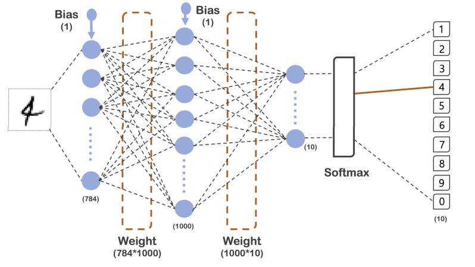

#### 소프트맥스 함수
- `소프트맥스 함수 softmax` : 다변수 다출력 함수
- 여러개의 변수를 받아서 여러개의 출력변수로 나타내주는 함수
    - 다차원 벡터가 출력된다.
- 출력벡터의 특징
    - 모든 출력원소의 값이 0과 1사이의 값을 갖는다. : 지수함수값이 모두 양수이고, 분모가 분자보다 크기때문이다.
    - 모든 출력원소의 합은 1이다.
    - 입력원소의 크기 순서와 출려원소의 크기 순서가 같다. : 단조증가한다.
- **이러한 출력벡터의 특징에 의해 인공신경망의 마지막 단에서 출력을 조건부확률로 변형해주는 기능을 한다.**
    


- 다중 카테고리 분류에서의 소프트맥스 함수의 기능
    - 여러개의 카데고리에 대해서 확률값을 반환해준다. 


```python
model = tf.keras.models.Sequential([
    tf.keras.layers.Flatten(input_shape=(28, 28)),
    tf.keras.layers.Dense(1000, activation='relu'),
    tf.keras.layers.Dense(10, activation='softmax')
])
```

### 1-5. 모델컴파일
- **optimizer** : loss 함수를 최적화하기 위한 방법
    - 오차를 줄여준다.
    - adam
- **loss** : 실제값과 예측값의 오차를 계산하는 함수
    - sparse_categorical_crossentropy
    - **이미지 데이터를 one-hot-encoding 해주는 효과**
- **metrics** 
    - accuracy

```python
model.compile(optimizer='adam',
             loss='sparse_categorical_crossentropy',
             metrics='accuracy')

model.summary()	     
```

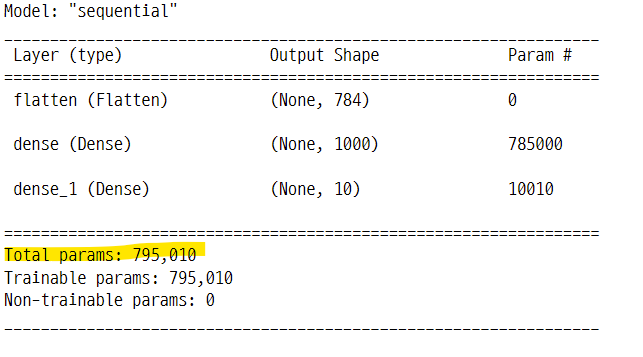


### 1-6. 모델학습
- **validation_data** : 각 epochs(1회 학습) 종료 시 loss와 metrics를 평가할 데이터
    - "Data on which to evaluate the loss and any model metrics at the end of each epoch."
- **epochs** : 모델을 훈련시킬 학습의 횟수 (정수)
    -"Number of epochs to train the model."
- **batch_size** : 그레디언트 업데이트당 샘플 수 (정수), 학습에 사용되는 데이터의 수
    - "Number of samples per gradient update."
    - GD : full batch : 전체 데이터를 한번에 학습한 후 스텝사이즈 결정하는 방식
    - SGD : mini batch : 작은 단위의 데이터를 학습한 후 스텝사이즈를 결정하는 방식
- **verbose** : 진행률 표시 여부 (0, 1, 2)
- 0 : 아무것도 표시하지 않음
- 1 : 진행률 표시줄이 보임 

```
Epoch 1/10
600/600 [==============================] - 3s 5ms/step - loss: 0.2212 - accuracy: 0.9360 - val_loss: 0.1160 - val_accuracy: 0.9645
```
- 2 : epochs 당 한줄로 표시 
```
Epoch 1/10
600/600 - 3s - loss: 0.0076 - accuracy: 0.9977 - val_loss: 0.0684 - val_accuracy: 0.9825 - 3s/epoch - 4ms/step
```

- fit
```python
import time

start_time = time.time()
hist = model.fit(x_train, y_train, validation_data=(x_test, y_test),
                epochs=10, batch_size=100, verbose=1)

print("Fit time : ", time.time() - start_time)
```

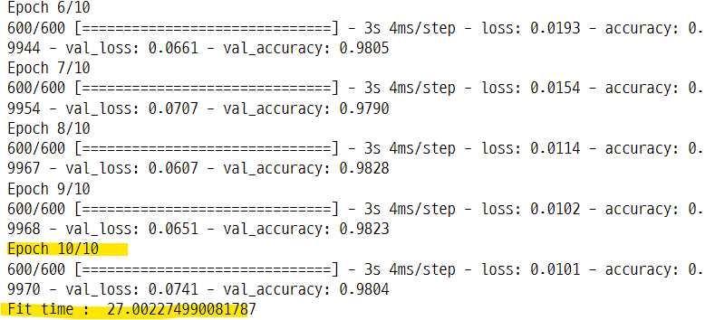


### 1-7. 학습 결과
- loss와 accuracy 값 그래프로 확인

```python
%matplotlib inline
plot_target = ['loss', 'val_loss', 'accuracy', 'val_accuracy']

plt.figure(figsize=(12, 8))
for each in plot_target :
    plt.plot(hist.history[each], label=each)

plt.legend()
plt.grid()
plt.show() ;
```

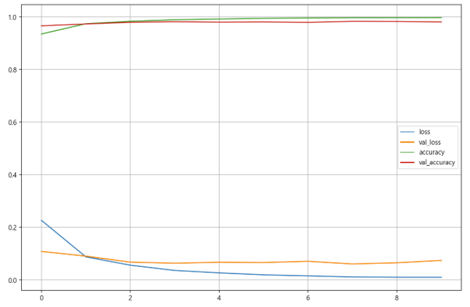

### 1-8. 모델의 성능 평가
- evaluate() : 함수는 loss와 accuracy 값을 반환해준다.

```python
score = model.evaluate(x_test, y_test)

print("Test loss : ", score[0])
print("Test accuracy : ", score[1])

>>>

313/313 [==============================] - 1s 2ms/step - loss: 0.0741 - accuracy: 0.9804
Test loss :  0.07406745105981827
Test accuracy :  0.980400025844574
```

### 1-9. epochs=200 으로 설정하여 모델 재학습
- 모델의 acc 값이 상승했다.
- 시간이 오래 걸렸다. 
    - Fit time :  556.7151250839233 
    - Test loss :  0.14856714010238647
    - Test accuracy :  0.9854999780654907

```python
start_time = time.time()

hist2 = model.fit(x_train, y_train, validation_data=(x_test, y_test),
                 epochs=200, batch_size=100, verbose=1)

print("Fit time : ", time.time() - start_time)
```

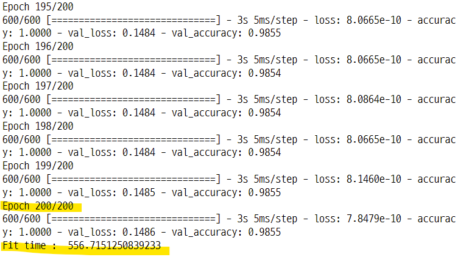

- 학습 결과 확인

```python
plt_target = ['loss', 'val_loss', 'accuracy', 'val_accuracy']

plt.figure(figsize=(12, 8))

for each in plt_target :
    plt.plot(hist2.history[each], label=each)

plt.legend()
plt.grid()
plt.show() ;
```

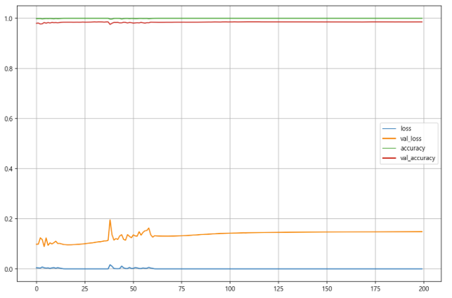

- 모델 성능 평가
- 전체 이미지 중에서 98%는 예측값과 정답이 일치 했고, 2% 정도는 예측이 틀렸다. 

```python
score2 = model.evaluate(x_test, y_test)

print("Test loss : ", score2[0])
print("Test accuracy : ", score2[1])

>>>

313/313 [==============================] - 1s 2ms/step - loss: 0.1486 - accuracy: 0.9855
Test loss :  0.14856714010238647
Test accuracy :  0.9854999780654907
```

### 1-10. 예측값과 정답이 틀린 것 확인

#### 예측값 확인
- 카테고리 값이 0~9 총 10개이다. 예측값은 카테고리 별로 확률값으로 반환된다. 따라서 10개의 확률값중 가장 큰 확률값을 선택한다.
- **np.argmax(matrix, axis=0)**
    - 하나의 컬럼안에서 큰 값이 있는 행의 인덱스 반환
    - 10개의 컬럼마다 10000개의 행중에 큰 값이 있는 행의 인덱스를 찾아준다.
- **np.argmax(matrix, axis=1)**
    - 하나의 행안에서 큰 값이 있는 컬럼의 인덱스 반환
    - 10000개의 행마다 10개의 컬럼중에 큰 값이 있는 컬럼의 인덱스를 찾아준다.

```python
import numpy as np

predicted_result = model.predict(x_test)
predicted_labels = np.argmax(predicted_result, axis=1)
predicted_labels[:10]

>>>

array([7, 2, 1, 0, 4, 1, 4, 9, 5, 9], dtype=int64)
```

#### 정답과 다른 예측값의 인덱스 
- 라벨데이터와 예측값을 비교하여 틀린 것만 따로 저장
    - 즉 정답으로 주어진 라벨데이터와 모델이 학습한 후 예측한 값이 다른 것을 의미한다. 
- 이 중에서 랜덤하게 20개만 선택

```python
wrong_result = []

for n in range(0, len(y_test)) :
    if predicted_labels[n] != y_test[n] :
        wrong_result.append(n)

len(wrong_result)

>>>

196
```

- 20개의 샘플을 무작위로 선택

```python
import random

samples = random.choices(population=wrong_result, k=20)
samples

>>>

[813,
 7182,
 1901,
 5897,
 4199,
 2597,
 2130,
 1878,
 582,
 5897,
 4860,
 9664,
 1709,
 3985,
 8094,
 1941,
 1393,
 4731,
 5457,
 1232]
```

### 1-11. 어떤 이미지가 예측에서 틀렸는지 이미지로 확인
- 정답으로 주어진 값과 예측한 값을 확인
    - 실제 숫자의 이미지 중에는 눈으로 보기에도 애매하게 쓰여진 것들이 있다.

```python
plt.figure(figsize=(12, 10))

for idx, n in enumerate(samples) :
    plt.subplot(4, 5, idx+1)
    plt.imshow(x_test[n].reshape(28, 28), cmap='Greys', interpolation='nearest')
    plt.title("Label : " + str(y_test[n]) + " Predict : " + str(predicted_labels[n]), fontsize=15)
    plt.axis('off')

plt.tight_layout()
plt.show() ;
```

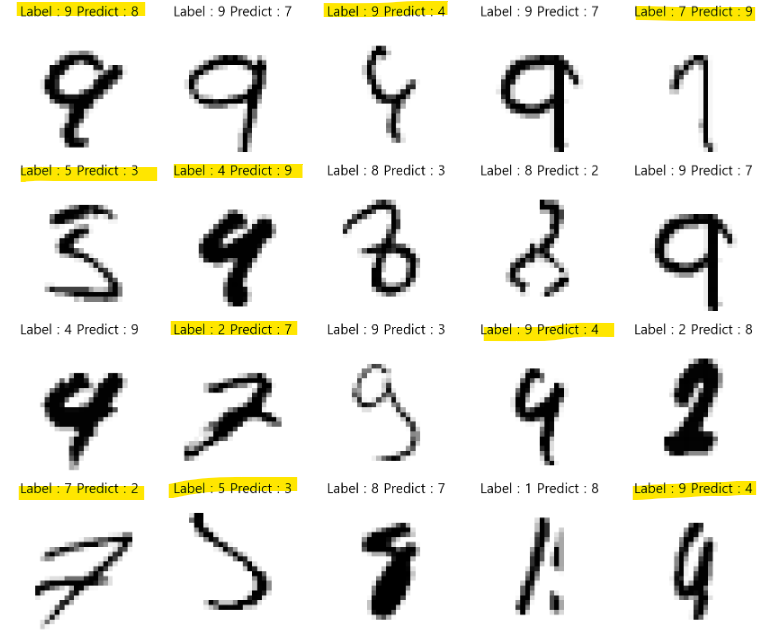

## 2. mnist fashion image data
- fashion 데이터 이미지를 사용하여 예측 모델 만들기
- 28 * 28 크기의 옷 이미지 데이터
- 10가지의 패션데이터 카테고리 종류
    - 정답, 즉 라벨데이터는 0~9 사이의 숫자들로 이루어져 있다.
    - 각각의 숫자는 옷의 종류를 의미하는 카테고리 값이다.
```
The classes are:

| Label | Description |
|:-----:|-------------|
|   0   | T-shirt/top |
|   1   | Trouser     |
|   2   | Pullover    |
|   3   | Dress       |
|   4   | Coat        |
|   5   | Sandal      |
|   6   | Shirt       |
|   7   | Sneaker     |
|   8   | Bag         |
|   9   | Ankle boot  |
```

### 2-1. 데이터 임포트

```python
f_mnist = tf.keras.datasets.fashion_mnist

(X_train, y_train), (X_test, y_test) = f_mnist.load_data()
X_train, X_test = X_train / 255.0, X_test / 255.0
```

#### 라벨 데이터는 카테고리 값으로 되어 있다.
- 각 번호마다 제품의 품목에 해당한다.

```python
y_test[:10]

>>>

array([9, 2, 1, 1, 6, 1, 4, 6, 5, 7], dtype=uint8)
```

### 2-2. 샘플 이미지 확인
- 0부터 학습데이터의 길이 만큼의 범위에서 20개의 랜덤한 숫자를 선택
    - 이 값을 데이터의 인덱스로 사용한다.

```python
samples = random.choices(population=range(0, len(y_train)), k=20)
samples

>>>

[54044,
 55771,
 24856,
 32436,
 31467,
 50363,
 13073,
 11399,
 58095,
 24110,
 51443,
 31220,
 11790,
 24374,
 3679,
 21466,
 8846,
 38461,
 34472,
 19171]
```


#### 이미지 그리기

```python
%matplotlib inline

plt.figure(figsize=(12, 10))

for idx, n in enumerate(samples) :
    plt.subplot(4, 5, idx+1)
    plt.imshow(X_train[n].reshape(28, 28), cmap='Greys', interpolation='nearest')
    plt.axis("off")
    plt.title("Label : " + str(y_train[n]))

plt.tight_layout()
plt.show() ;
```

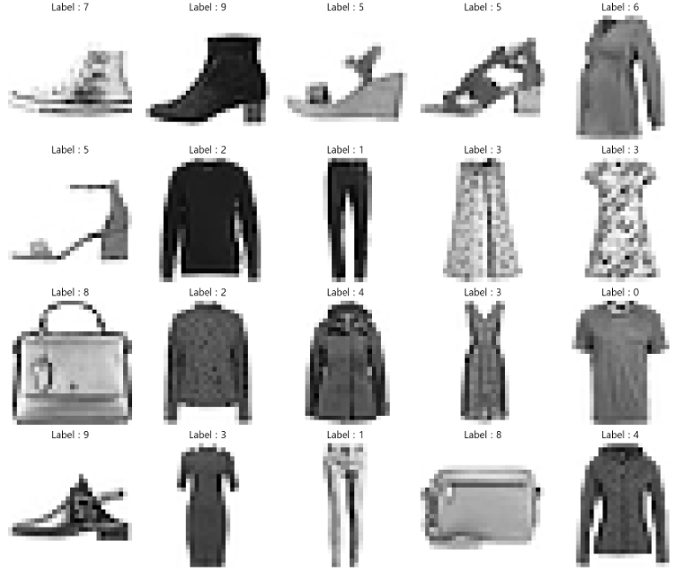


### 2-3. 딥러닝 모델 생성
- 컴파일에서 loss 인수를 sparse_categorical_crossentropy로 설정하면 입력 데이터를 원핫인코딩 한것과 같다.

```python
model_f = tf.keras.Sequential([
    tf.keras.layers.Flatten(input_shape=(28, 28)),
    tf.keras.layers.Dense(1000, activation='relu'),
    tf.keras.layers.Dense(10, activation='softmax')
])

model_f.compile(optimizer='adam',
               loss='sparse_categorical_crossentropy',
               metrics=['accuracy'])

model_f.summary()	       
```

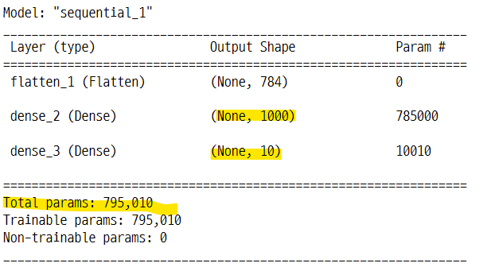

### 2-4. 모델 학습

```python
import time

start_time = time.time()

hist_f = model_f.fit(X_train, y_train, validation_data=(X_test, y_test),
                     epochs=10, batch_size=100, verbose=1)

print("Fit time : ", time.time() - start_time)
```

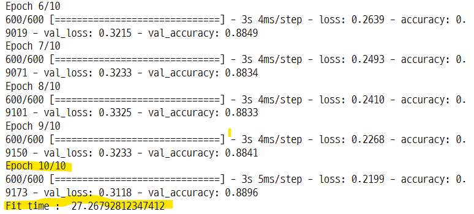

### 2-5. 학습 결과

```python
plot_target = ['loss', 'val_loss', 'accuracy', 'val_accuracy']

plt.figure(figsize=(12, 8))
for each in plot_target :
    plt.plot(hist_f.history[each], label=each)

plt.legend()
plt.show() ;
```

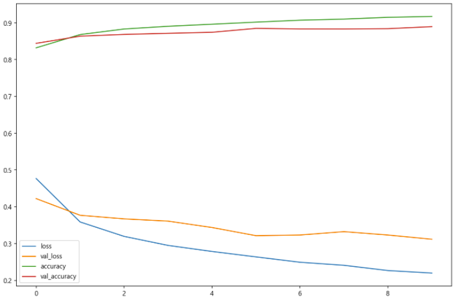


### 2-6. 모델 성능 평가
- 전체 테스트 데이터 10000개 중에서 88%는 예측이 정답과 일치했다.

```python
score_f = model_f.evaluate(X_test, y_test)

print("Test loss : ", score_f[0])
print("Test acc : ", score_f[1])

>>>

313/313 [==============================] - 1s 2ms/step - loss: 0.3118 - accuracy: 0.8896
Test loss :  0.31183409690856934
Test acc :  0.8895999789237976
```

### 2-7. 예측이 틀린 데이터 확인
- model의 마지막 layer의 뉴런은 10개
    - 즉 1개의 이미지를 model에 넣고 예측하면 가중합을 거쳐, softmax 활성함수의 계산으로 최종적으로 10개의 조건부확률값이 나온다.
- 10000개의 이미지를 각각 model 넣고 예측하면 결과값은 (10000, 10) 이 된다.
    - 각각 이미지는 행이고, 이미지당 결과값이 10개의 열이 된 것.
    - np.argmax(result, axis=1)을 하면, 한 개의 이미지 행의 결과값 10개 중에서 가장 큰 값을 찾고 컬럼 인덱스를 계산하라는 의미이다.
- 즉 딥러닝 결과 10개의 값중에서 가장 높은 확률값을 찾는다.

#### 예측값 확인

```python
predicted_result = model_f.predict(X_test)
predicted_labels = np.argmax(predicted_result, axis=1)
predicted_labels[:10]

>>>

array([9, 2, 1, 1, 6, 1, 4, 6, 5, 7], dtype=int64)

y_test[:10]

>>>

array([9, 2, 1, 1, 6, 1, 4, 6, 5, 7], dtype=uint8)
```

#### 틀린 데이터의 인덱스 모으기
- 전체 테스트 데이터 10000개 중에서 약 11% 가량이 틀렸다. (acc:88.9%)
    - 따라서 틀린 데이터의 인덱스의 갯수는 1104

```python
wrong_result = []

for n in range(0, len(y_test)) :
    if predicted_labels[n] != y_test[n] :
        wrong_result.append(n)

len(wrong_result)

>>>

1104
```

#### 틀린 데이터 중에서 20개를 무작위로 선택

```python
samples = random.choices(population=wrong_result, k=20)
samples[:5]

>>>

[3585, 793, 2421, 2491, 7596]
```

### 2-8. 틀린 데이터의 이미지 확인

#### 이미지의 라벨로 이미지의 카테고리를 사용
- 이미지를 확인해 보면 제품의 품목을 명확하게 판단하기 어려운 것들이 있다.
    - 셔츠와 드레스, 코트와 풀오버 등등

```python
cate = {"0" : "T-shirt/top",
       "1" : "Trouser",
       "2" : "Pullover",
       "3" : "Dress",
       "4" : "Coat",
       "5" : "Sandal",
       "6" : "Shirt",
       "7" : "Sneaker",
       "8" : "Bag",
       "9" : "Ankle boot"}

plt.figure(figsize=(14, 12))

for idx, n in enumerate(samples[:16]) :
    plt.subplot(4, 4, idx+1)
    plt.imshow(X_test[n].reshape(28, 28), cmap='Greys', interpolation='nearest')
    plt.title("Label : " + str(cate[str(y_test[n])]) + " | Predict : " + str(cate[str(predicted_labels[n])]),
             fontsize=12)
    plt.axis("off")
    origin_label = cate
plt.tight_layout()
plt.show() ;
```

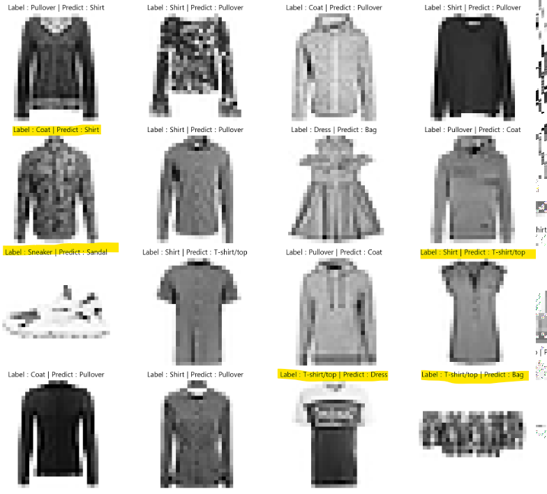

