# Convolutional Neural Network
- convolutional : "나선형의"
- 컨볼루션 신경망
- process : 입력 -> 특징검출 -> 분류
    - 입력 단계 : img 벡터 입력
    - 특징검출 단계 : layer(컨볼루션 + Relu) -> layer(풀링) -> ... 반복
    - 분류 단계 : 풀링 -> 평면화 -> softmax -> 예측값(조건부확률)

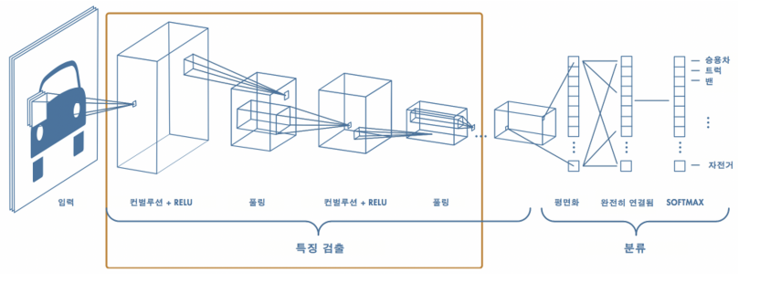

## 1. CNN 구조
- Img Input
- CNN : 2개의 레이어로 구성됨
    - Convolutional Layer : 사진에서 특징을 추출
    - Neural Network : 분류결과 반환
- Clf

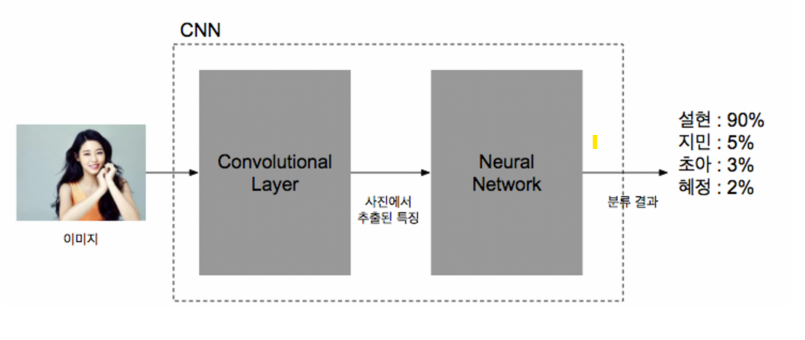

## 2. Convolutional Filter
- 어떤 행렬에서 특정 크기의 배열을 순차적으로 이동하며 값을 계산하는 방식
    - 어떤 크기로 어떤 위치의 어떤 방법으로 계산할 지 설정할 수 있다.
    - 큰 행렬에서 어떤 특징을 찾아내 작은 크기의 행렬로 변환시킬 수 있다.
- img에서 각 픽셀에 해당하는 값들을 conv window가 지나가면서 특정한 계산을 하여 규칙적인 값을 재배열 시킨다.
    - 이미지 변환이 일어난다. **원래 이미지에서 어떤 특징을 찾아낸다.**

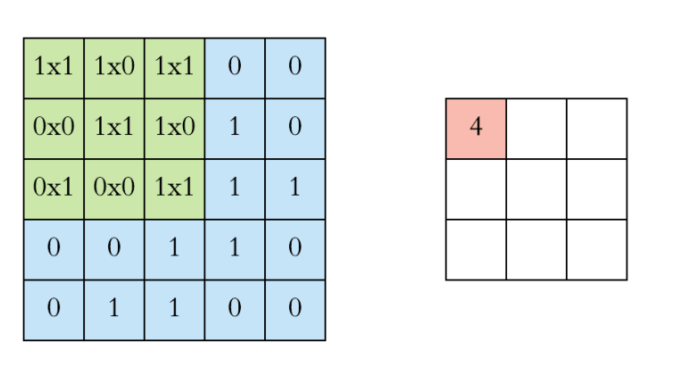

### 동작 방식
- convolution : 특정 패턴이 있는지 conv window로 훑으면서 마킹한다.
    - 위아래선, 좌우선, 대각선, 특정 질감, 동그라미, 네모 등등의 패턴을 "조각필터"로 확인한다.
- conv window로 훓고 지나갈때마다 숫자를 반환한다.
- 이 값을 activation func(활성함수 : 주로 ReLu)에 넣어서 나온 결과값으로 이미지를 새로 만든다.        

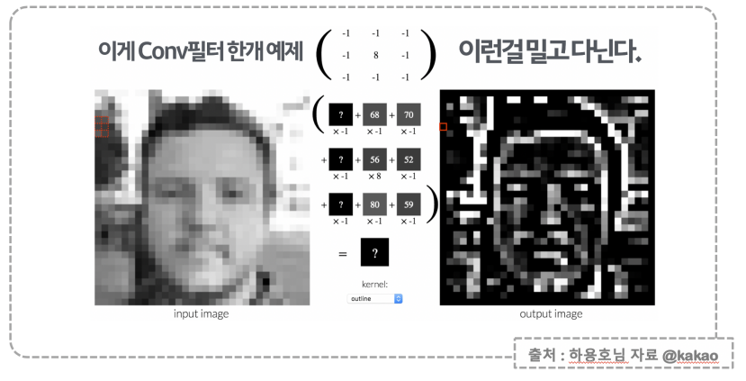

## 3. Pooling
- 이미지의 형태를 확인하기 위해 이미지를 축소하여 멀리서 보는 기능을 하는 방법
    - 이미지를 가까이에서 보면 서로 다른 값들로 채워진 픽셀들로 특별한 형태나 질감 등을 알아보기 힘들다.
    - 점차 멀리 떨어져 이미지를 보면, 점, 선, 질감 등을 확인 할 수 있다.
    - 더 멀리 떨어져서 이미지를 보면 부분적인 형태등을 알 수 있다.
    - 더 멀리 떨어져서 이미지를 보면 어떤 물체인지 알 수 있다.
- 이렇게 멀리 떨어져서 보는 방식을 이미지를 축소하여 전체 형태를 확인할 수 있게 해준다. 

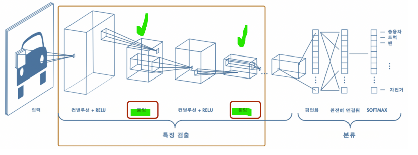

### MaxPooling
- 행렬의 어떤 부분을(Pool) 중요한 정보 한개(Max)로 줄이는 방식
    - 선명한 정보만 남긴다. 
    - 판단과 학습이 쉬워진다.
    - 노이즈가 줄어든다.
    - 학습의 융통성이 확보된다.
- **stride** : Pooling을 할 때 어떤 크기로 이동할지 설정하는 값
    - 정확한 의미, 기능 확인 해 볼것
- **보통 2X2 행렬을 이동하면서 큰 값을 찾아낸다.**
- max pooling을 하고 나면 이미지의 크기가 절반으로 줄어든다.

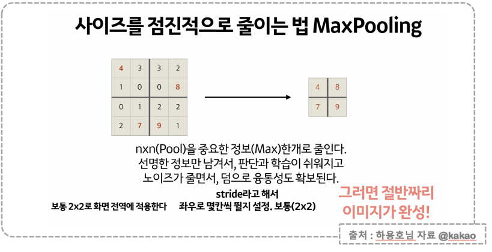

#### 큰 값 찾기 
- 4x4 행렬에서 2x2 크기 단위로 구분하여 각 단위에서 가장 큰 값만 반환한다.
    - 행렬의 크기가 작아지지만 다른 의미에서 특징이 뚜렷한 값만 남는다.

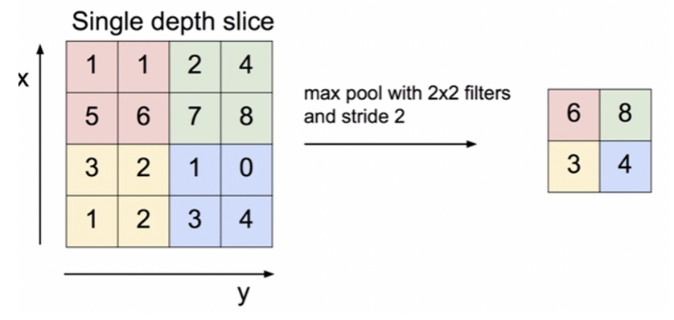

## 4. Conv Layer
- Conv Window와 MaxPooling 이 여러개 나열되어 있다. 
- **Conv Window** : 이미지에서 패턴들을 쌓아, 복잡한 패턴을 인식한다.
    - 이미지에서 어떤 특징을 찾아 activation 함수를 거쳐 결과값을 반환하여 새로운 이미지를 만든다.
    - 채널이 늘어난다. 이미지 사이즈는 바뀌지 않는다.
- **Max Pooling** : 사이즈를 줄여가며, 이미지를 더욱 추상화해나간다. 
    - 이 이미지에서 선명하고 정보만 남기는 방식으로 줄여준다.
    - 이미지의 사이즈가 절반으로 줄어든다. 채널의 수는 바뀌지 않는다.
- Conv Layer를 지나고 마지막 맥스풀링을 한 이미지가 neural network를 거쳐 학습을 하게 된다.
- Conv Layer는 neural network의 학습 효과를 증진시키기 위한 이미지 처리 과정과 같다.

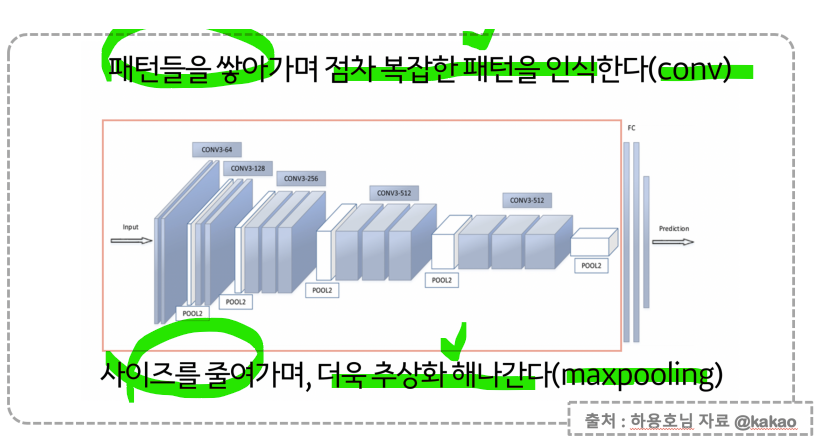

### Zero padding
- Conv Window 즉 **kernel_size**에 의해 이미지의 모서리와 모서리를 잇는 선에서는 이미지 바깥이 빈공간이 된다. 이미지 사이즈 유지를 위해 Conv 하기 전에 이미지 모서리와 모든 변의 바깥을 0으로 채워주는 것을 의미한다.

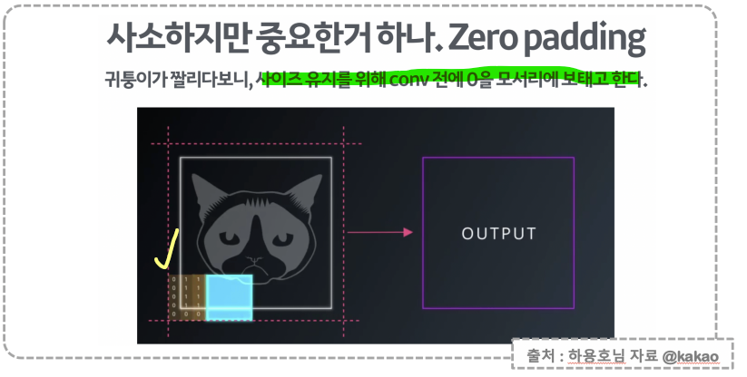

### dropout
- 특정한 이미지를 학습시키면 overfitting이 발생하여, 유사한 이미지라도 예측성능이 떨어지게 된다.
    - "귀가 뾰족한" "검은 고양이"를 학습시키면, 뚱뚱하거나 갈색이거나 귀가 쳐진 고양이는 예측하지 못한다.

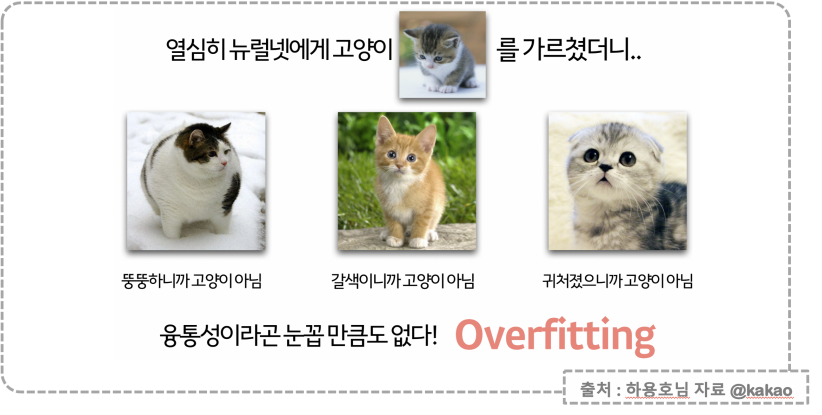

- 이러한 overfitting 문제를 줄이기 위해서 학습을 시킬 떄 **일부러 정보를 누락시키거나 중간중간 노드를 끈다.**
    - 즉 이미지에서 어떤 특징을 지운 나머지 특징만으로 학습을 반복하여, 해당 특징의 중요도를 상쇄시켜준다.
    - 고양이의 몸뚱이를 지우고 얼굴만 학습 (뉴럴넷의 특정 노드를 끈다.)
    - 고양이의 색을 지우고 학습 (뉴럴넷의 특정 노드를 끈다.)
    - 고양이의 귀를 지우고 학습 (뉴럴넷의 특정 노드를 끈다.)
- dropout 기능은 학습에 응용력을 주는 것과 같다. 

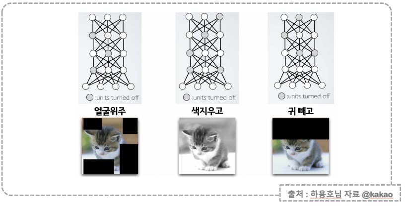

## tensorflow 

### 1. 텐서플로우 임포트

```python
import tensorflow as tf

tf.__version__

>>>

'2.8.0'
```

### 2. 데이터 임포트
- mnist 데이터 불러오기
- 데이터에 픽셀값의 최대값이 255를 나누어주면 모든 값이 0~1사이의 값을 가지게 된다.
    - 스케일링을 한 것과 같은 기능이다.

```python
from tensorflow.keras import datasets

mnist = datasets.mnist

(X_train, y_train), (X_test, y_test) = mnist.load_data()
X_train, X_test = X_train / 255.0, X_test / 255.0

X_train = X_train.reshape((60000, 28, 28, 1))
X_test = X_test.reshape((10000, 28, 28, 1))

X_train.shape, X_test.shape

>>>

((60000, 28, 28, 1), (10000, 28, 28, 1))
```

### 3. CNN 모델 생성
- `Conv2D` :
    - **filters** : 출력공간의 차원. 컨볼루션의 출력 필터 수.
    - **kernel_size** : 컨볼루션 창 covolution window. 2개의 정수로 이루어진 튜플/리스트 값
    - **strides** : 높이와 넓이에 따라 컨볼루션의 보폭. 2개의 정수로 구성된튜플/리스트 값.
    - **padding** : 이미지의 바깥에 0을 채워준다. valid=패딩없음, same=0을 균일하게 패딩
    - **dilation_rate** : 확장 컨볼루션(dilated convolution)에서 사용되는 확장 속도값.
    - **activation** : 컨볼루션에 사용할 활성화 함수.
    - 그 외는 문서 참조

```python
from tensorflow.keras import layers, models

model = models.Sequential([
    layers.Conv2D(32, kernel_size=(5, 5), strides=(1, 1),
                 padding="same", activation="relu", input_shape=(28, 28, 1)),
    layers.MaxPooling2D(pool_size=(2, 2), strides=(2, 2)),
    layers.Conv2D(64, (2, 2), padding="same", activation="relu"),
    layers.MaxPooling2D(pool_size=(2, 2)),
    layers.Dropout(0.25),
    layers.Flatten(),
    layers.Dense(1000, activation="relu"),
    layers.Dense(10, activation="softmax")

])
```
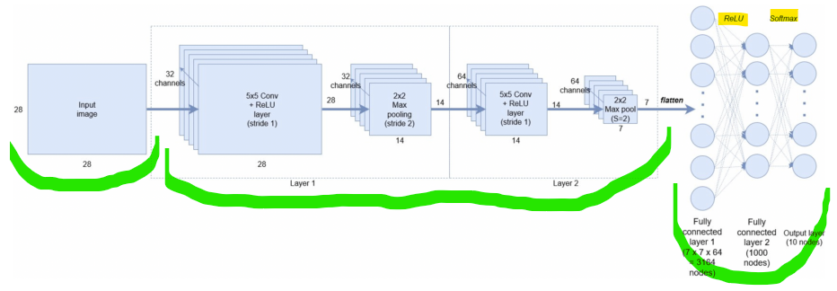

#### 생성한 cnn 모델 요약 정보 확인
- 컨볼루션 레이어와 맥스 풀링 레이어를 거치면서 채널의 수가 늘어나 변수의 수가 크게 늘어난다.

```python
model.summary()
```

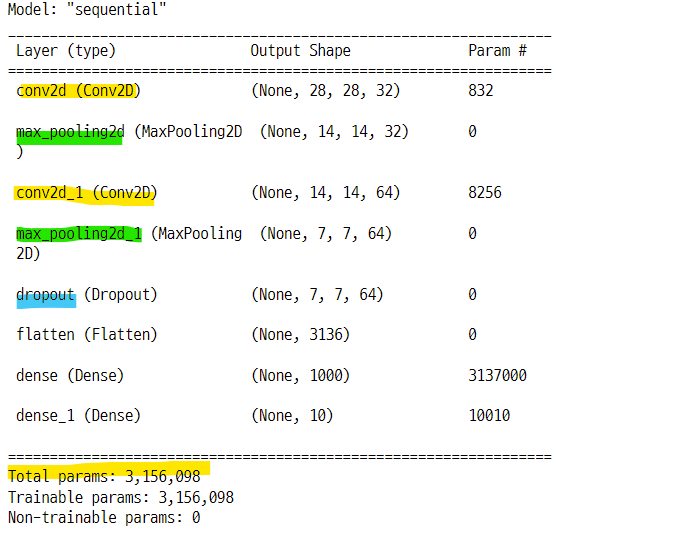

### 4. 모델 학습
- 시간 꽤 걸린다. 5분정도

```python
import time

model.compile(optimizer="adam",
             loss="sparse_categorical_crossentropy",
             metrics="accuracy")

s_time = time.time()

hist = model.fit(X_train, y_train, validation_data=(X_test, y_test),
                epochs=5, verbose=1)

print("fit time : {}".format(time.time() - s_time))
```

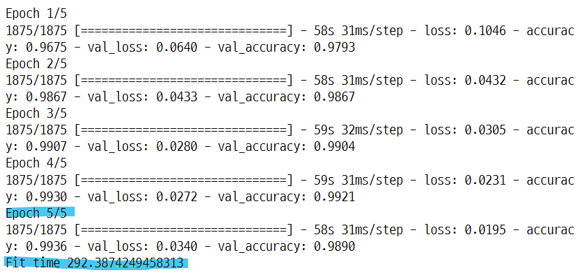

### 5. 학습 결과
- 단순히 뉴럴넷 모델을 사용했을 때보다 성능이 더 좋다.
    - 이미지를 분석하는데 있어서 cnn 모델이 유용하다.
    - convolution filter, maxpolling, dropout, zero padding 등의 기능이 사용되면서 이미지 분석을 좀 더 효과적으로 할 수 있다. 

```python
%matplotlib inline

plot_target = ["loss", "val_loss", "accuracy", "val_accuracy"]

plt.figure(figsize=(10, 8))

for each in plot_target :
    plt.plot(hist.history[each], label=each)

plt.legend()
plt.grid()
plt.show() ;
```

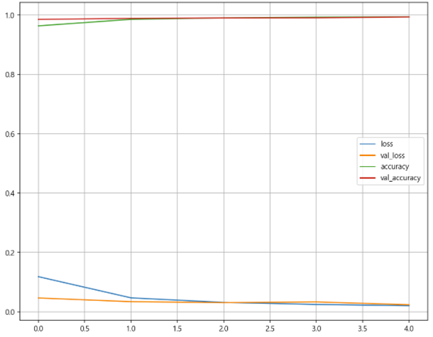


### 6. 모델 성능 확인
- 10000개의 테스트 데이터에서 99% 가깝게 예측했다.

```python
score = model.evaluate(X_test, y_test)

print("Test loss : {}".format(score[0]))
print("Test acc : {}".format(score[1]))

>>>

313/313 [==============================] - 4s 12ms/step - loss: 0.0237 - accuracy: 0.9929
Test loss : 0.023742275312542915
Test acc : 0.992900013923645
```

### 7. 정답과 틀린 값을 예측한 데이터 확인

#### 예측값 확인
- 예측값은 10000X10의 행렬로 이루어져 있다.
- 행은 각 이미지 데이터를 의미하고, 열은 카테고리 값에 대한 조건부 확률값을 의미한다.
- softmax 함수를 통과하면서 각 카테고리 마다 확률값으로 반환된다.

```python
predicted_result = model.predict(X_test)
predicted_result

>>>

array([[1.7335725e-11, 6.5497424e-10, 1.8941917e-11, ..., 1.0000000e+00,
        4.6666804e-10, 1.0955169e-08],
       [7.7381070e-09, 2.3326014e-09, 1.0000000e+00, ..., 7.6859647e-12,
        4.1552700e-15, 4.7047002e-13],
       [1.3994444e-06, 9.9988806e-01, 2.5214885e-07, ..., 1.2867946e-05,
        4.3276883e-05, 9.9616882e-06],
       ...,
       [1.4913548e-14, 9.6570441e-09, 1.5957189e-12, ..., 4.7554467e-09,
        5.0919778e-07, 8.5297422e-09],
       [1.5340674e-12, 2.1198462e-13, 6.5895045e-16, ..., 3.2638311e-14,
        2.1823247e-07, 1.5190375e-12],
       [2.3881497e-09, 2.4401989e-09, 1.5461550e-09, ..., 7.3362784e-16,
        2.3298344e-10, 5.3302902e-13]], dtype=float32)


predicted_result.shape

>>>

(10000, 10)
```

#### 10개의 확률값 중에서 가장 큰 값의 인덱스 확인
- 인덱스의 값이지만 이 값이 0~9 까지의 카테고리를 의미한다.
- 행에서 가장 큰 값의 열의 인덱스

```python
predicted_labels = np.argmax(predicted_result, axis=1)
predicted_labels

>>>

array([7, 2, 1, ..., 4, 5, 6], dtype=int64)
```

#### 틀린 데이터의 인덱스를 한 곳에 모은다.
- 10000개의 데이터를 예측한 결과 틀린 데이터가 71개에 불과하다.
- mnist 이미지에서 눈으로 봐도 애매한 것들도 왠만하면 정답에 맞게 예측한 것으로 보여진다.

```python
wrong_data = []

for n in range(0, len(y_test)) :
    if predicted_labels[n] != y_test[n] :
        wrong_data.append(n)

len(wrong_data)

>>>

71
```

### 8. 틀린 데이터의 이미지 확인

#### 샘플 데이터

```python
import random

sampels = random.choices(population=wrong_data, k=16)
sampels

>>>

[359,
 4620,
 4176,
 3808,
 5937,
 6172,
 9669,
 2129,
 9792,
 2293,
 4497,
 2939,
 6532,
 7216,
 9009,
 5654]
```

#### 이미지 확인

```python
plt.figure(figsize=(12, 10))

for idx, n in enumerate(samples) : 
    plt.subplot(4, 4, idx + 1)
    plt.imshow(X_test[n].reshape(28, 28), cmap="Greys", interpolation="nearest")
    plt.axis("off")
    plt.title("Label " + str(y_test[n]) + " | Predeict " + str(predicted_labels[n]),
             fontsize=17)
    
plt.tight_layout()
plt.show() ;
```

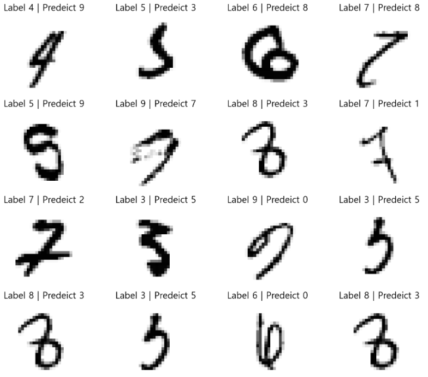

## CNN 모델로 fashion image 데이터 분류
- 위에서 만든 모델로 fashion image 데이터를 분류하기

### 1. 데이터 임포트

```python
from tensorflow.keras import datasets

f_mnist = datasets.fashion_mnist

(X_train, y_train), (X_test, y_test) = f_mnist.load_data()
X_train, X_test = X_train / 255.0, X_test / 255.0
X_train = X_train.reshape((60000, 28, 28, 1))
X_test = X_test.reshape((10000, 28, 28, 1))

X_train.shape, X_test.shape

>>>

((60000, 28, 28, 1), (10000, 28, 28, 1))
```

### 2. CNN 모델 학습
- 모델 생성, 모델 컴파일은 이미 모델을 생성했기 때문에 생략

```python
s_time = time.time()

hist_f = model.fit(X_train, y_train, validation_data=(X_test, y_test),
                  epochs=5, verbose=1)

print("Fit time : {}".format(time.time() - s_time))
```

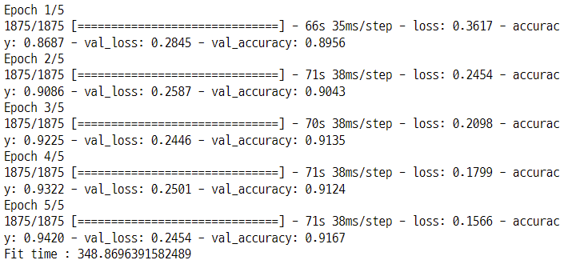


### 3. 학습 결과

```python
%matplotlib inline

plot_targets = ["loss", "val_loss", "accuracy", "val_accuracy"]
plt.figure(figsize=(10, 8))

for each in plot_targets :
    plt.plot(hist_f.history[each], label=each)

plt.legend()
plt.grid()
plt.show() ;
```

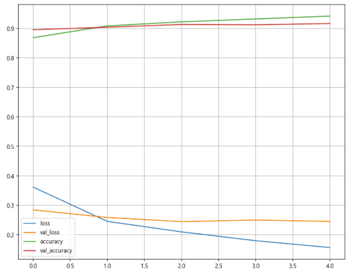

### 4. 성능 평가
- 단수 뉴럴넷 모델에서보다 성능이 향상 됐다.

```python
score = model.evaluate(X_test, y_test)

print("test loss : {}".format(score[0]))
print("test acc : {}".format(score[1]))

>>>

313/313 [==============================] - 4s 12ms/step - loss: 0.2454 - accuracy: 0.9167
test loss : 0.24540507793426514
test acc : 0.916700005531311
```

### 5. 예측 데이터에서 틀린 데이터 이미지 확인

```python
pred_result_f = model.predict(X_test)
pred_labels = np.argmax(pred_result_f, axis=1)
false_data = []

for n in range(0, len(y_test)) :
    if pred_labels[n] != y_test[n] :
        false_data.append(n)

sample_f = random.choices(population=false_data, k=16)

plt.figure(figsize=(12, 10))

for idx, n in enumerate(sample_f) : 
    plt.subplot(4, 4, idx+1)
    plt.imshow(X_test[n].reshape(28, 28), cmap="Greys", interpolation="nearest")
    plt.axis("off")
    plt.title("Label " + str(y_test[n]) + " | Predict " + str(pred_labels[n]),
             fontsize=17)
    
plt.tight_layout()
plt.grid()
plt.show() ;
```

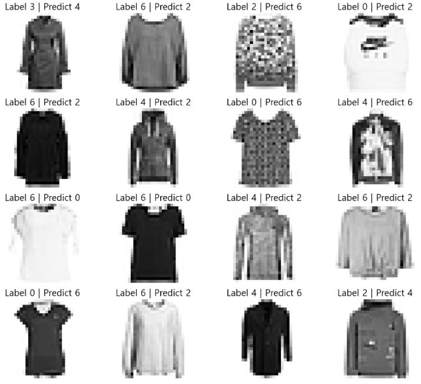

