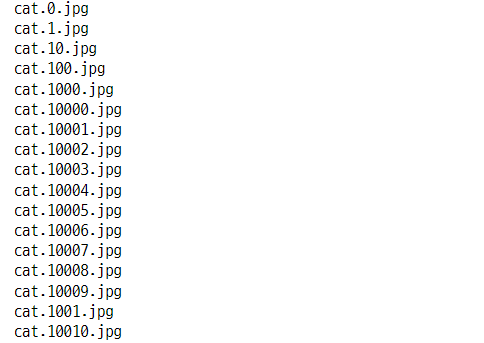

# CNN 모델로 cats and dogs image 분석

### 1. 데이터 임포트

```python
!ls ../../04_machine_learning/train/train
```


#### os 패키지 사용하여 해당 폴더의 파일명을 리스트로 가져오기

```python
import os

path = "../../04_machine_learning/train/train"

os.listdir(path)
```


#### 데이터 확인

```python
full_names = os.listdir(path)
full_names
```


#### 데이터의 길이

```python
len(full_names)

>>> print

25000
```

### 2. 데이터 구분
- 리스트 컴프리헨션을 사용하여 원하는 부분만 따로 저장
- labels : 동물명
- file_id : 파일명

```python
[each.split('.') for each in full_names]
```


#### 라벨값과 id값을 분리

```python
labels = [each.split('.')[0] for each in full_names]
file_id = [each.split('.')[1] for each in full_names]

labels[:10]

>>> print

['cat', 'cat', 'cat', 'cat', 'cat', 'cat', 'cat', 'cat', 'cat', 'cat']

file_id[:10]

>>> print

['0', '1', '10', '100', '1000', '10000', '10001', '10002', '10003', '10004']
```

#### 라벨값과 id값의 길이

```python
len(labels), len(file_id)

>>> print

(25000, 25000)
```

#### 데이터 분포 확인

```python
from collections import Counter

print(Counter(labels).keys())

>>> print

dict_keys(['cat', 'dog'])

print(Counter(labels).values())

>>> print

dict_values([12500, 12500])
```

### 3. 데이터 이미지 확인

```python
import random
import matplotlib.pyplot as plt
import matplotlib.image as mpimg
%matplotlib inline

samples = random.choices(full_names)
samples

>>> print

['dog.5784.jpg']
```

#### path 와 이미지 이름을 합하여 이미지 불러오기

```python
sample = random.choices(full_names)[0]
image = mpimg.imread(path + "/" + sample)
plt.figure(figsize=(6, 6))
plt.imshow(image)
plt.show()
```


#### 다른 이미지 확인

```python
temp = 'cat.2262.jpg'
temp_img = mpimg.imread(path + "/" + temp)

plt.figure(figsize=(6, 6))
plt.imshow(temp_img)
plt.show()
```


### 4. 이미지 크기 확인
- 이미지마다 크기가 다 다르다.

```python
samples_2 = random.choices(full_names, k=5)

for each in samples_2 :
    image = mpimg.imread(path + "/" + each)
    print(each, image.shape)

>>> print

cat.11261.jpg (258, 200, 3)
dog.12223.jpg (100, 108, 3)
dog.9293.jpg (249, 288, 3)
cat.8494.jpg (500, 374, 3)
cat.5822.jpg (179, 245, 3)
```

### 5. 이미지 크기 고정
- (128, 128, 3)의 크기로 고정시킨다.

```python
from skimage.transform import resize

temp = 'cat.2262.jpg'
temp_img = mpimg.imread(path + "/" + temp)

resized = resize(temp_img, (128, 128, 3))

fig, axes = plt.subplots(1, 2, figsize=(8, 4))
ax = axes.ravel()
ax[0].imshow(temp_img, cmap=plt.cm.gray)
ax[0].set_title("image")
ax[1].imshow(resized, cmap=plt.cm.gray)
ax[1].set_title("Resized")

fig.tight_layout
plt.show() ;
```


### 6. 전체 이미지 크기 조정
- `tqdm` : 처리과정을 바 형태로 확일 할 수 있는 패키지

#### tqdm 테스트
- 진행 프로세스 바
- for 문의 순회객체 부분에 tqdm()과 인수를 함께 입력해준다.
    - 반복문이 작동하는 동안의 시간을 계산하여 진행바의 형태로 보여준다.
    - tqdm()안에 반복할 횟수나, 리스트 형태의 객체를 넣어준다.
    - 또한 인수값을 변경하여 진행바의 이름이나 진행시간의 간격등을 조정할 수 있다.

```python
from tqdm import tqdm
import time

text = ""
for char in tqdm(["a", "b", "c", "d"]) :
    time.sleep(0.25)
    text = text + char

>>> print

100%|██████████| 4/4 [00:01<00:00,  3.76it/s]
```

- desc 인수로 이름을 설정할 수 있다. 

```python
for i in tqdm(range(100), desc="tqdm example", mininterval=0.01) :
    time.sleep(0.1)

>>> print

tqdm example: 100%|██████████| 100/100 [00:10<00:00,  9.14it/s]
```

#### 전체 이미지 사이즈 변환
- 전체 25000장의 이미지의 사이즈를 (128, 128, 3)의 크기로 변환해준다.
    - 7분 36초가 걸렸다.
- tqdm() 안에 리스트 형태의 객체를 넣어준다.
    - 파일명이 들어있는 객체를 넣어주면, 반복문에서 객체안의 데이터가 하나씩 꺼내지면서 시간을 계산한다.

```python
import numpy as np

images = []
bar_total = tqdm(full_names)
for file in bar_total :
    image = mpimg.imread(path + "/" + file)
    images.append(resize(image, (128, 128, 3)))

images = np.array(images)

>>> print

100%|██████████| 25000/25000 [07:36<00:00, 54.78it/s]
```

#### 변환 된 데이터 확인
- 첫번째 이미지 데이터의 모양

```python
images[0].shape

>>> print

(128, 128, 3)
```

- 전체 이미지 데이터의 모양

```python
images.shape

>>> print

(25000, 128, 128, 3)
```

### 7. Label 인코딩
- 라벨 데이터가 카테고리 값인 경우 라벨 인코더를 사용하여 숫자 데이터로 인코딩하면 편리하다.

```python
from sklearn.preprocessing import LabelEncoder

encoder = LabelEncoder()
encoder.fit(labels)
labels_encoded = encoder.transform(labels)
labels_encoded

>>> print

array([0, 0, 0, ..., 1, 1, 1])
```

#### 인코딩 결과와 인코딩에 사용된 라벨 값 확인

```python
labels_encoded[:3], encoder.classes_

>>> print

(array([0, 0, 0]), array(['cat', 'dog'], dtype='<U3'))
```

### 8. 데이터 분리
- 학습 데이터와 검증 데이터의 분리
    - 학습 데이터 : 20000 개
    - 검증 데이터 : 5000 개

```python
from sklearn.model_selection import train_test_split

X_train, X_test, y_train, y_test = train_test_split(images,
                                                   labels_encoded,
                                                   test_size=0.2,
                                                   random_state=13,
                                                   stratify=labels_encoded)

X_train.shape, X_test.shape

>>> print

((20000, 128, 128, 3), (5000, 128, 128, 3))
```

### 9. 데이터 이미지 확인
- 다양한 이미지들이 들어 있다.
    - 크기가 모두 같아진 것을 확인 할 수 있다.

#### 샘플 인덱스 선택

```python
samples = random.choices(population=range(0, 20000), k=8)
samples

>>> print

[5791, 12104, 10195, 6452, 11215, 1810, 5827, 5340]
```

```python
plt.figure(figsize=(14, 12))
for idx, n in enumerate(samples) :
    plt.subplot(2, 4, idx+1)
    plt.imshow(X_train[n], cmap="Greys",
              interpolation="nearest")
    plt.title(y_train[n])

plt.tight_layout()
plt.show()
```


### 10. CNN 모델 생성

```python
from tensorflow.keras import layers, models
import tensorflow as tf

model = models.Sequential([
    layers.Conv2D(32, (3, 3), activation="relu", input_shape=(128, 128, 3)),
    layers.MaxPooling2D(pool_size=(2, 2), strides=(2, 2)),
    layers.Dropout(0.25),

    layers.Conv2D(64, (3, 3), activation="relu", padding="same"),
    layers.MaxPooling2D(pool_size=(2, 2)),
    layers.Dropout(0.25),

    layers.Conv2D(64, (3, 3), activation="relu", padding="same"),
    layers.MaxPooling2D(pool_size=(2, 2)),
    layers.Dropout(0.25),

    layers.Flatten(),
    layers.Dense(512, activation="relu"),
    layers.Dropout(0.25),
    layers.Dense(2, activation="softmax")
])

model.summary()
```


### 11. 모델 컴파일

```python
model.compile(optimizer="adam", loss="sparse_categorical_crossentropy",
             metrics=["accuracy"])

import time

start = time.time()

hist = model.fit(X_train.reshape(20000, 128, 128, 3), y_train,
                epochs=5, verbose=1,
                validation_data=(X_test.reshape(5000, 128, 128, 3), y_test))

print("Fit time = {}".format(time.time() - start))

>>> print

Epoch 1/5
625/625 [==============================] - 205s 325ms/step - loss: 0.7033 - accuracy: 0.4978 - val_loss: 0.6932 - val_accuracy: 0.5000
Epoch 2/5
625/625 [==============================] - 189s 302ms/step - loss: 0.6931 - accuracy: 0.5045 - val_loss: 0.6933 - val_accuracy: 0.5000
Epoch 3/5
625/625 [==============================] - 187s 299ms/step - loss: 0.6604 - accuracy: 0.5963 - val_loss: 0.6360 - val_accuracy: 0.6318
Epoch 4/5
625/625 [==============================] - 186s 298ms/step - loss: 0.6013 - accuracy: 0.6773 - val_loss: 0.5567 - val_accuracy: 0.7178
Epoch 5/5
625/625 [==============================] - 187s 299ms/step - loss: 0.5301 - accuracy: 0.7343 - val_loss: 0.4898 - val_accuracy: 0.7718
Fit time = 1002.3295953273773
```

### 12. 학습 결과

```python
plot_target = ["loss", "val_loss", "accuracy", "val_accuracy"]

plt.figure(figsize=(12, 8))

for each in plot_target :
    plt.plot(hist.history[each], label=each)

plt.legend()
plt.show()
```


#### 모델 성능
- 검증 데이터 5000개 중에서 77% 정도 예측

```python
score = model.evaluate(X_test, y_test)

print("test loss = {}".format(score[0]))
print("test acc = {}".format(score[1]))

>>> print

157/157 [==============================] - 9s 56ms/step - loss: 0.4898 - accuracy: 0.7718
test loss = 0.4898195266723633
test acc = 0.7717999815940857
```

### 13. 예측 결과
- 예측이 틀린 이미지를 확인 해 보면, 개나 고양이를 구별하는 특징이 애매하거나 그 밖의 다른 요소들이 포함되어 있는 것을 육안으로 확인해 볼 수 있다.
    - 이러한 특징적 요소들을 어떻게 분리해내느냐에 따라서 정확성이 높아진다.


```python
pred = model.predict(X_test)
pred

>>> print

array([[0.8402983 , 0.15970173],
       [0.45042548, 0.54957455],
       [0.7804941 , 0.21950589],
       ...,
       [0.71486944, 0.28513056],
       [0.7193314 , 0.2806686 ],
       [0.42199636, 0.57800364]], dtype=float32)
```

```python
pred.shape

>>> print

(5000, 2)
```

#### 예측값
- 0, 1로 반환

```python
pred_label = np.argmax(pred, axis=1)
pred_label

>>> print

array([0, 1, 0, ..., 0, 0, 1], dtype=int64)

## 검증 데이터의 정답
y_test[:10]

>>> print

array([0, 1, 0, 1, 1, 0, 1, 1, 0, 0])
```

#### 예측값과 정답이 틀린 이미지의 인덱스

```python
wrong_data = []

for n in range(len(y_test)) :
    if pred_label[n] != y_test[n] :
        wrong_data.append(n)

len(wrong_data)

>>> print

1141
```

- 예측값과 정답이 다른 인덱스에서 샘플 선택

```python
wrong_samples = random.choices(wrong_data, k=16)
wrong_samples

>>> print

[47,
 28,
 1064,
 3999,
 488,
 3507,
 180,
 3982,
 1350,
 4648,
 2433,
 60,
 1054,
 1439,
 1727,
 2293]
```

#### 틀린 데이터 샘플 이미지로 확인

```python
plt.figure(figsize=(10, 8))
for idx, n in enumerate(wrong_samples) :
    plt.subplot(4, 4, idx+1)
    plt.imshow(X_test[n], cmap="Greys", interpolation="nearest")
    plt.title("label : " + str(y_test[n]) + " | pred : " + str(pred_label[n]))
    plt.axis("off") ; plt.grid("False")

plt.suptitle("wrong prediction img", y=1.03, fontsize=18)
plt.tight_layout()
plt.show()
```


