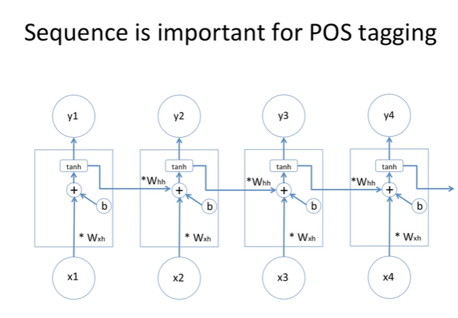
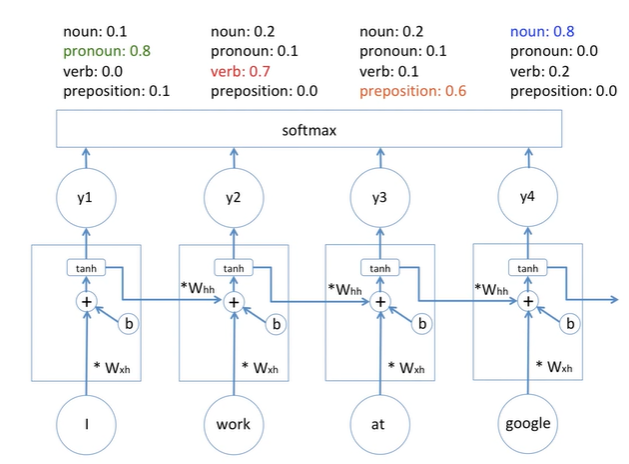
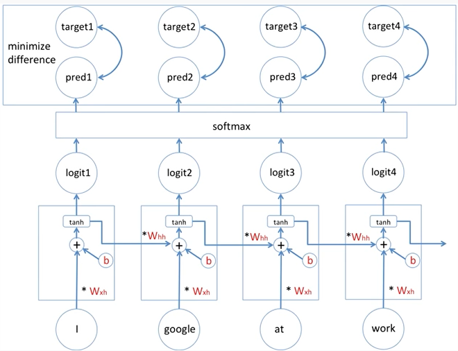
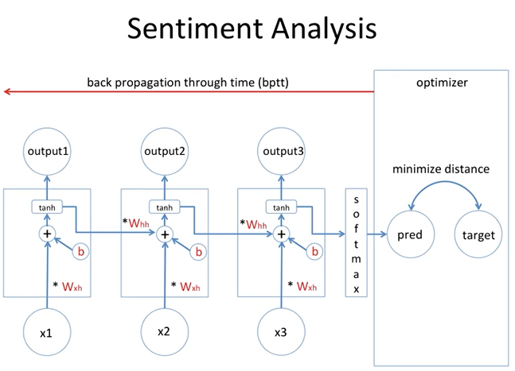
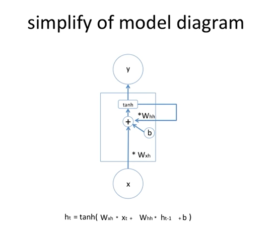
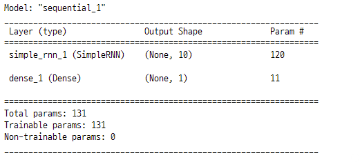
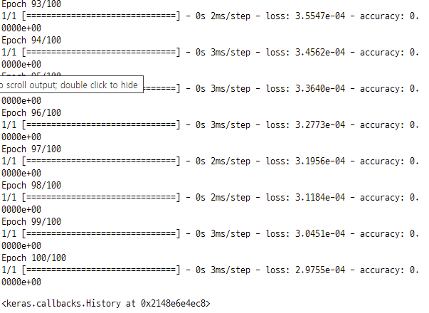
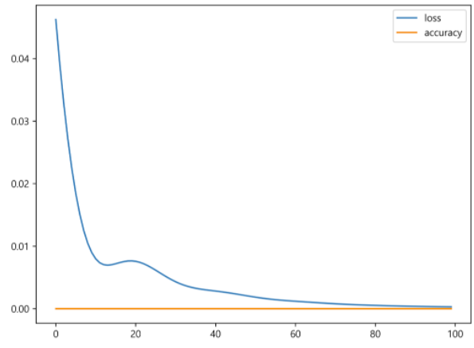
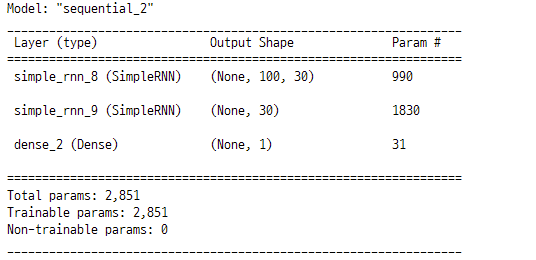
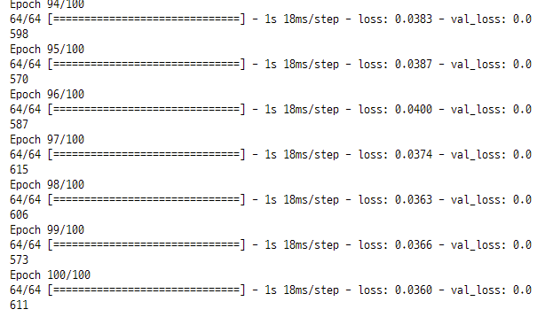

# RNN
- **Recurrent Neural Network** : 순환신경망
- **vanila RNN** : RNN의 여러가지 변형 중에서 기본이라는 의미

## 1. Sequence is important for Pos tagging
- 문장의 구조를 학습하고 추론하는 과정
    - 주어다음 동사, 동사 다음 목적어 
    - "i work at google" 에서 google을 판단할 때, i=대명사, work=동사, at=전치사를 추론한 각각의 값을 **이어 받아서**  명사라고 추론하는 구조이다.
    - 문자의 순서가 바뀌어도 그 자리에 오는 단어에 대해서 같은 형태소로 추론 해준다. 




### 1-1. 딥러닝 모델 구조 

- `input(x) - hidden_state - output(y)`
    - x_1 - h_1(cell) - y_1
    - input을 받은 hidden state(cell)에서는 output과 다음 h_state(cell)로 나가는 값이 동일하다. 

- `sell에는 두개의 가중치가 존재한다.`
    - input 값에 대한 w_xh
    - 이전 cell 들어온 값에 대한 w_hh

- `가중합 연산`
    - 현재 시점(cell)에 input된 x_2와 이전 시점(cell)에서 input된 값 두 개가 함께 고려된다.
    - 고려한다 : 더해준다. "+"
    - 즉 한 셀안에서 이전 셀의 값과 현재 들어온 값에 가중치를 곱하여 더한 **가중합**의 형태가 된다.

- `편향치 b 추가`
    - 각 셀의 가중합값에 편향치 b가 더 해진다. 
    - 딥러닝 학습 모델의 구조가 된다.

- `활성화 함수 tanh 추가`
    - output 값은 가중합이 활성화 함수를 통과한 결과 값이다.
    - 즉 활성화함수의 결과값이 cell output 값되고, 이 값이 다음 cell 넘겨진다.
    - 다음 sell에서는 이 활성화함수의 결과값을 다시 w_hh 가중치를 곱해서 넘겨받는다.
    - 활성화 함수가 추가됨으로써 딥러닝 모델이 비선형성이 된다.

- `카테고리 분류 : softmax 함수`
    - 각 sell에서의 결과값 y_1, y_2, y_3, y_4가 softmax 함수로 입력된다.
    - softmax함수는 벡터나 행렬을 입력받아서 조건부확률값의 형태로 바꿔준다.
    - 즉 softmax 함수는 라벨 데이터의 카테고리에 해당하는 품사의 종류마다 확률값으로 반환해준다. 
    - 각 y_i에 대한 품사의 종률를 확률값으로 반환해준다.
    - **supervised learning model** : 학습 데이터에 정답값이 주어진 모델



- `예측 prediction`
    - **logit** : softmax 함수의 input값
        - 각 sell의 결과값
    - **prediction** : softmax 함수의 output값



### 1-2. 모델의 학습
- 정답(target)과 예측값(pred)을 비교하여 이 둘의 차이를 줄여나가는 과정
    - **target** : 정답값, 라벨 데이터
- 가중치와 편향치 를 최적화 시켜준다. 
    - W_xh : 현재 input값의 가중치
    - W_hh : 이전 sell의 값의 가중치
    - b : 편향치 
- gradient decendent
    - 최적화할 값들을 조금씩 변형시켜주는 방법    
- BPTT : back propagation throgh time
    - 각 셀마다 W_xh, W_hh, b가 있지만 모델 구조상 각각 하나의 변수들이 변형된 것과 같다.
    - 하나의 변수를 변형하는 과정이므로 back propagation 이 아닌 **back propagation through time**이라고 부른다. 
    


## 2. Sentiment Analysis
- 문장의 감정을 수치화한 분석
    - 좋아요, 싫어요
    - happy, unhappy 등
- 최종 output 값을 예측해야하므로 softmax 함수가 마지막 cell 다음에 오게 된다.
- 주어진 정답값(targe)과 예측값(pred)값의 오차를 최소화하기 위한 최적화를 하게 된다.
- 최적화 방식은 bptt를 따른다. 
    - 하나의 변수를 조정한다. 
    - gradient decendent 방식으로 조정
    
## 3. simplify of model diagram
- RNN 모델 구조를 단순화하면 다음과 같다.
- output값을 출력해주는 활성화함수의 연산 : 가중합
- $h_t = tanh(W_{xh}x_t + W_{hh}h_{t-1} + b)$
    - 현재 input x_t와 가중치 W_xh의 곱
    - 이전 state의 값 h_t-1과 가중치 W_hh의 곱
    - 편향치 b 를 모두 더해준다.




### 참고
- https://www.youtube.com/watch?v=PahF2hZM6cs

## TensorFlow RNN

### 1. 라이브러리 임포트

```python
import tensorflow as tf

tf.__version__

>>>

'2.8.0'
```

### 2. time stamp 데이터 생성
- rnn 분석에 사용할 데이터 생성

```python
X = []
Y = []

for i in range(6) :
    lst = list(range(i, i + 4))
    X.append(list(map(lambda c : [c / 10], lst)))
    Y.append((i + 4) / 10)

X = np.array(X)
Y = np.array(Y)

for i in range(len(X)) :
    print(X[i], Y[i])

>>>

[[0. ]
 [0.1]
 [0.2]
 [0.3]] 0.4
[[0.1]
 [0.2]
 [0.3]
 [0.4]] 0.5
[[0.2]
 [0.3]
 [0.4]
 [0.5]] 0.6
[[0.3]
 [0.4]
 [0.5]
 [0.6]] 0.7
[[0.4]
 [0.5]
 [0.6]
 [0.7]] 0.8
[[0.5]
 [0.6]
 [0.7]
 [0.8]] 0.9
```

### 3. simple RNN model 생성
- input_shape=[timesteps, input_dim] 
- units : simple RNN 레이어에 존재하는 뉴런의 수
- return_sequences : 출력으로 시퀀스 전체를 출력할지 여부 설정

```python
model = tf.keras.Sequential([
    tf.keras.layers.SimpleRNN(units=10, return_sequences=False, input_shape=[4, 1]),
    tf.keras.layers.Dense(1)
])

model.compile(optimizer="adam", loss="mse", metrics="accuracy")
model.summary()
```



### 4. 모델 학습

```python
hist_sr = model.fit(X, Y, epochs=100, verbose=1)
hist_sr
```



### 5. 학습 결과
- 작은 길이의 데이터에서는 정확도가 높은 편이다.

```python
def plot_trainning_result(hist) :
    plot_target = ["loss", "accuracy"]

    for each in plot_target :
        plt.plot(hist.history[each], label=each)

plt.figure(figsize=(8, 6))
plot_trainning_result(hist_sr)
plt.legend()
plt.show() ; 	
```



### 6. 예측
- Y는 (i+4) / 10 이므로, 6 + 4 / 10 = 1
- 예측값이 1이 나올 수록 정확하다.

```python
model.predict(np.array([[[0.6], [0.7], [0.8], [0.9]]]))

>>>

array([[0.9631898]], dtype=float32)
```

#### 입력값을 바꿔서 예측
- -0.1 + 4 / 10 = 0.3
- 예측값이 0.3에 가깝게 나올수록 정확하다.

```python
model.predict(np.array([[[-0.1], [0.0], [0.1], [0.2]]]))

>>>

array([[0.22828916]], dtype=float32)
```

## 입력값이 큰 경우의 RNN
- 입력값이 커지면 RNN의 성능은 떨어진다.
- gradient vanishing 현상으로 인한 장기 의존성이 높아지기 때문이다.
    - LSTM summary에서 보충

### 1. 데이터 생성
- 균일분포의 데이터를 랜덤하게 생성
- 0~100 중 2개의 정수를 선택하여 idx 값으로 저장
- 원소가 100개인 영벡터 생성한 후 idx에 해당하는 값을 1로 저장
    - 인덱스가 2개 이므로 2개의 값이 바뀐다.
- X 데이터는 균일분포와 영벡터를 zip을 사용하여 합한다.
- Y 데이터는 균일분포 데이터에서 idx에 해당한는 값 2개를 곱한 후 저장한다. 

```python
X = []
Y = []

for i in range(3000) :
    lst = np.random.rand(100)
    idx = np.random.choice(100, 2, replace=False)
    zeros = np.zeros(100)
    zeros[idx] = 1
    X.append(np.array(list(zip(zeros, lst))))
    Y.append(np.prod(lst[idx]))

print(X[0], Y[0])

>>>

[[0.         0.12081525]
 [0.         0.92541031]
 [0.         0.8219348 ]
 [0.         0.42718652]
 [0.         0.67883278]
 [1.         0.78966009]
 [0.         0.09728805]
 [0.         0.62496675]
 [0.         0.70654689]
 [0.         0.31958938]
 [0.         0.76415308]
 [0.         0.74883606]
 [0.         0.4148991 ]
 ...]
```

- 데이터의 크기 확인

```python
len(X), len(Y), X[0].shape, Y[0].shape

>>>

(3000, 3000, (100, 2), ())
```

### 2. RNN 모델 생성

```python
model = tf.keras.Sequential([
    tf.keras.layers.SimpleRNN(units=30, return_sequences=True,
                              input_shape=[100, 2]),
    tf.keras.layers.SimpleRNN(units=30),
    tf.keras.layers.Dense(1)
])

model.compile(optimizer="adam", loss="mse")
model.summary()
```




### 3. 모델 학습

```python
X = np.array(X)
Y = np.array(Y)

history = model.fit(X[:2560], Y[:2560], epochs=100, validation_split=0.2)
```




### 4. 학습 결과
- loss 값과 val_loss 값의 차이가 점차 벌어진다.
- bptt 과정에서 vanishing 또는 exploding 문제가 발생하기 때문 

```python
import matplotlib.pyplot as plt
%matplotlib inline

plt.plot(history.history["loss"], 'b--', label="loss")
plt.plot(history.history["val_loss"], "r--", label="vla_lostt")
plt.xlabel("Epoch")
plt.legend()
plt.show() ;
```


