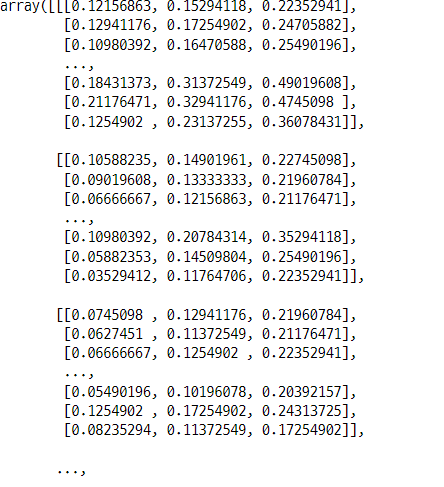

# 1. Pre-Trained Model
- 사전 훈련 모델
- 좋은 성능의 모델은 용량이나 구조가 매우 무겁다.
    - 모델이 무거울 수록 훈련시간이 오래 걸린다.
    - ResNet-50 : 8개의 P100 GPU를 29시간 학습해서 얻은 모델
    - Facebook 인공지능팀에서 이를 1시간으로 줄였다. GPU 256개 사용
- 연구자 또는 연구팀이 자신이 학습시킨 모델을 공개한다. 
- 이렇게 공개된 이미 훈련된 모델을 나의 분석에 사용할 수 있다.
    - 또는 전이학습에 이용할 수 있다. (Transfer Learning)

### 1-1. 모듈 설치, 임포트
- 가상환경 new_env에 tensorflow 가 설치 되어 있다.
    - jupyter notebook의 가상환경 이름은 ml_env로 되어 있다.
- jupyter notebook에서 pip를 사용하여 설치하면 new_env에 설치되지 않는 것 같다.
- new_env에 패키지 설치할 때는 아나콘트 프롬프트에서 가상환경 활성화 변경 후 설치해야 된다. 
    - jupyter notebook과 가상환경의 연결 프로세스 확인 해 볼것    

#### tensorflow_hub 설치
- 쥬피터 노트북에서 pip로 설치하면 base에서 설치 되는 것 같다.
- 아나콘다 프롬프트에서 가상환경을 new_env로 변경 후에 설치해야 된다.

```
pip install --upgrade tensorflow_hub
```

#### 현재 실행중인 가상환경 확인

```python
!conda info --envs

>>> print

# conda environments:
#
base                  *  C:\DS\Anaconda3
fc                       C:\DS\Anaconda3\envs\fc
new_env                  C:\DS\Anaconda3\envs\new_env
```

#### 아나콘다 프롬프트에서 현재 가상환경을 변경 후 설치함
- 텐서 플로우가 설치되어 있는 new_env 가상환경에 텐서 플로우 허브를 설치해주기 위해서
    - 쥬피터 노트북에서 pip로 설치하면 base에 설치 되는 것 같다.

```python
import tensorflow_hub as hub
```

#### 이미지 처리 패키지 opencv 설치
- 아나콘다 프롬프트에서
    - opencv-python==4.2.0.34 설치
    - opencv-contrib.python==4.2.0.34 설치

### 1-2. Mobile-net V2 사전훈련 모델 사용
- 구글 개발
- 계산 부담이 큰 컨볼루션 신경망(CNN)을 연산 성능이 제한된 모바일 환경에서도 작동가능하도록 구조를 경량화한 모델이다.
- 모델 경로
    - https://tfhub.dev/google/tf2-preview/mobilenet_v2/classification/2

### 1-3. Mobile-net V2 사전훈련 모델 임포트

```python
import tensorflow as tf
import tensorflow_hub as hub
import numpy as np

url = "https://tfhub.dev/google/tf2-preview/mobilenet_v2/classification/2"
model = tf.keras.Sequential([
    hub.KerasLayer(handle=url, input_shape=(224, 224, 3), trainable=False)
])

model.summary()
```


### 1-4. ImageNet V2
- 테스트용 이미지
- imagenet의 일부 데이터를 모아 놓음
- 아마존의 메커니컬 터크에서 배포
    - 사람의 수작업이 많이 필요한 이미지 라벨링 등을 위해 비교적 저렴한 가격으로 이미지를 제공하는 플랫폼
- **경로 바뀜**
    - https://s3-us-west-2.amazonaws.com/imagenetv2public/imagenetv2-top-images.tar.gz
    - 이미지넷 깃헙 : https://github.com/modestyachts/ImageNetV2

```python
import pathlib
import os

im_url = "https://s3-us-west-2.amazonaws.com/imagenetv2public/imagenetv2-top-images.tar.gz"
data_root_orig = tf.keras.utils.get_file("imagenetV2", im_url, cache_dir="./",
                                        extract=True)

data_root = pathlib.Path("./datasets/imagenetv2-top-images-format-val")
print(data_root)

>>> print

datasets\imagenetv2-top-images-format-val
```

- 이미지 파일 확인

```python
for idx, item in enumerate(data_root.iterdir()) :
    print(item)
    if idx == 9 :
        break

>>> print

datasets\imagenetv2-top-images-format-val\0
datasets\imagenetv2-top-images-format-val\1
datasets\imagenetv2-top-images-format-val\10
datasets\imagenetv2-top-images-format-val\100
datasets\imagenetv2-top-images-format-val\101
datasets\imagenetv2-top-images-format-val\102
datasets\imagenetv2-top-images-format-val\103
datasets\imagenetv2-top-images-format-val\104
datasets\imagenetv2-top-images-format-val\105
datasets\imagenetv2-top-images-format-val\106
```

### 1-5. 라벨 데이터 임포트
- 라벨 데이터를 텐서 플로우를 통해서 받는다.
    - label_url : https://storage.googleapis.com/download.tensorflow.org/data/imageNetLabels.txt
- 라벨 데이터에서 라벨에 사용할 부분을 떼어 내어 다른 객체에 저장한다.    

```python
label_url = "https://storage.googleapis.com/download.tensorflow.org/\
data/imageNetLabels.txt"
label_file = tf.keras.utils.get_file("label", label_url)
label_file

>>> print

'C:\\Users\\saint hong\\.keras\\datasets\\label'
```

- 라벨 부분만 떼어 내기

```python
label_text = None

with open(label_file, 'r') as f :
    label_text = f.read().split("\n")[:-1]

print(len(label_text))
print(label_text[:10])
print(label_text[-10:])

>>> print

1001
['background', 'tench', 'goldfish', 'great white shark', 'tiger shark', 'hammerhead', 'electric ray', 'stingray', 'cock', 'hen']
['buckeye', 'coral fungus', 'agaric', 'gyromitra', 'stinkhorn', 'earthstar', 'hen-of-the-woods', 'bolete', 'ear', 'toilet tissue']
```

### 1-6. 이미지 샘플링

#### 이미지가 저장되어 있는 주소 확인
- 괄호안에 있는 주소를 사용할 수 있다.

```python
all_image_paths = list(data_root.glob("*/*"))
all_image_paths[:10]

>>> print

[WindowsPath('datasets/imagenetv2-top-images-format-val/0/0af3f1b55de791c4144e2fb6d7dfe96dfc22d3fc.jpeg'),
 WindowsPath('datasets/imagenetv2-top-images-format-val/0/58fbc3e79ef15162b7726de04e98c90bb91a3055.jpeg'),
 WindowsPath('datasets/imagenetv2-top-images-format-val/0/83f4031ff33228b81c998261cd7139e62901d0ec.jpeg'),
 WindowsPath('datasets/imagenetv2-top-images-format-val/0/8e1374a4e20d7af22665b7749158b7eb9fa3826e.jpeg'),
 WindowsPath('datasets/imagenetv2-top-images-format-val/0/b29121a21b4011060eddae689e0b57c39f20e912.jpeg'),
 WindowsPath('datasets/imagenetv2-top-images-format-val/0/bcf8a5326180b5e9320642f5024096fbc8a5d454.jpeg'),
 WindowsPath('datasets/imagenetv2-top-images-format-val/0/c0c1167c3683ef5887a4803ee7c77ef2d1a93276.jpeg'),
 WindowsPath('datasets/imagenetv2-top-images-format-val/0/cc19eded6ed2e6a5b47b733552b97ba59c27d66d.jpeg'),
 WindowsPath('datasets/imagenetv2-top-images-format-val/0/e5cdec32ff335f3e036be8a9c41c616e74cce560.jpeg'),
 WindowsPath('datasets/imagenetv2-top-images-format-val/0/efae46d9adcc5d4578a91a028a259703ebd85ffe.jpeg')]
```

#### 이미지의 주소를 str로 만들고 리스트에 저장

```python
all_image_paths_2 = [str(path) for path in all_image_paths]
all_image_paths_2[:10]

>>> print

['datasets\\imagenetv2-top-images-format-val\\0\\0af3f1b55de791c4144e2fb6d7dfe96dfc22d3fc.jpeg',
 'datasets\\imagenetv2-top-images-format-val\\0\\58fbc3e79ef15162b7726de04e98c90bb91a3055.jpeg',
 'datasets\\imagenetv2-top-images-format-val\\0\\83f4031ff33228b81c998261cd7139e62901d0ec.jpeg',
 'datasets\\imagenetv2-top-images-format-val\\0\\8e1374a4e20d7af22665b7749158b7eb9fa3826e.jpeg',
 'datasets\\imagenetv2-top-images-format-val\\0\\b29121a21b4011060eddae689e0b57c39f20e912.jpeg',
 'datasets\\imagenetv2-top-images-format-val\\0\\bcf8a5326180b5e9320642f5024096fbc8a5d454.jpeg',
 'datasets\\imagenetv2-top-images-format-val\\0\\c0c1167c3683ef5887a4803ee7c77ef2d1a93276.jpeg',
 'datasets\\imagenetv2-top-images-format-val\\0\\cc19eded6ed2e6a5b47b733552b97ba59c27d66d.jpeg',
 'datasets\\imagenetv2-top-images-format-val\\0\\e5cdec32ff335f3e036be8a9c41c616e74cce560.jpeg',
 'datasets\\imagenetv2-top-images-format-val\\0\\efae46d9adcc5d4578a91a028a259703ebd85ffe.jpeg']
```

#### 이미지 주소를 랜덤하게 섞는다.

```python
import random

random.shuffle(all_image_paths_2)
image_count = len(all_image_paths_2)
print("image_count : ", image_count)
```

### 1-7. 이미지 확인
- 인물, 사물, 동물, 풍경 등의 다양한 이미지들이 들어 있다.
- 이미지 path에서 인덱스 번호에 해당하는 숫자를 가져온다. 
    - idx : 'datasets\\imagenetv2-top-images-format-val\\0\\efae46d9adcc5d4578a91a028a259703ebd85ffe.jpeg' 에서 0부분
    - split()으로 구분한 후 0의 위치인 -2를 인덱싱으로 사용한다.

```python
image_path.split("\\")[-2]

>>> print

'431'
```

```python
import matplotlib.pyplot as plt
%matplotlib inline

plt.figure(figsize=(12, 12))

for c in range(9) :
    image_path = random.choice(all_image_paths_2)
    plt.subplot(3, 3, c + 1)
    plt.imshow(plt.imread(image_path))
    
    ## path에서 인덱스 선택를 선택하고 +1 을 해준다.
    idx = int(image_path.split("\\")[-2]) + 1
    plt.title(str(idx) + ", " + label_text[idx])
    plt.axis("off")

plt.show()
```


### 1-8. 이미지 변환
- 이미지 크기 : (375, 500, 3) -> (224, 224, 3)
- 이미지 픽셀값 스케일링 : 맥스값으로 나누어 준다. 0~1사이의 값으로 스케일링
- 이미지 차원 : (224, 224, 3) -> (1, 224, 224, 3) : 3차원 텐서 -> 4차원 텐서 

#### 현재 이미지의 사이즈

```python
import cv2

img = random.choice(all_image_paths_2)
label = int(img.split("\\")[-2]) + 1
img_draw = cv2.imread(img)
img_draw
```


```python
img_draw.shape

>>> print

(375, 500, 3)
```

#### 이미지 사이즈 변환

```python
img_resized = cv2.resize(img_draw, dsize=(224, 224))
img_resized
img_resized.shape

>>> print

(224, 224, 3)
```

#### 이미지의 픽셀 최대값으로 스케일링
- 최대값으로 나누면 모든 값이 0~1 사이의 값으로 바뀐다.

```python
img_resized = img_resized / 255.0
img_resized
```


#### 이미지 행렬의 차원 확장
- 이미지의 모양을 (224, 224, 3)으로 변경한 상태
    - 3차원 텐서의 형태
- 이것을 4차원의 텐서 형태로 변환해준다.
    - (1, 224, 224, 3)

```python
img_resized = np.expand_dims(img_resized, axis=0)
img_resized
img_resized.shape

>>> print

(1, 224, 224, 3)
```

### 1-9. mobilenet-v2 사전훈련 모델로 이미지 예측
- 예측값 확인

```python
model.predict(img_resized)[0]

>>> print

array([ 0.2816033 , -1.324148  ,  1.5078083 , ..., -1.0896786 ,
       -0.64069706,  0.5398828 ], dtype=float32)
```

#### 예측값 중에서 값이 가장 큰 상위 5개만 선택
    - argsort()를 사용하면 값이 큰 순서대로 정렬 해준다. 
    - 이것을 [::-1]을 사용하여 인덱싱하여 순서를 뒤집어 준다. 
    - 앞에서 큰 5개를 선택한다.

```python
top_5_predict = model.predict(img_resized)[0].argsort()[::-1][:5]
top_5_predict

>>> print

array([355, 297, 356, 170, 592], dtype=int64)
```

#### 예측값 확인

```python
for pred in top_5_predict :
    print(label_text[pred])

>>> print

Arabian camel
ice bear
llama
borzoi
handkerchief
```

#### top 5 예측값 중에 정답이 있는지 확인

```python
print("pred num : {}".format(top_5_predict))
print("pred name : {}".format([label_text[pred] for pred in top_5_predict]))
print(label)
if label in top_5_predict :
    print("Answer is correct !!")
print("Predicted Answer is ", label_text[label])

plt.imshow(plt.imread(img)) ;
```

### 1-10. softmax 함수 직접 계산
- random.choices로 선택한 이미지를 예측한 값을 softmax 함수를 만들어 조건부확률 값으로 변환
- 이 사전훈련 모델은 softmax 함수가 적용되어 있지 않은 것 같다.
- 예측값 만으로도 값이 큰 순서로 정렬하여 어떤 카테고리인지 확인은 가능하다.

#### softmax 함수

```python
def softmax(x) :
    e_x = np.exp(x - np.max(x))
    return e_x / e_x.sum(axis=0)
```

#### 사전훈련 모델로 이미지를 예측
- 1001 개의 카테고리에 대한 예측값이 반환된다.
- 이 사전훈련 모델에는 softmax 함수가 적용되지 않았다.

```python
logits = model.predict(img_resized)[0]
logits

>>> print

array([ 0.2816033 , -1.324148  ,  1.5078083 , ..., -1.0896786 ,
       -0.64069706,  0.5398828 ], dtype=float32)

len(logits)

>>> print

1001
```

#### 사전훈련 모델의 예측값을 softmax 함수를 적용하여 조건부확률 형태로 변환

```python
prediction = softmax(logits)
prediction

>>> print

array([1.0615039e-04, 2.1308497e-05, 3.6178937e-04, ..., 2.6939006e-05,
       4.2205753e-05, 1.3743303e-04], dtype=float32)
```


#### 조건부 확률값이 큰 5가지를 선택
- argsort()는 인덱스를 반환 해 준다.

```python
top_5_predict = prediction.argsort()[::-1][:5]
top_5_predict

>>> print

array([355, 297, 356, 170, 592], dtype=int64)
```

#### 5가지의 라벨 확인

```python
labels = [label_text[index] for index in top_5_predict]
labels

>>> print

['Arabian camel', 'ice bear', 'llama', 'borzoi', 'handkerchief']
```

### 1-11. 예측 확률값 시각화
- 분류문제의 결과로 반환 된 이미지의 예측 확률값
    - 카테고리별로 조건부확률값과 같다.
    - 카테고리값이 10개면 10개의 확률값이 반환된다.
    - softmax의 결과값
- 실제 정답인 idx(355, 낙타)가 예측값 리스트에 있으면 칼라 리스트의 같은 인덱스를 "green"으로 바꾼다.    

```python
plt.figure(figsize=(14, 4))
plt.subplot(1, 2, 1)
plt.imshow(plt.imread(img))
idx = int(img.split("\\")[-2]) + 1
plt.title(str(idx) + ", " + label_text[idx])
plt.axis("off")

plt.subplot(1, 2, 2)
color = ["gray"] * 5
if idx in top_5_predict :
    color[top_5_predict.tolist().index(idx)] = "green"

color = color[::-1]
plt.barh(range(5), prediction[top_5_predict][::-1] * 100, color=color)
plt.yticks(range(5), labels[::-1])

plt.show() ;
```

#### 특정한 값만 그래프 색깔을 바꾸기 위한 코드
- 그래프의 막대 인덱스에 해당하는 칼라 리스트

```python
test = ["gray"] * 5
test

>>> print

['gray', 'gray', 'gray', 'gray', 'gray']
```

- 예측값 중에서 조건부확률이 가장 높은 것의 인덱스

```python
top_5_predict.tolist().index(355)

>>> print

0
```

- img의 인덱스 번호가 예측값 리스트에 있는지 확인 하고 해당 인덱스의 칼라 값을 변경

```python
test_idx = int(img.split("\\")[-2]) + 1
test_color = ["gray"] * 5
if test_idx in top_5_predict :
    test_color[top_5_predict.tolist().index(test_idx)] = "green"

test_color

>>> print

['green', 'gray', 'gray', 'gray', 'gray']
```

# 2. Transfer Learning
- 전이학습
- 사전훈련 모델에 전이학습을 적용

### 2-1. 데이터 임포트
- 개의 이미지와 품종 라벨이 들어 있는 데이터
- url : https://www.kaggle.com/c/dog-breed-identification/data
- 케글에서 파일 다운로드

```python
!ls ../../all_data/dog_data

>>> print

labels.csv
sample_submission.csv
test
train
```

### 2-2. label 데이터 확인
- 10222개의 이미지
- 120 품종

```python
import pandas as pd

label_text = pd.read_csv("../../all_data/dog_data/labels.csv")
print(label_text.head())

                                 id             breed
0  000bec180eb18c7604dcecc8fe0dba07       boston_bull
1  001513dfcb2ffafc82cccf4d8bbaba97             dingo
2  001cdf01b096e06d78e9e5112d419397          pekinese
3  00214f311d5d2247d5dfe4fe24b2303d          bluetick
4  0021f9ceb3235effd7fcde7f7538ed62  golden_retriever
```

#### 데이터 정보 확인

```python
label_text.info()
```


#### 데이터 프레임 확인

```python
label_text.head()
```


#### 카테고리값의 종류
- 라벨값의 종류 : 품종의 종류

```python
label_text["breed"].nunique()

>>> print

120
```

### 2-3. 이미지 샘플 확인

```python
plt.figure(figsize=(12, 8))

for c in range(6) :
    image_id = label_text.loc[c, "id"]
    plt.subplot(2, 3, c + 1)
    plt.imshow(plt.imread("../../all_data/dog_data//train/" + image_id + ".jpg"))
    plt.title(str(c) + ", " + label_text.loc[c, "breed"])
    plt.axis("off")

plt.show() ;
```


### 2-4. mobilenet-V2 사전훈련 모델 임포트

```python
from tensorflow.keras.applications import MobileNetV2

mobilev2 = MobileNetV2()
mobilev2

>>> print

<keras.engine.functional.Functional at 0x146deb05048>
```

#### mobilenet-V2 모델의 레이어 확인

```python
mobilev2.summary()
```


#### 소프트맥스 함수를 적용한 레이어 생성

```python
predictions = tf.keras.layers.Dense(120, activation="softmax")(x)
predictions

>>> print

<KerasTensor: shape=(None, 120) dtype=float32 (created by layer 'dense')>
```

#### 전이학습????
- 사전훈련 모델을 tensorflow model에 input
- 어떤 의미인지 확인 해 볼 것
- 변수의 갯수가 더 줄어들었다.

```python
model = tf.keras.Model(inputs=mobilev2.input, outputs=predictions)
model.summary()
```


### 2-5. 네트워크 구조의 마지막 20개 레이어만 학습
- 156개의 레이어들이 신경망을 구성하고 있다.

#### 레이어의 갯수

```python
len(model.layers)

>>> print

156
```
#### 레이어 10개만 확인
- 리스트에 레이어의 이름들이 들어 있다.

```python
model.layers[0:10]

>>> print

[<keras.engine.input_layer.InputLayer at 0x146dea2d2c8>,
 <keras.layers.convolutional.Conv2D at 0x146dce82888>,
 <keras.layers.normalization.batch_normalization.BatchNormalization at 0x146e059f888>,
 <keras.layers.advanced_activations.ReLU at 0x146ddfac948>,
 <keras.layers.convolutional.DepthwiseConv2D at 0x146dcc52348>,
 <keras.layers.normalization.batch_normalization.BatchNormalization at 0x146dcec5308>,
 <keras.layers.advanced_activations.ReLU at 0x146ddf43ac8>,
 <keras.layers.convolutional.Conv2D at 0x146dcea7448>,
 <keras.layers.normalization.batch_normalization.BatchNormalization at 0x146cf16db48>,
 <keras.layers.convolutional.Conv2D at 0x146dcea7608>]
```

#### 학습에 사용할 layer와 사용하지 않을 layer를 설정할 수 있다.
- 학습해야할 변수(파라미터)의 수가 줄어든다.
    - layer.trainable 값을 True, False 로 설정하면 사용여부를 선택할 수 있다.
    - 0~135 까지는 사용하지 않고, 136~156 까지 20개만 사용

```python
for layer in model.layers[:-20] :
    layer.trainable = False
for layer in model.layers[-20:] :
    layer.trainable = True

model.compile(optimizer="sgd", loss="sparse_categorical_crossentropy",
             metrics=["accuracy"])
model.summary()
```


### 2-6. train x 데이터 생성
- 이미지 데이터의 사이즈를 변환한다.
- 이미지의 픽셀값을 스케일링 한다.

```python
train_X = []
for i in range(len(label_text)) :
    img = cv2.imread("../../all_data/dog_data/train/" + label_text["id"][i] + ".jpg")
    img = cv2.resize(img, dsize=(224, 224))
    img = img / 255.0
    train_X.append(img)

train_X = np.array(train_X)
print(train_X.shape)
print(train_X.size * train_X.itemsize, ' bytes')

(10222, 224, 224, 3)
12309577728  bytes

>>> print

(10222, 224, 224, 3)
12309577728  bytes
```

#### 이미지 데이터 확인

```python
train_X[1]
```


### 2-7. train y 데이터 생성
- 120개의 품종을 중복값 없이 유니크한 값으로 정렬한 리스트를 만든다.
- 데이터 프레임의 품종 컬럼의 값을 이 리스트에서 일치하는 값의 인덱스로 변환한다.
    - 카테고리값을 숫자로 변환한 것과 같다.
    - boston_bull = 0
    - dingo = 1

```python
unique_Y = label_text["breed"].unique().tolist()
train_Y = [unique_Y.index(breed) for breed in label_text["breed"]]
train_Y = np.array(train_Y)

print(train_Y[:10])
print(train_Y[-10:])

>>> print

[0 1 2 3 4 5 5 6 7 8]
[34 87 91 63 48  6 93 63 77 92]
```

### 2-8. 모델 학습
- 전이학습 시간도 오래걸림 (30분)
- 전이학습이 아니면 시간이 더 오래 걸린다.
    - 사전학습 모델 자체가 무겁기 때문이다.

```python
history = model.fit(train_X, train_Y, epochs=10,
                   validation_split=0.25, batch_size=32)		
```


### 2-9. 학습 결과

```python
plot_target = ["loss", "val_loss", "accuracy", "val_accuracy"]
ls = ["b-", "r--", "g-", "k--"]
plt.figure(figsize=(12, 10))

for idx, t in enumerate(plot_target) :
    plt.plot(history.history[t], ls[idx], label=t)
    plt.xlabel("Epochs")

plt.legend()
plt.show() ;
```

