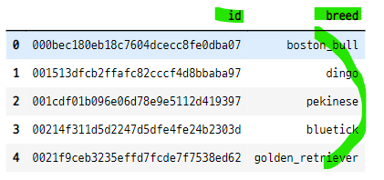
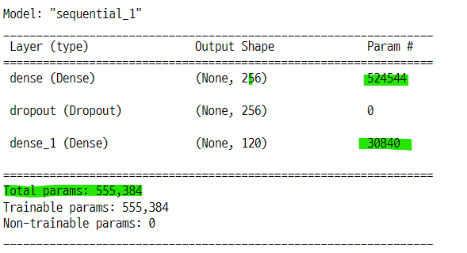
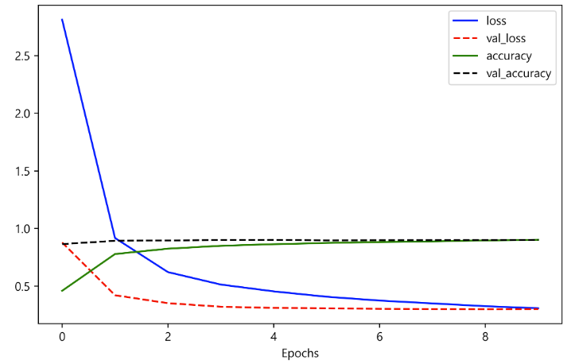

# feature extractor
- `feature extractor` : 특징 추출기
- 미리 훈련된 모델에서는 데이터의 특징만 추출
- 그 특징을 작은 네트워크에 통과시켜 예측하는 방법
- 학습할때 전체 네트워크의 계산을 반복할 필요가 없음.

### inception V3
- 2014년 구글이 ImageNet이라는 대회에서 발표한 GoogleNet 이름의 CNN 기반 모델

### 1. Inception V3 임포트
- ``사전훈련 모델``
    - https://tfhub.dev/google/tf2-preview/inception_v3/feature_vector/4
    - **Inception V3 모델의 특징 벡터 추출 모델에 해당한다.**
    - inception_v3/classification/4 분류 모델도 있다.
    - hub.KerasLayer을 통해 사용할 수 있다.
    - 파라미터의 갯수가 2천1백만개나 된다.
- ``입력`` : 이미지의 특징 벡터 : 크기 : 2048
    - 일반적인 이미지의 색상값 : 0~1 범위의 값
    - 입력 이미지의 크기 : height x width = 299 x 299
- ``fine-tuning`` : trainable=True : hub.KerasLayer에 전달하여 모델을 미세 조정할 수 있다.
- ``출력`` : 특징 벡터의 배치
    - tf.keras.layers.Dense(num_clases, activation="softmax")로 이미지 분류 사용가능
    - 모델의 무게가 커서 오래걸릴 수 있다.
- **InceptionV3 모델을 통해 이미지의 특징 벡터를 추출한 후 작은 네트워크를 통해 예측한다.**

#### 텐서플로우 임포트, 버전 확인

```python
import tensorflow as tf
import tensorflow_hub as hub

tf.__version__

>>> print

'2.8.0'
```

#### 특징 추출기 모델 임포트
- inception_v3

```python
inception_url = "https://tfhub.dev/google/tf2-preview/inception_v3/feature_vector/4"
feature_model = tf.keras.Sequential([
    hub.KerasLayer(inception_url, output_shape=(2048, ), trainable=False)
])

feature_model.build([None, 299, 299, 3])
feature_model.summary()
```


### 2. dog data 임포트
- 120개의 카테고리 값(품종)으로 이루어진 데이터
    - id와 breed 특징벡터로 이루어져 있다.

#### 파일 위치 확인
- labels.csv 파일을 임포트 한다.

```python
!ls ../../all_data/dog_data

>>> print

labels.csv
sample_submission.csv
test
train
train_sub
```

#### 라벨 데이터를 데이터 프레임으로 변환

```python
import pandas as pd
import numpy as np

label_text = pd.read_csv("../../all_data/dog_data/labels.csv")
label_text.head()
```


#### 라벨 데이터의 유니크 값의 갯수

```python
label_text["breed"].nunique()

>>> print

120
```

#### 이미지 확인
- 훈련데이터의 path + 라벨데이터에서 id값 + jpg확장자

```python
plt.figure(figsize=(12, 8))

for c in range(6) :
    image_id = label_text.loc[c, "id"]
    plt.subplot(2, 3, c + 1)
    plt.imshow(plt.imread("../../all_data/dog_data/train/" + image_id + ".jpg"))
    plt.title(str(c) + ", " + label_text.loc[c, "breed"])
    plt.axis("off")

plt.show() ;
```


### 3. image data generator를 위한 훈련 이미지 분류 저장
- imagedatagenerator는 사진 데이터를 증강하는 기능이 있다.
- 사진데이터가 너무 많아서 메모리 부족현상이 나타날 수 있다.
- 이럴때는 imagedatagenrator를 이용하면 필요할 때마다 디스크에서 배치 크기만큼 조금씩 데이터를 읽을 수 있다.
    - **이미지 데이터를 사용하려면 각 라벨(카테고리값)의 이름을 하위 폴더로 가지고 있도록 세팅해야한다.**
    - 즉 품종 별로 디렉토리를 만들고 이미지를 품종에 따라 복사, 저장한다.

#### 라벨 폴더를 생성할 상위폴더 생성
- 학습할 데이터가 있는 디렉토리에 train_sub 새로운 디렉토리 생성

```python
import os
import shutil

os.mkdir("../../all_data/dog_data/train_sub")

!ls ../../all_data/dog_data

>>> print

labels.csv
sample_submission.csv
test
train
train_sub
```

#### train_sub 폴더에 라벨이름으로 된 하위 폴더 생성
- 중복된 이름이 없는 경우에만 폴더를 생성한다.
    - 따라서 품종의 갯수만큼 폴더가 만들어진다.
- dog data의 훈련용 이미지를 새로 만든 품종 폴더에 복사 저장한다.
    - **shutil.copy(원본 url, 붙여넣기 할 url)**
    - 즉 이미지를 품종에 맞는 폴더에 따로 분류해서 저장하는 것과 같다.
- tqdm() 프로세스 바를 임포트하여 진행 과정을 확인 한다.

```python
from tqdm import tqdm

dog_url = "../../all_data/dog_data/"

for i in tqdm(range(len(label_text)), desc="make dir", mininterval=0.01 ) :
    if os.path.exists(dog_url + "train_sub/" + label_text.loc[i]["breed"]) == False :
        os.mkdir(dog_url + "train_sub/" + label_text.loc[i]["breed"])
    shutil.copy(dog_url + "train/" + label_text.loc[i]["id"] + ".jpg",
               dog_url + "train_sub/" + label_text.loc[i]["breed"])

>>> print

make dir: 100%|██████████| 10222/10222 [01:16<00:00, 134.48it/s]
```

#### 생성된 폴더의 개수는 라벨데이터의 유니크 값과 같다.

```python
len(os.listdir(dog_url + "train_sub"))

>>> print

120

label_text["breed"].nunique()

>>> print

120
```

#### boston_bull 폴더안의 이미지 갯수
- boston_bull 품종 폴더에 저장 된 이미지의 갯수는 87개이다.

```python
len(os.listdir(dog_url + "train_sub/" + label_text.loc[0]["breed"]))

>>> print

87
```

### 4. imagedatagenerator 생성
- imagedatagenerator 관련 API
    - https://www.tensorflow.org/api_docs/python/tf/keras/preprocessing/image/ImageDataGenerator
- 훈련용 데이터 설정
    - `rescale` : 픽셀을 정규화 : 픽셀값의 최대값인 255로 나누어 준다. 0~1사이의 값으로 정규화
    - `horizontal_flip` : 좌우반전 : 수평으로 뒤집기
    - `shear_range` : 반시계 방향 전단 각도 : 기울이기 (전단 강도라는 공학개념 있음)
    - `zoom_range` : 확대, 축소 설정
    - `width_shift_range` : 좌우 평행이동
    - `height_shift_range` : 상하 평행이동
- 테스트용 데이터 설정
    - 픽셀 정규화만 적용

#### 훈련 데이터용 이미지 제너레이터와 검증 데이터용 이미지 제너레이터 생성

```python
from tensorflow.keras.preprocessing.image import ImageDataGenerator
from tensorflow.keras.applications.inception_resnet_v2 import preprocess_input

train_datagen = ImageDataGenerator(rescale=1./255., horizontal_flip=True,
                                  shear_range=0.2, zoom_range=0.2,
                                  width_shift_range=0.2, height_shift_range=0.2,
                                  validation_split=0.25)

valid_datagen = ImageDataGenerator(rescale=1./255., validation_split=0.25)
```

### 5. 데이터 생성
- imagedatagenerator api에서 flow_from_directory 참조
    - flow_from_dataframe 모듈도 있다.
- 새로 만든 품종 폴더에서 이미지를 꺼내서 훈련, 검증에 사용하는 방식    

```python
image_size = 299
batch_size = 32
dog_url = "../../all_data/dog_data/"

train_generator = train_datagen.\
flow_from_directory(directory=dog_url + "train_sub/",
                    subset="training", batch_size=batch_size,
                    seed=13, shuffle=True, class_mode="categorical",
                    target_size=(image_size, image_size))

valid_generator = valid_datagen.\
flow_from_directory(directory=dog_url + "train_sub/",
                   subset="validation", batch_size=1,
                   seed=13, shuffle=True,
                   class_mode="categorical", target_size=(image_size, image_size))

>>> print

Found 7718 images belonging to 120 classes.
Found 2504 images belonging to 120 classes.
```

#### 이미지 제너레이터 객체

```python
train_generator

>>> print

<keras.preprocessing.image.DirectoryIterator at 0x22dc906bd88>

valid_generator

>>> print

<keras.preprocessing.image.DirectoryIterator at 0x22dc91916c8>
```

### 6. 훈련데이터를 특징 벡터로 변환
- ``x, y = train_generator.next()``
    - 훈련이미지 생성기에서 다음 batch 만큼 이동한다.
    - 즉 dog img를 위에서 설정한 값데로 변형하여 이미지의 벡터값과 카테고리 라벨데이터로 반환한다. 
    - 값의 정확한 의미는 더 알아 볼 것
- ``feature_model.predict(x)``
    - 현재 모델은 Inception_V3 모델의 feature_vector 추출 모델이다. 
    - 이 값이 이미지의 특징 벡터?(배치) 값이다.
- 시간 오래걸린다. 
    - 20분 이상

#### batch step 값 확인

```python
(7718 * 3) // batch_size

>>> print

723
```

#### 특징 벡터 변환

```python
from tqdm import tqdm

batch_step = (7718 * 3) // batch_size
train_features = []
train_Y = []

for idx in tqdm(range(batch_step), desc="transform", mininterval=0.01) :
    x, y = train_generator.next()
    train_Y.extend(y)

    feature = feature_model.predict(x)
    train_features.extend(feature)

train_features = np.array(train_features)
train_Y = np.array(train_Y)

>>> print

transform: 100%|██████████| 723/723 [22:35<00:00,  1.87s/it]

print(train_features.shape)
print(train_Y.shape)

>>> print

(23058, 2048)
(23058, 120)
```

#### inception_v3 모델을 사용하여 추출한 이미지의 특징 벡터들
- 23058개의 행, 2048개의 열로 이루어져 있는 텐서

```python
train_features[:3]

>>> print

array([[0.25885704, 0.23362869, 0.41311187, ..., 0.09414279, 0.19174461,
        0.61206704],
       [0.11117902, 0.5666669 , 0.15018946, ..., 0.8774555 , 0.3867059 ,
        0.1982957 ],
       [0.32686925, 0.32665995, 0.18242414, ..., 0.17517401, 0.72029376,
        0.38720524]], dtype=float32)
```

#### inception_v3 모델을 사용하여 추출한 카테고리 라벨 데이터들
- 23058개의 행, 120개의 열로 이루어져 있는 텐서
    - 이미지지 마다 라벨값이 dummy 형태로 되어 있다.
    - 120개 품종중에서 해당하는 품종의 인덱스에 1값이 저장되어 있다.

```python
train_Y[:3]

>>> print

array([[0., 0., 0., 0., 0., 0., 0., 0., 0., 0., 0., 0., 0., 0., 0., 0.,
        0., 0., 0., 0., 0., 0., 0., 0., 0., 0., 0., 0., 0., 0., 0., 0.,
        0., 0., 0., 0., 0., 0., 0., 0., 0., 0., 0., 0., 0., 0., 0., 0.,
        0., 0., 0., 0., 0., 0., 0., 0., 0., 0., 0., 0., 0., 0., 0., 0.,
        0., 0., 0., 0., 0., 0., 0., 0., 0., 0., 0., 0., 0., 0., 0., 0.,
        0., 0., 0., 0., 0., 0., 0., 0., 0., 0., 1., 0., 0., 0., 0., 0.,
        0., 0., 0., 0., 0., 0., 0., 0., 0., 0., 0., 0., 0., 0., 0., 0.,
        0., 0., 0., 0., 0., 0., 0., 0.],
       [0., 0., 0., 0., 0., 0., 0., 0., 0., 0., 0., 0., 0., 0., 0., 0.,
        0., 0., 0., 0., 0., 0., 0., 0., 0., 0., 0., 0., 0., 0., 0., 0.,
        0., 0., 0., 0., 0., 0., 0., 0., 0., 0., 0., 0., 0., 0., 0., 0.,
        0., 0., 0., 0., 0., 0., 0., 1., 0., 0., 0., 0., 0., 0., 0., 0.,
        0., 0., 0., 0., 0., 0., 0., 0., 0., 0., 0., 0., 0., 0., 0., 0.,
        0., 0., 0., 0., 0., 0., 0., 0., 0., 0., 0., 0., 0., 0., 0., 0.,
        0., 0., 0., 0., 0., 0., 0., 0., 0., 0., 0., 0., 0., 0., 0., 0.,
        0., 0., 0., 0., 0., 0., 0., 0.],
       [0., 0., 0., 0., 0., 0., 0., 0., 0., 0., 0., 0., 0., 0., 0., 0.,
        0., 0., 0., 0., 0., 0., 0., 0., 0., 0., 0., 0., 0., 0., 0., 0.,
        0., 0., 0., 0., 0., 0., 1., 0., 0., 0., 0., 0., 0., 0., 0., 0.,
        0., 0., 0., 0., 0., 0., 0., 0., 0., 0., 0., 0., 0., 0., 0., 0.,
        0., 0., 0., 0., 0., 0., 0., 0., 0., 0., 0., 0., 0., 0., 0., 0.,
        0., 0., 0., 0., 0., 0., 0., 0., 0., 0., 0., 0., 0., 0., 0., 0.,
        0., 0., 0., 0., 0., 0., 0., 0., 0., 0., 0., 0., 0., 0., 0., 0.,
        0., 0., 0., 0., 0., 0., 0., 0.]], dtype=float32)
```

#### keras iterator test
- next() 메서드는 어떤 기능을 하는지 확인
    - [(229, 229, 3)]의 행렬이 160개로 이루어져 있는 텐서의 형태로 만들어 준다.

```python
test_size = 5
x_feature = []
y_feature = []

for idx in range(test_size) :
    print(idx)
    x, y = train_generator.next()
    x_feature.extend(x)
    y_feature.extend(y)

>>> print

0
1
2
3
4
```

- x.feature 리스트의 길이

```python
len(x_feature)

>>> print

160
```

- x.feature 한 개의 크기 : 160개의 행렬 중 크기가 다른 경우 저장

```python
temp = []
for i in range(len(x_feature)) :
    if x_feature[i].shape not in temp :
        temp.append(x_feature[i].shape)

temp

>>> print

[(299, 299, 3)]
```

### 7. 검증데이터에서 특징 벡터 추출

```python
from tqdm import tqdm
import time

valid_features = []
valid_Y = []

for idx in tqdm(range(valid_generator.n), desc="valid feat", mininterval=0.01) :
    x, y = valid_generator.next()
    valid_Y.extend(y)

    feature = feature_model.predict(x)
    valid_features.extend(feature)

valid_features = np.array(valid_features)
valid_Y = np.array(valid_Y)

>>> print

valid feat: 100%|██████████| 2504/2504 [04:20<00:00,  9.62it/s]


print(valid_features.shape)
print(valid_Y.shape)

>>> print

(2504, 2048)
(2504, 120)
```

#### 검증데이터의 특징 벡터 확인

```python
## 특징값
valid_features[0]

>>> print

array([0.23134774, 0.12438712, 0.09621695, ..., 0.13003205, 0.3212153 ,
       0.03164997], dtype=float32)

## 종속값
valid_Y[0]

>>> print

array([0., 0., 0., 0., 0., 0., 0., 0., 0., 0., 0., 0., 0., 0., 0., 0., 0.,
       0., 0., 0., 0., 0., 0., 0., 0., 0., 0., 0., 0., 0., 0., 0., 0., 0.,
       0., 0., 0., 0., 0., 0., 0., 0., 0., 0., 0., 0., 0., 0., 0., 0., 0.,
       0., 0., 0., 0., 0., 0., 0., 0., 0., 0., 0., 0., 0., 0., 0., 0., 0.,
       0., 0., 0., 0., 0., 0., 0., 0., 0., 0., 0., 0., 0., 0., 0., 1., 0.,
       0., 0., 0., 0., 0., 0., 0., 0., 0., 0., 0., 0., 0., 0., 0., 0., 0.,
       0., 0., 0., 0., 0., 0., 0., 0., 0., 0., 0., 0., 0., 0., 0., 0., 0.,
       0.], dtype=float32)
```

### 8. 모델 확립
- 현재 진행 중인 실험의 의미
    - **dog 이미지에서 더 높은 수준의 특징을 뽑아내기 위한 사전훈련 모델로 Inception_V3의 feature_vector 추출 모델을 사용**
    - 이 모델에서 반환 된 값으로 좀 더 작은 네트워크 모델을 사용하여 예측하는 과정
- 모델에 사용한 인수들
    - 1st activation : relu (BPTT의 vanishing 현상을 줄이기 위한 방법)
    - last activation : softmax (조건부확률 값으로 반환하기 위한 방법)
    - optimizer : RMSprop (Adagrad 에서 변형된 방법, 스텝사이즈를 맥락에 맞게 줄이는 방법)
    - loss : categorical_crossentropy (loss를 줄여주기 위한 방법, input 데이터를 원핫인코딩 형태로 변환해주는 기능을 한다.)
    - Dropout layer : 과최적화 문제를 줄이기 위해서 학습중에 일부러 정보를 누락시키는 방법
        - 뉴럴넷의 특정 노드를 끄는 방식

```python
model = tf.keras.Sequential([
    tf.keras.layers.Dense(256, activation="relu", input_shape=(2048,)),
    tf.keras.layers.Dropout(0.5),
    tf.keras.layers.Dense(120, activation="softmax")
])

model.compile(tf.optimizers.RMSprop(0.0001), loss="categorical_crossentropy", \
metrics=["accuracy"])

model.summary()
```


### 9. 모델 학습

```python
start = time.time()
hist = model.fit(train_features, train_Y,
                validation_data=(valid_features, valid_Y),
                epochs=10, batch_size=32)
print("fit time : {}".format(time.time() - start))
```


### 10. 학습결과

```python
plot_target = ["loss", "val_loss", "accuracy", "val_accuracy"]
line_style = ["b-", "r--", "g-", "k--"]

for idx, target in enumerate(plot_target) :
    plt.plot(hist.history[target], line_style[idx], label=target)


plt.xlabel("Epochs")
plt.legend()
plt.show() ;
```


### 11. 샘플 데이터 추출을 위해 라벨을 알파벳 순으로

```python
import os

unique_Y = os.listdir(dog_url + "train_sub")
unique_Y
```


- 정렬

```python
unique_sorted_Y = sorted(unique_Y)
print(unique_sorted_Y)

>>> print

['affenpinscher', 'afghan_hound', 'african_hunting_dog', 'airedale', 'american_staffordshire_terrier', 'appenzeller', 'australian_terrier', 'basenji', 'basset', 'beagle', 'bedlington_terrier', 'bernese_mountain_dog', 'black-and-tan_coonhound', 'blenheim_spaniel', 'bloodhound', 'bluetick', 'border_collie', 'border_terrier', 'borzoi', 'boston_bull', 'bouvier_des_flandres', 'boxer', 'brabancon_griffon', 'briard', 'brittany_spaniel', 'bull_mastiff', 'cairn', 'cardigan', 'chesapeake_bay_retriever', 'chihuahua', 'chow', 'clumber', 'cocker_spaniel', 'collie', 'curly-coated_retriever', 'dandie_dinmont', 'dhole', 'dingo', 'doberman', 'english_foxhound', 'english_setter', 'english_springer', 'entlebucher', 'eskimo_dog', 'flat-coated_retriever', 'french_bulldog', 'german_shepherd', 'german_short-haired_pointer', 'giant_schnauzer', 'golden_retriever', 'gordon_setter', 'great_dane', 'great_pyrenees', 'greater_swiss_mountain_dog', 'groenendael', 'ibizan_hound', 'irish_setter', 'irish_terrier', 'irish_water_spaniel', 'irish_wolfhound', 'italian_greyhound', 'japanese_spaniel', 'keeshond', 'kelpie', 'kerry_blue_terrier', 'komondor', 'kuvasz', 'labrador_retriever', 'lakeland_terrier', 'leonberg', 'lhasa', 'malamute', 'malinois', 'maltese_dog', 'mexican_hairless', 'miniature_pinscher', 'miniature_poodle', 'miniature_schnauzer', 'newfoundland', 'norfolk_terrier', 'norwegian_elkhound', 'norwich_terrier', 'old_english_sheepdog', 'otterhound', 'papillon', 'pekinese', 'pembroke', 'pomeranian', 'pug', 'redbone', 'rhodesian_ridgeback', 'rottweiler', 'saint_bernard', 'saluki', 'samoyed', 'schipperke', 'scotch_terrier', 'scottish_deerhound', 'sealyham_terrier', 'shetland_sheepdog', 'shih-tzu', 'siberian_husky', 'silky_terrier', 'soft-coated_wheaten_terrier', 'staffordshire_bullterrier', 'standard_poodle', 'standard_schnauzer', 'sussex_spaniel', 'tibetan_mastiff', 'tibetan_terrier', 'toy_poodle', 'toy_terrier', 'vizsla', 'walker_hound', 'weimaraner', 'welsh_springer_spaniel', 'west_highland_white_terrier', 'whippet', 'wire-haired_fox_terrier', 'yorkshire_terrier']
```

### 12. 샘플 데이터 예측을 위한 샘플 선택
- 샘플 데이터의 path를 선택하고 image_path에 저장
- 샘플 데이터의 라벨값 추출
- 라벨값에 맞는 품종 리스트의 인덱스값 추출

```python
import random

image_path = random.choice(valid_generator.filepaths)
image_path

>>> print

'../../all_data/dog_data/train_sub/leonberg\\0a896d2b3af617df543787b571e439d8.jpg'
```

#### image generator의 파일주소 생성 기능

- 검증 데이터의 이미지 제너레이터의 filepaths 테스트
    - 파일경로 + 품종폴더 + 품종별이미지 id를 합쳐서 생성해 준다.

```python
valid_generator.filepaths

>>> print

['../../all_data/dog_data/train_sub/affenpinscher\\00ca18751837cd6a22813f8e221f7819.jpg',
 '../../all_data/dog_data/train_sub/affenpinscher\\01268f0007876a692907bda89468184c.jpg',
 '../../all_data/dog_data/train_sub/affenpinscher\\0162107acd8f2588c0944b791d61bb0c.jpg',
 '../../all_data/dog_data/train_sub/affenpinscher\\040fef64640b89c53f161b6c5215b78b.jpg',
 '../../all_data/dog_data/train_sub/affenpinscher\\0484a6cc686a07e1edacd0fb44b1d965.jpg',
 '../../all_data/dog_data/train_sub/affenpinscher\\100f347ec78a42a9e7c2418e4beb3f6a.jpg',
 ...]
```

- generator의 filepaths 메서드를 사용하지 않으면 특징 벡터가 선택된다.

```python
test_path = random.choice(valid_generator)
test_path

>>> print

(array([[[[0.5372549 , 0.34117648, 0.14901961],
          [0.5529412 , 0.3647059 , 0.1764706 ],
          [0.52156866, 0.3647059 , 0.16470589],
          ...,
          [0.454902  , 0.43529415, 0.42352945],
          [0.45882356, 0.43921572, 0.427451  ],
          [0.46274513, 0.4431373 , 0.43137258]],

         [[0.53333336, 0.3372549 , 0.14509805],
          [0.5411765 , 0.3529412 , 0.16470589],
          [0.5137255 , 0.35686275, 0.15686275],
          ...,
```

#### 샘플 이미지의 주소에서 품종 선택

```python
real_y = image_path.split("/")
real_y

>>> print

['..',
 '..',
 'all_data',
 'dog_data',
 'train_sub',
 'leonberg\\0a896d2b3af617df543787b571e439d8.jpg']
```

- 이미지 id를 한번더 분리

```python
real_y[5].split("\\")

>>> print

['leonberg', '0a896d2b3af617df543787b571e439d8.jpg']
```

- 샘플 품종만 선택

```python
sample_breed = real_y[5].split("\\")[0]
sample_breed

>>> print

'leonberg'
```
#### 라벨데이터 유니크 리스트에서 인덱스 반환

```python
idx = unique_sorted_Y.index(sample_breed)
idx

>>> print

69
```

### 13. 샘플 이미지 벡터 변환
- `feature_model` : Inception_v3의 feature vector 추출기
- 모델로 예측을 하기 위해 샘플 이미지 벡터의 사이즈를 변환한다.
    - (299, 299)
- 이미지의 픽셀값을 스케일링 한다.
    - image / 255.0
- 이미지의 차원 확장
    - 3차원 텐서 -> 4차원 텐서
- image_path 는 샘플 데이터의 주소가 저장 되어 있다.

```python
import cv2
img = cv2.imread(image_path)
img

>>> print

array([[[255, 255, 255],
        [255, 255, 255],
        [255, 255, 255],
        ...,
        [120, 106,  94],
        [129, 110,  97],
        [128, 104,  92]],

       [[255, 255, 255],
        [255, 255, 255],
        [255, 255, 255],
        ...,
```
    
#### 사이즈 변환
- (299, 299) 로 변환

```python
img = cv2.resize(img, dsize=(299, 299))
img

>>> print

array([[[255, 255, 255],
        [255, 255, 255],
        [255, 255, 255],
        ...,
        [102,  91,  79],
        [127, 109,  96],
        [128, 104,  92]],

       [[255, 255, 255],
        [255, 255, 255],
        [255, 255, 255],
        ...,
```

#### 픽셀값 스케일링

```python
img = img / 255.0
img

>>> print

array([[[1.        , 1.        , 1.        ],
        [1.        , 1.        , 1.        ],
        [1.        , 1.        , 1.        ],
        ...,
        [0.4       , 0.35686275, 0.30980392],
        [0.49803922, 0.42745098, 0.37647059],
        [0.50196078, 0.40784314, 0.36078431]],

       [[1.        , 1.        , 1.        ],
        [1.        , 1.        , 1.        ],
        [1.        , 1.        , 1.        ],
        ...,
```

#### 텐서플로우 모델에 사용하기위해 샘플 이미지 행렬의 차원을 확장
- 현재 샘플 이미지의 모양 : 3차원 텐서

```python
img.shape

>>> print

(299, 299, 3)
```

- 4차원 텐서로 변환

```python
img_expand = np.expand_dims(img, axis=0)
img_expand.shape

>>> print

(1, 299, 299, 3)
```

### 14. 특징벡터 추출기 모델로 샘플이미지 예측
- 이미지에서 고차원의 특징 벡터틀을 반환해준다.
    - 예측에 유용한 특징들을 찾아준 것

```python
feature_vector = feature_model.predict(img_expand)
feature_vector

>>> print

array([[0.13665797, 0.15005936, 0.02925468, ..., 0.24367832, 0.32602125,
        0.18400307]], dtype=float32)
```

- 특징벡터의 모양

```python
feature_vector.shape

>>> print

(1, 2048)
```

### 15. 예측모델로 반환 된 특징벡터를 다시 예측
- 카테고리별 조건부확률 값이 반환된다.
    - 120개의 카테고리별 조건부 확률값

```python
prediction = model.predict(feature_vector)[0]
prediction
```


- 예측값의 길이

```python
len(prediction)

>>> print

120
```

### 16. 가장 높은 확률 5개의 인덱스와 라벨 데이터
- 가장 큰 조건부확률 값 5개
    - 즉 모델이 샘플 이미지의 품종을 예측한 것중에서 가장 확률이 높은 것 5가지

```python
top_5_predict = prediction.argsort()[::-1][:5]
top_5_predict

>>> print

array([ 69,  78,  59, 108,  97], dtype=int64)
```

- 5가지의 인덱스로 품종 이름 확인

```python
labels = [unique_sorted_Y[index] for index in top_5_predict]
labels

>>> print

['leonberg',
 'newfoundland',
 'irish_wolfhound',
 'tibetan_mastiff',
 'scottish_deerhound']
```

### 17. 예측값 이미지로 확인
- 샘플 이미지의 주소에서 추출했던 품종

```python
sample_breed

>>> print

'leonberg'
```

#### 모델이 예측한 품종의 조건부확률을 막대 그래프로 확인

```python
plt.figure(figsize=(16, 6))

plt.subplot(1, 2, 1)
plt.imshow(plt.imread(image_path))
plt.title(sample_breed)
plt.axis("off")

plt.subplot(1, 2, 2)
color = ["gray"] * 5
if idx in top_5_predict :
    color[top_5_predict.tolist().index(idx)] = "green"
color = color[::-1]
plt.barh(range(5), prediction[top_5_predict][::-1] * 100, color=color)
plt.yticks(range(5), labels[::-1])
plt.show() ;
```


