# Neural Style Transfer
- ``신경 스타일 전이``
- 2015년 딥러닝과 예술의 만남으로 큰 화제가 되었던 기술
    - 이미지의 스타일을 학습해서 다른 이미지에 전이 시키는 기능
- 텐서플로우 튜토리얼 참조
    - https://www.tensorflow.org/tutorials/generative/style_transfer
- 신경 스타일 전이 논문 리뷰
    - 신경 스타일 전이의 수학적 원리
    - https://velog.io/@goe87088/%EB%85%BC%EB%AC%B8-Image-Style-Transfer-Using-Convolutional-Neural-Networks
- 신경 스타일 전이에 사용되는 gram matrix의 개념
    - https://aigong.tistory.com/360

# 1. 텍스쳐 합성
- 텍스쳐 합성은 한 장의 이미지를 원본으로 삼아 해당 텍스쳐를 재생성하는 작업

#### 텐서플로우 임포트

```python
import tensorflow as tf
import matplotlib.pyplot as plt
import cv2
%matplotlib inline

tf.__version__

>>> print

'2.8.0'
```

### 1-1 이미지 임포트
- url 주소에 이미지가 저장 되어 있다.
- keras 모듈로 이미지를 불러온다.

```python
style_path = tf.keras.utils.get_file("style.jpg", "http://bit.ly/2mGfZIq")
style_path
```
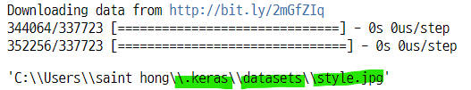

### 1-2 이미지 사이즈 변환 및 픽셀값 스케일링

#### 이미지 객체 

```python
style_image = plt.imread(style_path)
style_image

>>> print

array([[[ 97, 217, 216],
        [137, 241, 244],
        [168, 255, 255],
        ...,
        [ 43, 147, 246],
        [ 39, 128, 232],
        [ 32, 110, 218]],

       [[134, 255, 254],
        [150, 255, 255],
        [171, 254, 255],
        ...,
        [ 57, 159, 255],
        [ 42, 131, 235],
        [ 14,  97, 203]],

       [[134, 255, 251],
        [141, 254, 248],
        [166, 255, 255],
        ...,
        [ 46, 145, 247],
        [ 21, 114, 217],
        [  0,  80, 184]],

       ...,
```

#### 이미지 사이즈 변환

```python
style_image = cv2.resize(style_image, dsize=(224, 224))
style_image

>>> print

array([[[163, 254, 255],
        [159, 253, 255],
        [152, 255, 255],
        ...,
        [  3, 146, 243],
        [ 28, 159, 254],
        [ 51, 148, 247]],

       [[132, 255, 245],
        [157, 247, 254],
        [177, 255, 255],
        ...,
```

#### 이미지 픽셀값 스케일링

```python
style_image = style_image / 255.0
style_image

>>> print

array([[[0.63921569, 0.99607843, 1.        ],
        [0.62352941, 0.99215686, 1.        ],
        [0.59607843, 1.        , 1.        ],
        ...,
        [0.01176471, 0.57254902, 0.95294118],
        [0.10980392, 0.62352941, 0.99607843],
        [0.2       , 0.58039216, 0.96862745]],

       [[0.51764706, 1.        , 0.96078431],
        [0.61568627, 0.96862745, 0.99607843],
        [0.69411765, 1.        , 1.        ],
        ...,
```

### 1-3 image 불러오기
- 스타일 전이를 하기 위한 기본 이미지 확인
    - **이 이미지의 스타일을 구성하는 텍스쳐, 색감, 색의 분포 등을 새로운 사진에 적용하게 된다.**

```python
plt.imshow(style_image)
plt.show() ;
```
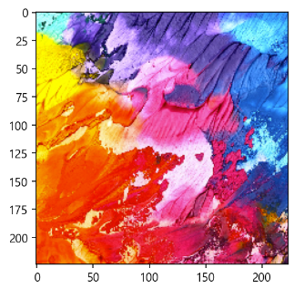

## 2. noisy 한 target 이미지 생성
- 스타일 이미지 벡터에서 균일값을 랜덤하게 생성하여 노이즈 이미지를 만든다.

```python
target_image = tf.random.uniform(style_image.shape)
target_image

>>> print

<tf.Tensor: shape=(224, 224, 3), dtype=float32, numpy=
array([[[0.90340984, 0.15296102, 0.3773359 ],
        [0.4675387 , 0.32746112, 0.535043  ],
        [0.9410814 , 0.02237427, 0.28876793],
        ...,
        [0.24216044, 0.09099603, 0.47706437],
        [0.7900952 , 0.7484462 , 0.03161287],
        [0.5842627 , 0.10073531, 0.5382415 ]],

       [[0.7278955 , 0.28698826, 0.6759857 ],
        [0.34672832, 0.32150018, 0.4416659 ],
        [0.4908887 , 0.5658778 , 0.66587615],
        ...,
```

#### 균일화 된 벡터의 이미지 확인
- 이미지에 사용된 색깔이 고르게 분포된 상태와 유사하다.
    - 노이즈 이미지와 같아진다.

```python
plt.imshow(target_image)
plt.show() ;
```
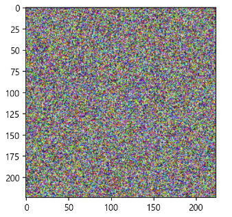

## 3. 신경 스타일 전이 모델 임포트
- 텐서플로우 튜토리얼의 신경스타일 전이 
    - https://www.tensorflow.org/tutorials/generative/style_transfer
- `VGG19`
    - 사전훈련 모델
    - 이미지 분류 네트워크

```python
from tensorflow.keras.applications import VGG19
from tensorflow.keras.applications.vgg19 import preprocess_input

vgg = VGG19(include_top=False, weights="imagenet")
vgg
```
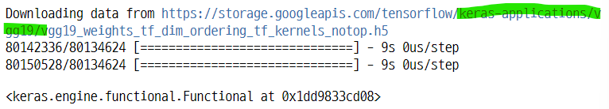

### 3-1 VGG19의 여러가지 레이어들 
- 이중에서 이미지의 특징을 추출하는 레이어만 사용
- Dense 레이어 제외

```python
for layers in vgg.layers :
    print(layers.name)

>>> print

input_1
block1_conv1
block1_conv2
block1_pool
block2_conv1
block2_conv2
block2_pool
block3_conv1
block3_conv2
block3_conv3
block3_conv4
block3_pool
block4_conv1
block4_conv2
block4_conv3
block4_conv4
block4_pool
block5_conv1
block5_conv2
block5_conv3
block5_conv4
block5_pool
```

### 3-2 VGG19 모델에서 특정 레이어만 선택 후 모델 생성
- 스타일 전이을 담당하는 레이어 5개 선택
    - model.get_layer(레이어 이름)으로 레이어 선택

```python
style_layers = ["block1_conv1", "block2_conv1", "block3_conv1",
               "block4_conv1", "block5_conv1"]

vgg.trainable = False
outputs = [vgg.get_layer(name).output for name in style_layers]
outputs
```
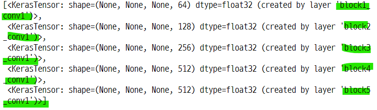

#### 모델 객체 생성

```python
model = tf.keras.Model([vgg.input], outputs)
model

>>> print

<keras.engine.functional.Functional at 0x1dd9811bcc8>
```

## 4. 스타일 값 계산
- feature layers 별로 나온 특징 벡터들을 합성해주는 과정이다.
- 이미지의 합성은 기본적으로 벡터의 가중합으로 이루어진다.
    - 올리베티 이미지 합성에서 안경 이미지와 안경 없는 이미지를 합성할 때 각 이미지에 서로 다른 가중치를 곱한 후 두 값을 더했던 것과 같은 원리
- 여기에서는 gram matrix라는 계산 방식을 사용한다.
    - 텐서를 행렬로 변환하여 내적하는 방식이다.

### 4-1. gram matrix의 특징
- 외적 또는 내적으로 구할 수 있는 것 같다.
- ``feature map`` : HxM의 행렬이 C개 있을 때, 각 행렬을 행벡터로 만든 후 쌓아올려 만든 행렬
    - F의 크기 : (channel, heightxwidth)
    - 6x7 행렬 4개 : 4x42 행렬로 변환
- feature map을 내적하면 C개의 행렬의 원소가 다른 행렬의 원소와 곱해져 더한 값이 원소인 행렬이 된다.
    - (4x42) @ (42x4) = (4x4)
- 서로 다른 특징을 나타내는 행렬이 텐서의 형태로 있을 때 이것을 feature map으로 만든 후 내적하면, 각각의 특징들끼리 모두 곱해져 더한 값으로 이루어진 GramMatrix 가 된다.
- **feature map의 channel 간 상관관계를 의미한다.**
- `참조 사이트`
    - https://aigong.tistory.com/360 
    - 위키백과

### 4-2. tensor flow api Gram matrix
- 이미지의 스타일 값 : 각 중간층(layer)들의 특성맵의 평균과 피쳐맵들 사이의 상관관계
    - 각 위치에서 특성 벡터끼리의 **외적(cross product)**을 구한 후 평균값을 구한다.
    - $G^{l}_{cd} = \dfrac{\sum_{ij} F^{l}_{ijc}(x) F^{l}_{ijd}(x)}{IJ}$
- tf.linalg.einsum() 함수로 쉽게 계산할 수 있다.
- **공분산 행렬과 유사한 형태가 된다.**
    - $\text{C}[X, Y] = 
    \begin{bmatrix}
    \text{Var}[X] & \text{Cov}[X, Y] \\
    \text{Cov}[Y, X] & \text{Var}[Y] 
    \end{bmatrix}$

### 4-3. 그람 매트릭스의 형태
- feature map
    - $\text{F} \in \text{R}^{N_l \time M_l}$

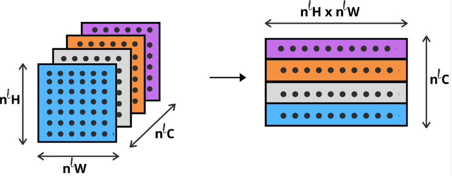

- gram matrix
    - $\text{G} = \text{V}^T \text{V}$

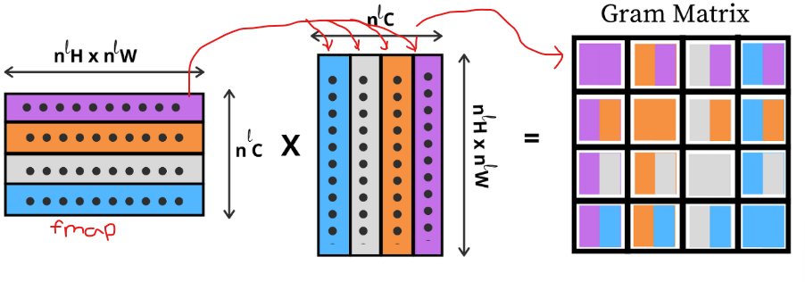

### 4-4. gram matrix 함수
- 특징 추출값을 1차원 벡터로 만들고
- 자기자신의 전치행렬을 곱한다.
- 현재 모델인 VGG19의 input shape 타입인 float32로 타입 변환 

```python
def gram_matrix(input_tensor) :
    channels = int(input_tensor.shape[-1])
    a = tf.reshape(input_tensor, [-1, channels])
    n = tf.shape(a)[0]
    gram = tf.matmul(a, a, transpose_a=True)

    return gram / tf.cast(n, tf.float32)
```

### 4-5. 함수의 실행 1 : 텐서의 모양 바꾸기
- 3차원 -> 2차원
    - feature map을 만든 것과 같다.
- 채널이 3개인 텐서를 한 개의 채널의 행렬로 변환
    - (224x224)x3 -> (50176x3)
- tf.reshape(array, [-1, a]) : a개의 열이 되도록 원소를 순차적으로 자른다.
    - 3x4 행렬을 [-1, 6] 으로 reshape 하면, [1,2,3,4,5,6], [7,8,9,10,11,12] 가 된다.
- tf.reshape(array, [a, -1]) : a개의 행이 되도록 원소를 순차적으로 자른다.

#### 기본 이미지의 크기
- 앞에서 이미지의 크기를 변환해 주었다.

```python
target_image.shape

>>> print

TensorShape([224, 224, 3])
```

#### 텐서의 차원을 줄인다.
- 이미지의 마지막 차원의 값을 저장 후 tf.reshape()에 사용
    - 텐서플로우 패키지에도 크기를 변환하는 메서드가 있다.
    - 앞의 두 차원을 곱하여 하나의 차원으로 병합한다.
    - 224 x 224 = 50176

```python
temp_chan = int(target_image.shape[-1])
temp_chan

>>> print

3

temp_matrix = tf.reshape(target_image, [-1, temp_chan])
temp_matrix
```
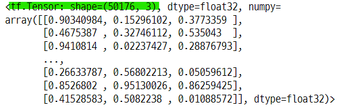

### 4-6. 함수의 실행 2 : 텐서를 float32 타입으로 변환
- tf.cast()
- 현재 타입은 int32

```python
tf.shape(temp_matrix)[0]

>>> print

<tf.Tensor: shape=(), dtype=int32, numpy=50176>
```

- float32 타입으로 변환

```python
tf.cast(tf.shape(temp_matrix)[0], tf.float32)

>>> print

<tf.Tensor: shape=(), dtype=float32, numpy=50176.0>
```

### 4-7. 함수의 실행 3 : 행렬과 행렬의 곱
- feature map의 내적
    - 원래 행렬과 전치 행렬의 곱
    - (50176x3).T @ (50176x3) = 3x3
- 3개의 채널로 나눠졌던 각 행렬들이 모든 행렬의 원소들과 곱한뒤 더해진 것과 같다.    
- 이것을 temp_matrix 로 나눈다.

#### feature map의 내적 

```python
tf.matmul(temp_matrix, temp_matrix, transpose_a=True)

>>> print

<tf.Tensor: shape=(3, 3), dtype=float32, numpy=
array([[16666.098, 12536.129, 12518.404],
       [12536.129, 16697.477, 12528.619],
       [12518.404, 12528.619, 16707.164]], dtype=float32)>
```

#### gram matrix를 이미지 행렬로 나누기

```python
tf.matmul(temp_matrix, temp_matrix, transpose_a=True) / tf.cast(tf.shape(temp_matrix)[0], tf.float32)

>>> print

<tf.Tensor: shape=(3, 3), dtype=float32, numpy=
array([[0.33215278, 0.24984314, 0.24948989],
       [0.24984314, 0.33277816, 0.24969347],
       [0.24948989, 0.24969347, 0.33297122]], dtype=float32)>
```

## 5. 텍스쳐 이미지(기본 이미지)에서 gram matrix를 계산하기 위한 과정

### 5-1.스타일 이미지
- 이미지의 저장 위치

```python
style_path

>>> print

'C:\\Users\\saint hong\\.keras\\datasets\\style.jpg'
```

#### 이미지 객체 만들고 크기 확인

```python
style_image = plt.imread(style_path)
style_image.shape

>>> print

(698, 960, 3)
```

### 5-2. 스타일 이미지 크기 변환

```python
style_image = cv2.resize(style_image, dsize=(224, 224))
style_image.shape

>>> print

(224, 224, 3)
```

### 5-3. 스타일 이미지의 픽셀값 스케일링

```python
style_image = style_image / 255.0
style_image

>>> print

array([[[0.63921569, 0.99607843, 1.        ],
        [0.62352941, 0.99215686, 1.        ],
        [0.59607843, 1.        , 1.        ],
        ...,
        [0.01176471, 0.57254902, 0.95294118],
        [0.10980392, 0.62352941, 0.99607843],
        [0.2       , 0.58039216, 0.96862745]],

       [[0.51764706, 1.        , 0.96078431],
        [0.61568627, 0.96862745, 0.99607843],
        [0.69411765, 1.        , 1.        ],
        ...,
```

### 5-4. 스타일 이미지 타입 변환
- int32 -> float32

```python
style_batch = style_image.astype("float32")
style_batch

>>> print

array([[[0.6392157 , 0.99607843, 1.        ],
        [0.62352943, 0.99215686, 1.        ],
        [0.59607846, 1.        , 1.        ],
        ...,
        [0.01176471, 0.57254905, 0.9529412 ],
        [0.10980392, 0.62352943, 0.99607843],
        [0.2       , 0.5803922 , 0.96862745]],

       [[0.5176471 , 1.        , 0.9607843 ],
        [0.6156863 , 0.96862745, 0.99607843],
        [0.69411767, 1.        , 1.        ],
        ...,
```

### 5-5. 스타일 이미지의 차원 확장

```python
style_batch = tf.expand_dims(style_batch, axis=0)
style_batch.shape

>>> print

TensorShape([1, 224, 224, 3])
```

### 5-6. VGG19 모델의 특징 레이어의 결과값
- 스타일 레이어 5개를 통과한 값(텐서 형태) 5개가 반환된다.
- 특징 레이어 하나를 통과하면 채널이 3개에서 64개로 늘어난다.

```python
style_output = model(preprocess_input(style_batch * 255.0))
style_output

>>> print

[<tf.Tensor: shape=(1, 224, 224, 64), dtype=float32, numpy=
 array([[[[0.00000000e+00, 7.71361847e+01, 4.89518471e+01, ...,
           0.00000000e+00, 2.17660351e+01, 0.00000000e+00],
          [0.00000000e+00, 1.18745834e+02, 1.10257843e+02, ...,
           0.00000000e+00, 1.78045822e+02, 1.18730324e+02],
          [0.00000000e+00, 1.10473915e+02, 1.01654991e+02, ...,
           0.00000000e+00, 1.76393463e+02, 1.08639626e+02],
          ...,
          [0.00000000e+00, 1.61248489e+02, 5.42330208e+01, ...,
           0.00000000e+00, 0.00000000e+00, 0.00000000e+00],
          [4.11843443e+00, 1.62048355e+02, 7.68683319e+01, ...,
           0.00000000e+00, 4.33858566e+01, 3.38925629e+01],
          [4.91584206e+01, 1.06434753e+02, 5.76393623e+01, ...,
           0.00000000e+00, 4.41963387e+01, 5.66943970e+01]],
```

#### 반환값의 길이
- 레이어의 수와 같다.

```python
len(style_output)

>>> print

5
```

#### 반환값의 모양

```python
style_output[0].shape

>>> print

TensorShape([1, 224, 224, 64])
```

## 6. 특징 레이어들의 이미지 확인
- 모델의 각 레이어마다 원본 이미지에서 추출한 특징들이 다르다.
    - 정확하게 알 수는 없지만 공통되고 두드러진 특징을 추출한 것 같다.

### 6-1. 모델에 사용한 레이어들

```python
style_layers

>>> print

['block1_conv1',
 'block2_conv1',
 'block3_conv1',
 'block4_conv1',
 'block5_conv1']
```

### 6-2. tf.squeeze()
- 텐서의 모양에서 크기 1의 차원을 제거 해준다.

```python
print(style_output[0].shape)

plt.figure(figsize=(8, 6))
plt.subplot(1, 2, 1)
plt.imshow(style_image)
plt.title("style image : origin")

plt.subplot(1, 2, 2)
plt.imshow(tf.squeeze(style_output[0][:, :, :, 0], 0), cmap="gray")
plt.title("style image : block1_conv1 layer")
plt.show() ;
```
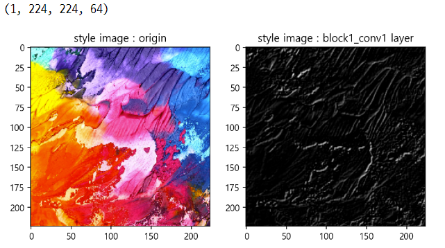

### 6-3. 5개의 특징 이미지들

```python
plt.figure(figsize=(10, 10))
for i in range(5) :
    plt.subplot(3, 2, i + 1)
    plt.imshow(tf.squeeze(style_output[i][:, :, :, 0], 0), cmap="gray")
    plt.title("style layer : {}".format(style_layers[i]))

plt.tight_layout()
plt.show() ;
```
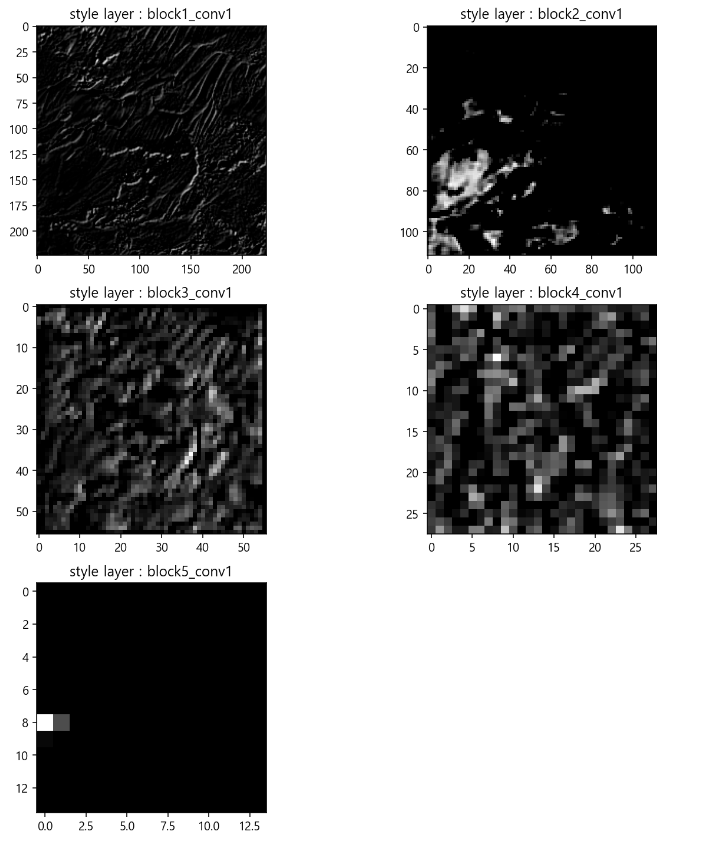

## 7. 텍스쳐 이미지의 gram matrix 분포 확인
- 스타일 레이어를 통과한 5개의 특징 텐서를 gram matrix 함수에 넣는다.
    - 마지막에 내적을 계산하므로, 채널 갯수 크기의 정방행렬로 반환된다.
    - 레이어 마다 채널의 갯수가 다르다.
- 레이어마다 값의 분포가 다르다.
    - 즉 레이어마다 각각의 알고리즘에 의해 이미지에서 특징을 추출한다.


### 7-1. 특징 결과값의 크기
- 모델의 레이어 5개를 통과하여 반환된 이미지의 특징값

```python
len(style_output), style_output[0].shape

>>> print

(5, TensorShape([1, 224, 224, 64]))
```

### 7-2. 그람 매트릭스로 만들기

```python
def gram_matrix(input_tensor) : 
    channels = int(input_tensor.shape[-1])
    a = tf.reshape(input_tensor, [-1, channels])
    n = tf.shape(a)[0]
    gram = tf.matmul(a, a, transpose_a=True)
    
    return gram / tf.cast(n, tf.float32)

style_outputs = [gram_matrix(out) for out in style_output]
style_outputs
```
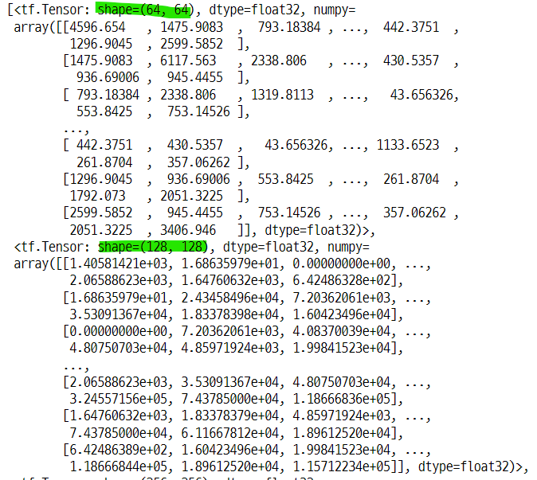
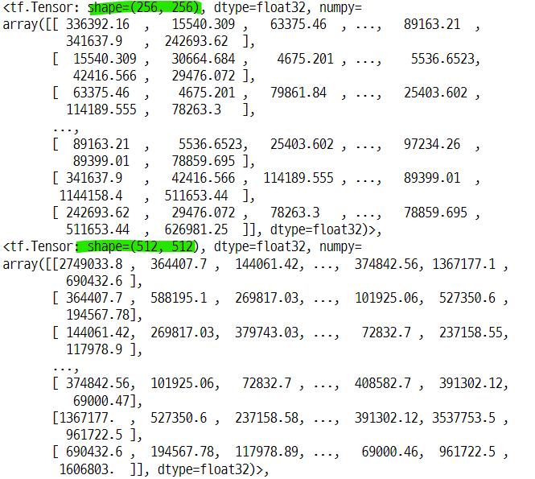
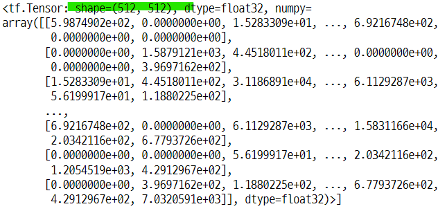

### 7-3. 특징 레이어에서 반환 된 특징 벡터를 gram matrix로 만든 결과
- 각 결과의 크기가 다르다.
- 레이어별로 채널의 갯수가 다르다.

```python
for i in range(4) :
    print("feature {}, shape {}".format(i+1, style_outputs[i].numpy().shape))

>>> print

feature 1, shape (64, 64)
feature 2, shape (128, 128)
feature 3, shape (256, 256)
feature 4, shape (512, 512)
```

### 7-4. 레이어 별 그람 매트릭스의 분포도

```python
plt.figure(figsize=(12, 10))
for c in range(5) :
    plt.subplot(3, 2, c + 1)
    array = sorted(style_outputs[c].numpy()[0].tolist())
    array = array[::-1]
    plt.bar(range(style_outputs[c].shape[0]), array)
    plt.title(style_layers[c])
plt.show() ;
```
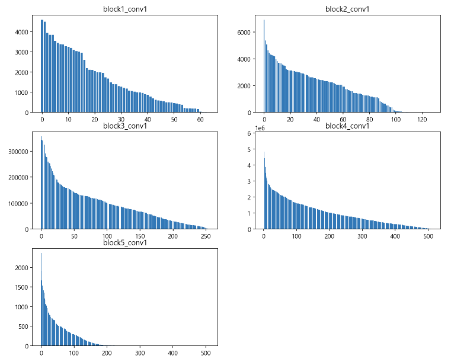

#### 그람 매트릭스를 정렬한 결과값

```python
sorted(style_outputs[1].numpy().tolist())[::-1]
```
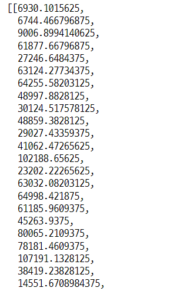

## 8. 스타일 전이를 위한 추가 함수 생성
- 1) 타겟 텍스쳐에서 gram matrix를 구하는 함수
- 2) 원본 텍스쳐의 gram matrix 값과 타겟 텍스쳐의 gram matrix 값 사이의 MSE를 구하는 함수

#### target img
- 원본이미지의 픽셀값에서 랜덤하게 균일분포로 생성한 값의 이미지

```python
plt.imshow(target_image)
plt.title("target image : noisy image")
plt.show() ;
```
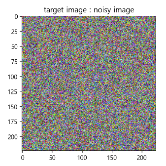

### 8-1. 타겟 이미지 -> gram matrix

```python
def get_outputs(image) :
    image_batch = tf.expand_dims(image, axis=0)
    output = model(preprocess_input(image_batch * 255.0))
    outputs = [gram_matrix(out) for out in output]

    return outputs
```

### 8-2. 텐서의 요소별 계산
- 파라미터
    - style_outputs : 텍스쳐 이미지의 gram matrix 값
    - outputs : 타겟 이미지의 gram matrix 값 : get_outputs(image) 함수의 결과값
- MSE : mean square of error : 잔차 제곱 합
    - tf.reduce_sum()
    - tf.reduce_mean()
- o : outputs
- s : style_outputs

```python
def get_loss(outputs, style_outputs) :
    return tf.reduce_sum([tf.reduce_mean((o-s)**2) \
                          for o, s in zip(outputs, style_outputs)])
```

### 8-3. 배열의 값을 지정된 최소값과 최대값으로 자르기
- tf.clip_by_value() : 지정한 범위 내의 값만 남기고 자른다.
    - 최소값과 최대값 사이의 값만 남긴다.
    - 최소값과 최대값 범위 밖의 값은 최소값과 최대값으로 대체한다.
    - 대상 배열의 모양 그대로 출력 된다.
    - min 보다 작으면 0, max 보다 크면 1로 반환된다.

```python
def clip_0_1(image) :
    return tf.clip_by_value(image, clip_value_min=0.0, clip_value_max=1.0)
```

#### 테스트
- 배열 모양 그대로 반환

```python
temp = np.linspace(-2, 2, 10)
temp

>>> print

array([-2.        , -1.55555556, -1.11111111, -0.66666667, -0.22222222,
        0.22222222,  0.66666667,  1.11111111,  1.55555556,  2.        ])

## 함수 호출
clip_0_1(temp)	

>>> print

<tf.Tensor: shape=(10,), dtype=float64, numpy=
array([0.        , 0.        , 0.        , 0.        , 0.        ,
       0.22222222, 0.66666667, 1.        , 1.        , 1.        ])>
```

### 8-4. GradientTape
- 자동 미분을 위한 작업 기록 함수
    - https://www.tensorflow.org/api_docs/python/tf/GradientTape#stop_recording
- 학습되지 않는 가중치(혹은 입력)에 대해 Gradient를 계산한다.
    - 학습해야할 가중치가 존재하지 않는 상황
    - 현재 존재하는 것은 2개의 이미지와 MSE 값이다.

#### 최적화 계산기 생성
- LBFGS 또는 Adam

```python
opt = tf.optimizers.Adam(learning_rate=0.2, beta_1=0.99, epsilon=1e-1)
opt

>>> print

<keras.optimizer_v2.adam.Adam at 0x1ddb79d4748>
```

#### gradient tape 함수

```python
@tf.function()
def train_step(image) : 
    with tf.GradientTape() as tape :
        # 타겟이미지의 gram matrix 구하는 함수
        outputs = get_outputs(image)
        # 텍스쳐 이미지와 타겟 이미지의 특징 레이어별 gram matrix 값의 mse 계산
        loss = get_loss(outputs, style_outputs)
        
    grad = tape.gradient(loss, image)
    # 최적화 계산기
    opt.apply_gradients([(grad, image)])
    image.assign(clip_0_1(image))
```
### 8-5. 함수 작동 과정
- ``train_step()`` : gradienttape 함수 : 학습되지 않은 가중치에 대한 gradient값 계산
    - ``get_outputs(image)`` : 타겟 이미지(노이즈 이미지)를 특징 레이어 5개 값으로 만들고, gram matrix 값으로 반환
    - ``get_loss(타겟 이미지의 gram, 텍스쳐 이미지의 gram)`` : 텍스쳐 이미지(스타일 이미지, 기본 이미지)와 타겟 이미지(노이즈 이미지)의 gram 값의 잔차제곱합 계산
    - ``clip_0_1(image)`` : 픽셀값을 0과 1사이의 값으로 자른다.
- 두 이미지의 특징 벡터간의 잔차제곱합을 최소화하는 최적화 계산기(opt)를 통해 어떤 r가중치 값을 반환하는 과정

### 9. epoch 설정 및 애니메이션 효과
- tf.Variable() : https://www.tensorflow.org/guide/variable

```python
import IPython.display as display
import time
import imageio

image = tf.Variable(target_image)
epochs = 50
steps_per_epoch = 100

tf.Variable(target_image).shape

>>> print

TensorShape([224, 224, 3])
```

#### tf.Variable() 로 변형한 이미지
- 노이즈 이미지(=target image)를 매개변수의 인자값으로 넣어준다.

```python
image

>>> print

<tf.Variable 'Variable:0' shape=(224, 224, 3) dtype=float32, numpy=
array([[[0.90340984, 0.15296102, 0.3773359 ],
        [0.4675387 , 0.32746112, 0.535043  ],
        [0.9410814 , 0.02237427, 0.28876793],
        ...,
        [0.24216044, 0.09099603, 0.47706437],
        [0.7900952 , 0.7484462 , 0.03161287],
        [0.5842627 , 0.10073531, 0.5382415 ]],

       [[0.7278955 , 0.28698826, 0.6759857 ],
        [0.34672832, 0.32150018, 0.4416659 ],
        [0.4908887 , 0.5658778 , 0.66587615],
        ...,
```

### 10. 텍스쳐 합성
- tf.Variable(target_image) 를 train_step() 함수에 아규먼트로 넣는다.
    - train_step() : 텍스쳐 이미지와 타겟 이미지의 잔차를 최적화한 값 반환
- numpy 배열을 이미지로 저장해주는 함수
    - imageio.imwrite()
    - cv2.imwrite()
    - https://www.delftstack.com/ko/howto/numpy/save-numpy-array-as-image/
- **즉 노이즈 이미지를 스타일 이미지(기본 이미지)의 텍스쳐와 유사하게 스타일을 전이한 것과 같다.**
    - 노이즈 이미지가 어느정도 스타일 이미지와 유사하게 변환됐다.

```python
from tqdm import tqdm

start = time.time()
step = 0
for n in tqdm(range(epochs), desc="style_transfer", mininterval=0.01) :
    for m in range(steps_per_epoch) :
        step += 1
        # 텍스쳐 이미지와 타겟 이미지의 mse의 최적화 값 반환하는 함수
          # input : image = tf.Variable(target_image)
          # output : image.assign(clip_01_(image))
        train_step(image)
    if n % 5 == 0 or n == epochs - 1 :
        imageio.imwrite("style_epoch_{0}.png".format(n), image.read_value().numpy())
    display.clear_output(wait=True)
    plt.imshow(image.read_value())
    plt.title("Train step : {}".format(step))
    plt.show() ;

end = time.time()
print("Total time : {:.1f}".format(end-start))
```
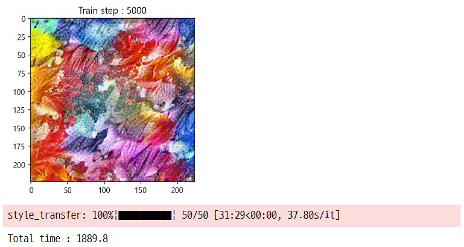

## 11. 더 나은 결과물을 위한 테스트
- variation loss를 계산한다. 이 값이 최소값이 될 수록 매끄럽게 보인다.
    - high_pass_x_y() : 인접한 픽셀과의 차이를 계산하는 함수
    - total_variation_loss() : high_pass_x_y()의 결과값을 제곱해서 평균 후 더하는 RMS 값 반환
- **즉 가까운 픽셀간의 차이를 줄여주기 때문에 이미지의 매끄러운 텍스쳐를 만들어 준다.**

### 11-1. high_pass 함수

```python
def high_pass_x_y(image) :
    x_var = image[:, 1:, :] - image[:, :-1, :]
    y_var = image[1:, :, :] - image[:-1, :, :]
    return x_var, y_var
```

### 11-2. total_variation_loss 함수 
- high_pass 결과값의 크기 계산 함수

```python
def total_variation_loss(image) :
    x_deltas, y_deltas = high_pass_x_y(image)

    return tf.reduce_mean(x_deltas ** 2) + tf.reduce_mean(y_deltas ** 2)
```

## 12. 텍스쳐 전이한 원본, 타겟 이미지(노이즈 이미지), 텍스쳐 이미지의 variation 상황

```python
print("target    :", total_variation_loss(image.read_value()))
print("noise     :", total_variation_loss(tf.random.uniform(style_image.shape)))
print("original  :", total_variation_loss(style_image))

>>> print

target    : tf.Tensor(0.10633081, shape=(), dtype=float32)
noise     : tf.Tensor(0.33467752, shape=(), dtype=float32)
original  : tf.Tensor(0.03641251305469578, shape=(), dtype=float64)
```

### 13. gradient tape 함수 수정
- 다시 variation loss를 구해서 전체 loss에 누적해서 더함
- 텍스쳐 이미지와 타겟 이미지의 loss 값 + 인접 픽셀값의 차이 RMS 값을 합해준다.
- 다시 loss 계산
    - get_loss() += total_variation_loss() 을 누적해서 더함
- 처음 loss 계산
    - loss = get_loss(outputs, style_outputs)     

```python
total_variation_weight = 1e9
style_weight = 1e-1

@tf.function()
def train_step(image) :
    with tf.GradientTape() as tape :
        outputs = get_outputs(image)
        loss = style_weight * get_loss(outputs, style_outputs)
        loss += total_variation_weight * total_variation_loss(image)

    grad = tape.gradient(loss, image)
    opt.apply_gradients([(grad, image)])
    image.assign(clip_0_1(image))
```
    
## 14. 다시 테스트를 설정

```python
target_image = tf.random.uniform(style_image.shape)
image = tf.Variable(target_image)

epochs = 50
steps_per_epochs = 100
```

## 15. 텍스쳐 합성 시작
- 한장의 이미지를 원본으로 삼아 해당 텍스쳐를 재생성하는 작업
    - 처음 실행 했던 것보다 스타일 이미지의 텍스쳐가 더 잘 나타나는 것 같다.

```python
start = time.time()

step = 0
for n in tqdm(range(epochs), desc="style_transfer", mininterval=0.01) :
    for m in range(steps_per_epochs) :
        step += 1
        train_step(image)
    if n % 5 == 0 or n == epochs - 1 :
        imageio.imwrite("style_variation_epoch_{0}.png"\
                        .format(n), image.read_value())
    display.clear_output(wait=True)
    plt.imshow(image.read_value())
    plt.title("Train step : {}".format(step))
    plt.show()

end = time.time()
print("Fit time : {}".format(end - start))
```
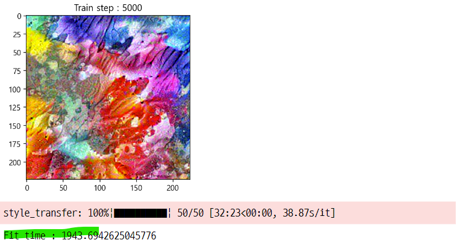

#### 텍스쳐 이미지(기본 이미지), 타겟 이미지(노이즈 이미지), 스타일 전이 이미지 비교

```python
plt.figure(figsize=(12, 10))
plt.subplot(1, 3, 1)
plt.imshow(style_image)
plt.title("texture img", fontsize=15, y=1.03)

plt.subplot(1, 3, 2)
plt.imshow(target_image)
plt.title("target img", fontsize=15, y=1.03)

plt.subplot(1, 3, 3)
plt.imshow(image)
plt.title("result : style tranform", fontsize=15, y=1.03)

plt.tight_layout()
plt.show() ;
```
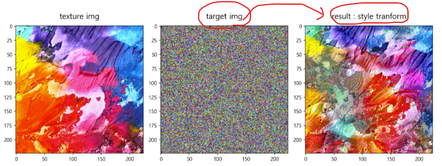

## 16. transfer 결과
- 첫번째 실험의 결과인 텍스쳐 합성 이미지의 RMS 값은 0.1063381 있다. 즉 인접한 픽셀간의 차이가 컸다.
- 두번째 실험의 결과인 텍스쳐 합성 이미지의 RMS 값은 0.03788로 텍스쳐 이미지의 값과 거의 비슷할 정도로 합성이 잘 된 것으로 보인다. 

```python
print("target   :", total_variation_loss(image.read_value()))
print("original :", total_variation_loss(style_image))

>>> print

target   : tf.Tensor(0.037887253, shape=(), dtype=float32)
original : tf.Tensor(0.03641251305469578, shape=(), dtype=float64)
```

# 2. Neural style transfer 2
- 신경 스타일 전이 2

#### 패키지 임포트

```python
import tensorflow as tf

import matplotlib.pyplot as plt
import IPython.display as display
import time
import imageio
import cv2
from tqdm import tqdm
%matplotlib inline
```

## 1. 타겟 이미지 임포트
- 스타일 전이의 대상이 되는 이미지
    - 텍스쳐 이미지의 스타일 처럼 바꿀 이미지

```python
content_path = tf.keras.utils.get_file("content.jpg", "http://bit.ly/2mAfUX1")
content_image = plt.imread(content_path)
content_image
```
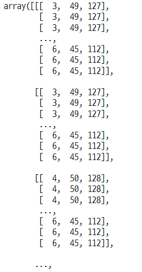

#### 이미지 모양

```python
content_image.shape

>>> print

(1460, 2200, 3)
```
### 1-1. 이미지 크기 변환을 위한 가로 세로 정규화값 생성

```python
## 차원의 값 중 큰 값 저장
long_dim = max(content_image.shape[:-1])
long_dim

>>> print

2200
```

### 1-2. 스케일링 할 값 생성

``` python
max_dim = 512
scale = max_dim / long_dim
scale

>>> print

0.23272727272727273
```

### 1-3. 이미지의 새로운 크기값 계산

```python
new_height = int(content_image.shape[0] * scale)
new_width = int(content_image.shape[1] * scale)

print(new_height, new_width)

>>> print

339 512
```
### 1-4. 타겟 이미지의 사이즈 변환

```python
content_image = cv2.resize(content_image, dsize=(new_width, new_height))
content_image

>>> print

array([[[  4,  49, 128],
        [  4,  49, 128],
        [  3,  48, 129],
        ...,
        [  7,  46, 113],
        [  6,  45, 112],
        [  6,  45, 112]],

       [[  6,  52, 130],
        [  6,  52, 130],
        [  3,  48, 129],
        ...,
        [  7,  46, 113],
        [  8,  47, 114],
        [  8,  47, 114]],

```

### 1-5. 타겟 이미지의 픽셀값 스케일링

```python
content_image = content_image / 255.0
content_image

>>> print

array([[[0.01568627, 0.19215686, 0.50196078],
        [0.01568627, 0.19215686, 0.50196078],
        [0.01176471, 0.18823529, 0.50588235],
        ...,
        [0.02745098, 0.18039216, 0.44313725],
        [0.02352941, 0.17647059, 0.43921569],
        [0.02352941, 0.17647059, 0.43921569]],

       [[0.02352941, 0.20392157, 0.50980392],
        [0.02352941, 0.20392157, 0.50980392],
        [0.01176471, 0.18823529, 0.50588235],
        ...,
```

### 1-6. 타겟 이미지 확인

```python
plt.figure(figsize=(8, 8))
plt.imshow(content_image)
plt.show() ;
```
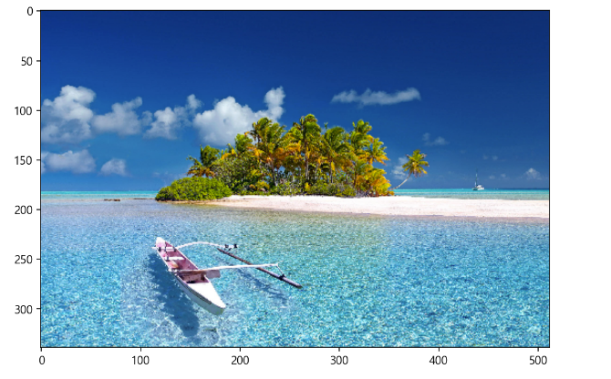

## 2. content 특징 추출 모델

### 2-1. vgg 모델 호출 및 중층 레이어 확인

```python
from tensorflow.keras.applications import VGG19
from tensorflow.keras.applications.vgg19 import preprocess_input

vgg = VGG19(include_top=False, weights="imagenet")

for layer in vgg.layers :
    print(layer.name)

>>> print

input_1
block1_conv1
block1_conv2
block1_pool
block2_conv1
block2_conv2
block2_pool
block3_conv1
block3_conv2
block3_conv3
block3_conv4
block3_pool
block4_conv1
block4_conv2
block4_conv3
block4_conv4
block4_pool
block5_conv1
block5_conv2
block5_conv3
block5_conv4
block5_pool
```

### 2-2. 이미지 batch화
- vgg 모델의 입력 데이터로 사용하기 위한 설정
- dtype을 float32로 변경
- 텐서의 모양을 1차원 확장

```python
content_batch = content_image.astype("float32")
content_batch = tf.expand_dims(content_batch, axis=0)
content_batch

>>> print

<tf.Tensor: shape=(1, 339, 512, 3), dtype=float32, numpy=
array([[[[0.01568628, 0.19215687, 0.5019608 ],
         [0.01568628, 0.19215687, 0.5019608 ],
         [0.01176471, 0.1882353 , 0.5058824 ],
         ...,
         [0.02745098, 0.18039216, 0.44313726],
         [0.02352941, 0.1764706 , 0.4392157 ],
         [0.02352941, 0.1764706 , 0.4392157 ]],

        [[0.02352941, 0.20392157, 0.50980395],
         [0.02352941, 0.20392157, 0.50980395],
         [0.01176471, 0.1882353 , 0.5058824 ],
         ...,
```

#### batch화 한 이미지의 모양

```python
content_batch.shape

>>> print

TensorShape([1, 339, 512, 3])
```

### 2-3. 이미지에서 컨텐츠를 추출하는 레이어를 사용하는 모델 생성
- keras.Model([vgg.input], outputs) : outputs에 이 레이어를 설정
- 모델에 batch 이미지를 입력하면 컨텐츠 추출 레이어에서 반환값이 나온다.
    - 이 레이어를 통과하면 이미지에서 어떤 특징을 내포하는 행렬이 반환된다.

#### 레이어 선택하고 모델 생성

```python
content_layers = ["block5_conv2"]

vgg.trainable = False
outputs = [vgg.get_layer(name).output for name in content_layers]
model_content = tf.keras.Model([vgg.input], outputs)

content_output = model_content(preprocess_input(content_batch * 255.0))
```

#### block5_conv2 레이어에서 반환 된 이미지의 값

```python
content_output

>>> print

<tf.Tensor: shape=(1, 21, 32, 512), dtype=float32, numpy=
array([[[[  0.       ,   0.       , 176.00456  , ...,   0.       ,
           49.864147 ,  32.747818 ],
         [  0.       ,   0.       ,  66.24236  , ...,   0.       ,
           86.71455  ,   0.       ],
         [  0.       ,   0.       ,  31.699821 , ...,   0.       ,
           89.50239  ,  14.754747 ],
         ...,
         [  0.       ,   0.       ,   5.814362 , ...,   0.       ,
           71.01455  ,   0.       ],
         [  0.       ,   0.       ,  16.384115 , ...,   0.       ,
           71.11234  ,   0.       ],
         [  0.       ,   0.       ,  24.388548 , ...,   0.       ,
           63.45701  ,  17.029453 ]],

        [[  0.       ,   0.       , 213.95108  , ...,   0.       ,
            0.       ,   0.       ],
         [  0.       ,   0.       ,  64.498276 , ...,   0.       ,
            0.       ,   0.       ],
         [  0.       ,   0.       ,  20.855743 , ...,   0.       ,
            0.       ,   0.       ],
         ...,
```

### 2-4. 컨텐츠 추출 함수 생성
- get_content_output() : 이미지에서 content 를 추출하는 모델의 반환값을 가져오는 함수
- get_content_loss() : 두 이미지에서 content 값의 loss 값을 계산하는 함수

#### get_content_output() 함수

```python
def get_content_output(image) :
    image_batch = tf.expand_dims(image, axis=0)
    output = model_content(preprocess_input(image_batch * 255.0))

    return output
```

#### get_content_loss() 함수

```python
def get_content_loss(image, content_output) :
    return tf.reduce_sum(tf.reduce_mean(image - content_output) ** 2)
```

## 3. 텍스쳐 이미지의 특징 5가지 추출 모델 재 설정

```python
style_layers = ["block1_conv1",
               "block2_conv1",
               "block3_conv1",
               "block4_conv1",
               "block5_conv1"]

vgg.trainable = False
outputs_2 = [vgg.get_layer(name).output for name in style_layers]
model = tf.keras.Model([vgg.input], outputs_2)
model

>>> print

<keras.engine.functional.Functional at 0x18605549088>
```


### 3-1. 이미지를 gram matrix로 변환해주는 함수 재설정

```python
def get_outputs(image) :
    image_batch = tf.expand_dims(image, axis=0)
    output = model(preprocess_input(image_batch * 255.0))
    outputs = [gram_matrix(out) for out in output]

    return outputs
```

### 3-2. 두 이미지의 gram matrix 값의 오차를 계산해주는 함수 재설정
- mean square of error

```python
def get_loss(outputs, style_outputs) :
    return tf.reduce_sum([tf.reduce_mean((o - s) ** 2) \
                          for o, s in zip(outputs, style_outputs)])
```

### 3-3. 특징 벡터의 값을 0과 1사이의 값으로 만들어 주는 함수 재설정

```python
def clip_0_1(image) :
    return tf.clip_by_value(image, clip_value_min=0.0, clip_value_max=1.0)
```

### 3-4. gram matrix를 계산해주는 함수 재설정

```python
def gram_matrix(input_tensor) :
    channels = int(input_tensor.shape[-1])
    a = tf.reshape(input_tensor, [-1, channels])
    n = tf.shape(a)[0]
    gram = tf.matmul(a, a, transpose_a=True)

    return gram / tf.cast(n, tf.float32)
```

### 3-5. 5가지 특징 오차 외에 추가된 인접한 픽셀값의 오차 계산기
- 인접한 픽셀값의 차이를 계산하고 이를 RMS 값으로 반환

```python
def high_pass_x_y(image) :
    x_var = image[:, 1:, :] - image[:, :-1, :]
    y_var = image[1:, :, :] - image[:-1, :, :]
    return x_var, y_var

def total_variation_loss(image) :
    x_deltas, y_deltas = high_pass_x_y(image)
    return tf.reduce_mean(x_deltas ** 2) + tf.reduce_mean(y_deltas ** 2)
```

### 3-6. 5가지 특징 추출 레이어를 사용한 텍스쳐 이미지 특징 추출

```python
style_path = tf.keras.utils.get_file("style.jpg", "http://bit.ly/2mGfZIq")
style_image = plt.imread(style_path)
style_image = cv2.resize(style_image, dsize=(224, 224))
style_image = style_image / 255.0

style_batch = style_image.astype("float32")
style_batch = tf.expand_dims(style_batch, axis=0)
style_output = model(preprocess_input(style_batch * 255.0))
style_outputs = [gram_matrix(out) for out in style_output]
style_outputs

>>> print

[<tf.Tensor: shape=(64, 64), dtype=float32, numpy=
 array([[4596.654   , 1475.9083  ,  793.18384 , ...,  442.3751  ,
         1296.9045  , 2599.5852  ],
        [1475.9083  , 6117.563   , 2338.806   , ...,  430.5357  ,
          936.69006 ,  945.4455  ],
        [ 793.18384 , 2338.806   , 1319.8113  , ...,   43.656326,
          553.8425  ,  753.14526 ],
        ...,
        [ 442.3751  ,  430.5357  ,   43.656326, ..., 1133.6523  ,
          261.8704  ,  357.06262 ],
        [1296.9045  ,  936.69006 ,  553.8425  , ...,  261.8704  ,
         1792.073   , 2051.3225  ],
        [2599.5852  ,  945.4455  ,  753.14526 , ...,  357.06262 ,
         2051.3225  , 3406.946   ]], dtype=float32)>,
 <tf.Tensor: shape=(128, 128), dtype=float32, numpy=
 array([[1.40581421e+03, 1.68635979e+01, 0.00000000e+00, ...,
         2.06588623e+03, 1.64760632e+03, 6.42486328e+02],
        [1.68635979e+01, 2.43458496e+04, 7.20362061e+03, ...,
         3.53091367e+04, 1.83378398e+04, 1.60423496e+04],
        [0.00000000e+00, 7.20362061e+03, 4.08370039e+04, ...,
         4.80750703e+04, 4.85971924e+03, 1.99841523e+04],
        ...,
        [2.06588623e+03, 3.53091367e+04, 4.80750703e+04, ...,
         3.24557156e+05, 7.43785000e+04, 1.18666836e+05],
        [1.64760632e+03, 1.83378379e+04, 4.85971924e+03, ...,
         7.43785000e+04, 6.11667812e+04, 1.89612520e+04],
        [6.42486389e+02, 1.60423496e+04, 1.99841523e+04, ...,
         1.18666844e+05, 1.89612520e+04, 1.15712234e+05]], dtype=float32)>,
```

## 4. 최적화 계산기 설정

```python
opt = tf.optimizers.Adam(learning_rate=0.001, beta_1=0.99, epsilon=1e-1)
opt

>>> print

<keras.optimizer_v2.adam.Adam at 0x186055655c8>
```

## 5. 그래디언트 loss 최적화 함수 설정 
- 전체 loss 계산 함수에 content loss를 추가
- train_step(image) : 함수가 전체 loss를 계산하는 함수
    - get_loss : 5가지 특징 추출 레이어의 반환값의 오차
    - total_variation_loss : 이미지의 인접 픽셀값 사이의 오차 (스타일 전이 후 매끄럽게 해주는 효과)
    - get_content : 컨텐츠 추출 레이어의 반환값의 오차

```python
total_variation_weight = 1e9
style_weight = 1e-2
content_weight = 1e4

@tf.function()
def train_step(image) :
    with tf.GradientTape() as tape :
        # gram matrix 값 반환
        outputs = get_outputs(image)
        # content layer를 사용해서 만든 model_content의 특징값 반환
        output2 = get_content_output(image)
        # 풍경 이미지와 텍스쳐 이미지의 특징 레이어값 사이의 loss 값 : mse
        loss = style_weight * get_loss(outputs, style_outputs)
        # 인접 픽셀간 오차 계산기의 반환 값
        loss += total_variation_weight * total_variation_loss(image)
        # content layer 값 사이의 loss 값
        loss += content_weight * get_content_loss(output2, content_output)

    grad = tape.gradient(loss, image)
    opt.apply_gradients([(grad, image)])
    image.assign(clip_0_1(image))
```

### 5-1. 학습을 위한 설정

```python
image = tf.Variable(content_image.astype("float32"))
epochs = 20
steps_per_epochs = 100
```

## 6. 스타일 전이
- 실행시간 : 1시간
- 타겟 이미지가 텍스쳐 이미지의 특징들과 유사하게 변한 것을 알 수 있다.

```python
step = 0

for n in tqdm(range(epochs), desc="style_transfer", mininterval=0.01) :
    for m in range(steps_per_epochs) :
        step += 1
        train_step(image)
    if n % 5 == 0 or n == epochs - 1 :

        imageio.imwrite("style_{0}_content_{1}_transfer_epoch_{2}.png".format(
            style_weight, content_weight, n), image.read_value().numpy())

    display.clear_output(wait=True)
    plt.figure(figsize=(9, 9))
    plt.imshow(image.read_value())
    plt.title("Train step : {}".format(step))
    plt.show() ;
```
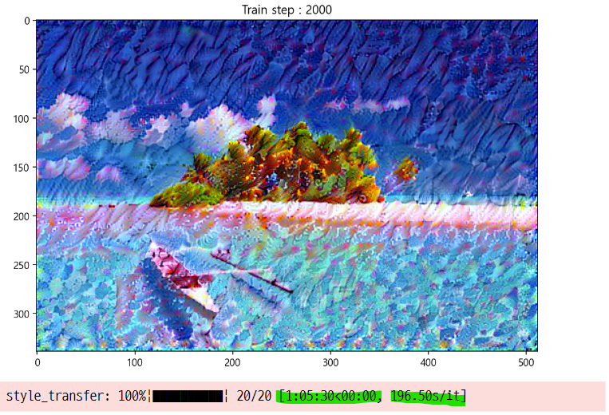

