# TensorFlow

## 텐서플로우란?
- tensorflow
    - tensor : 다차원의 벡터나 행렬
    - Graph : 텐서가 흐르는 경로 (혹은 공간)
    - **tensor flow : 텐서가 graph를 통해서 흐른다.**
- 머신러닝을 위한 오픈소스 플랫폼 - 딥러닝 프레임워크
- 구글이 주도적으로 개발 - 구글 코랩에서 사용가능
- 최신버전 2.8.0
- 고수준 API인 keras가 병합되어있다.

## 딥러닝의 구조
- Deep Learning and Keras
- 신경망에서 아이디어를 얻어서 시작된 **Neural Net**
- **뉴런** : 신경망의 최소단위 
    - 뉴런은 입력(input), 가중치(weights), 활성화함수(activation function), 출력(activation)으로 구성되어 있다.
    - 뉴런에서 학습할 때 변하는 것은 가중치이다.
    - 처음에는 초기화를 통해 랜덤값을 넣고, 학습과정에서 일정한 값으로 수렴하게 된다.
- **레이어** : 뉴런이 모여있는 것 (input layer, hidden layer, output layer)
- **망(net)** : 여러개의 레이어들이 모여있는 것
- **deep learning** : 신경망이 깊어지면, 많아지면 깊은 신경망이 된다.

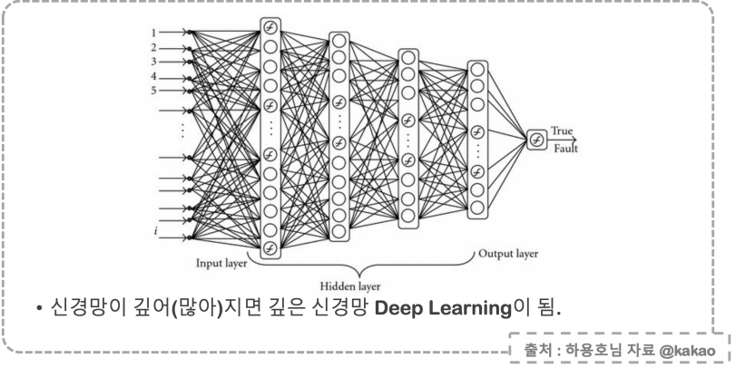

#### 뉴런의 구조 

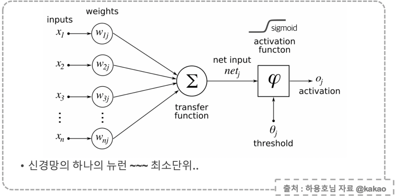

#### 레이어와 망의 구조

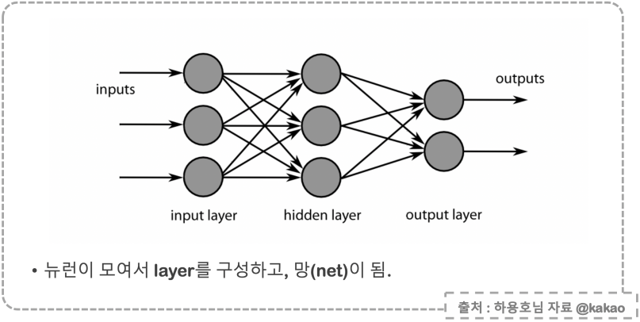


### 뉴럴넷의 학습 방법 : back propagation
- 뉴럴넷에서 사용하는 학습 방법
    - **역전파** : 뒤로 전달한다는 의미
- 현재 지점에서 오차의 정도를 미분한 값을 이전 단계로 전달하며 업데이트 한다.
    - 미분하고 곱하고 더한값을 역방향으로 반복하며 업데이트
    
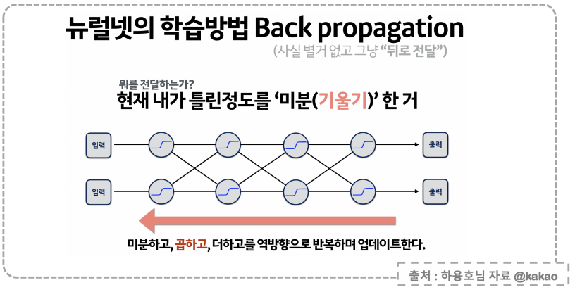

### Vanishing gradient 현상
- 뉴럴넷의 이러한 학습방법에서 sigmoid 함수를 사용할 경우 업데이트 값이 점차 사라져가는 경향이 나타난다.
    - **underfitting : fitting이 잘 안되는 현상**
- 왜냐하면 시그모이드 함수의 특성상 가운데의 꺾이는 부분을 제외하면 양쪽 끝은 기울기가 0이기 때문이다.

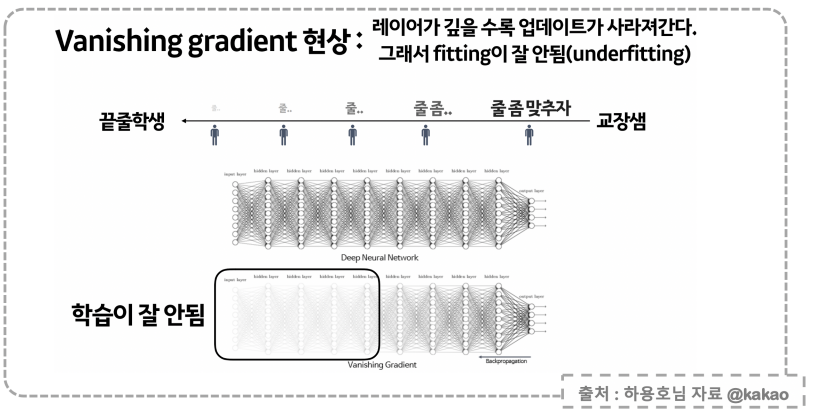

### 뉴럴넷에서 답을 회신받는 방법
- activation 함수
    - **value** : 이 값이 얼마가 될까? : **ouput을 그냥 받는다.**
    - **O/X 문제** : 이것이 맞냐? 틀리냐? : **sigmoid를 먹인다.**
    - 또는 대신에 **ReLu**
    - **category** : 이건 어떤 종류인가? : **softmax를 먹인다.**

### ReLU 함수
- ReLU : Rectified Linear Units
    - 양수값에서 기울기가 1로 유지 된다. (미분값이 있다. vanishing 현상이 줄어든다.)
    - 시그모이드 함수에서는 가운데 구간을 제외한 모든 구간에서 기울기가 0이다.

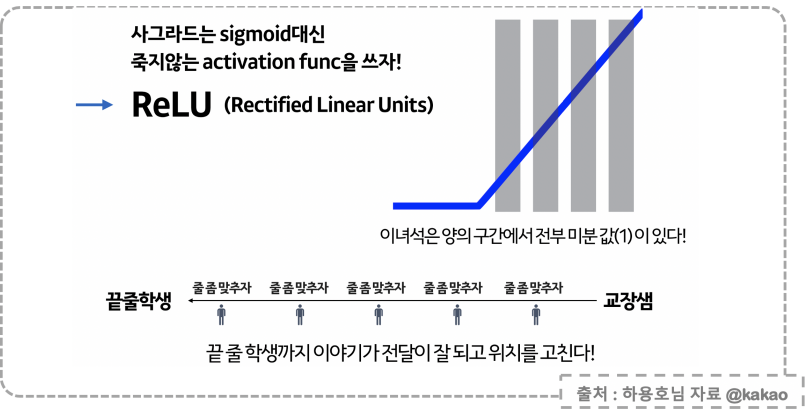


## model compiled

### loss 함수
- 딥러닝 모델의 학습을 위해서 **loss(cost) 함수**를 설정해야 한다. 
    - 비용함수
- loss 함수는 정답까지 얼마나 멀리 있는지를 측정해준다.
    - 오차의 크기
- **mse** : mean square error 오차 제곱의 평균 사용
- **optimizer** : loss를 어떻게 줄여줄 것인지 방법을 선택

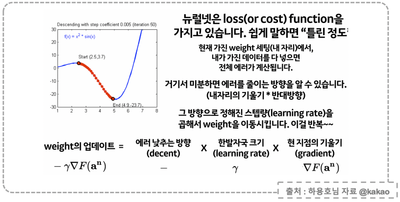

### Gradient Decent
- 기존 뉴럴넷이 가중치를 최적화하는 방법
- loss function의 현재 가중치에서의 기울기(gradient)를 구해서 loss를 줄이는 방향으로 업데이터해 나간다. 

### 가중치를 찾는 과정
- 최적의 weight를 찾아가는 과정
    - $- \gamma \triangledown F(a^{n})$
    - - : decent, 에러를 낮추는 방향
    - \gamma : learning rate : 한발자국의 크기
    - \triangledown F(a^{n}) : gradient : 현재 지점의 기울기
- **loss function** : 뉴럴넷의 예측과정에서 오차가 발생한다. 이 오차의 정도를 말한다. 
- 현재 weight 세팅에서 데이터를 입력하면 전체 에러(오차)가 계산된다.
    - 라벨과 예측값과의 차이
- 즉 현재 지점(어떤 weight 값이 셋팅된 지점)에서의 loss function의 기울기를 구하고 이 기울기가 현재보다 낮아지는 방향으로 weight 값을 다시 셋팅한다.
    - 현재 기울기의 방향과 반대방향으로 향한다.
- **스텝사이즈(learning rate, step size)** : 현재 지점에서 기울기가 낮아지는 다음 지점으로 나아갈 때 (새로운 weight 값을 찾을때) 사용되는 다음 지점까지의 거리. 스텝사이즈값에 따라서 최적화 값이 달라진다.

### GD와 SGD
- `GD (Gradient Descent)`
    - full-batch : 학습데이터를 전부 다 읽고 최적의 1스텝을 나간다.
    - 결과적으로 최적화가 잘 된다.
    - 그러나 모든 것을 계산한 후에 최적의 스텝을 가기때문에 너무 느리다. 
- `SGD (Stochastic Gradient Descent)`
    - mini-batch : 학습데이터를 작은 토막단위로 읽고 여러스텝을 나간다.
    - 단계마다 최적화가 부정확하지만 결과적으로 최적화가 잘 된다.
    - 데이터의 일부분만 검토한 한 스텝을 나가기때문에 시간이 적게 걸린다.

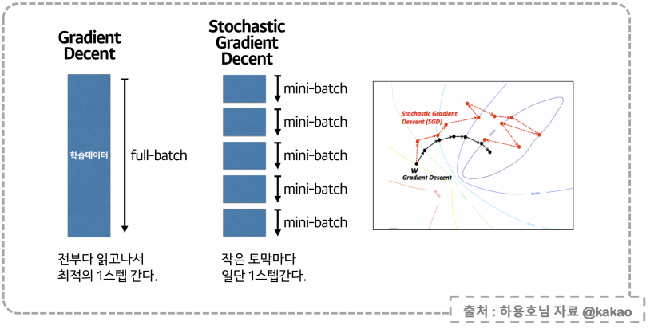

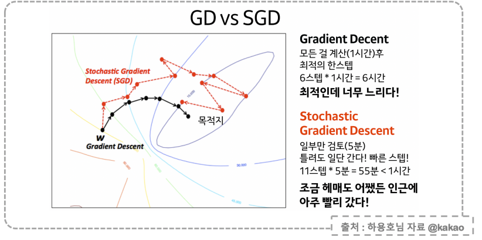

### Optimize
- loss 함수를 최소화하는 가중치를 찾아가는 과정에 대한 알고리즘
- "산을 잘 타고 내려오는 과정" : 오차 함수의 최저값을 찾는 과정, 즉 오차의 정도가 가장 낮은 지점을 찾는 것과 같다.
    - 어느 방향으로 갈 것인가?
    - 어느정도의 보폭으로 나갈 것인가?
    - 이 두가지를 잘 선택해야 빠르게 산을 내려올 수 있다. 
#### 여러가지 Optimizer
    - GD를 개선한 것이 SGD
    - 이후 SGD의 장단점을 개선한 여러가지 optimizer들이 있다.
- 스텝방향을 개선한 것들
    - **Momentum** : 스텝계산해서 움직인 후, 내려오던 관성 방향을 다시 가는 방식
    - **NAG** (Nesterov Accelerated Gradient) : 일단 관성 방향으로 먼저 움직이고, 움직인 자리에 스텝을 계산해서 속도를 개선하는 방식
    - **Adam** (RMSProp + Momentum) : 방향과 스텝사이즈를 적당하게 조정하는 방식
    - **Nadam** (Adam + NAG) : 
- 스텝사이즈를 개선한 것들
    - **Adagrad** : 안가본 곳은 큰 스텝사이즈로 가면서 적당히 탐색하고, 많이 가본곳은 작은 스텝사이즈로 세밀히 탐색하는 방식
    - **AdaDelta** : 스텝사이즈가 작아져서 더딘것을 개선한 방식
    - **RMSProp** : 스텝사이즈를 줄이면서 나아가는데 이전의 맥락을 파악하면서 나아가는 방식
- **일반적으로 Adam을 사용하고, 성능을 개선하기 위해 다른 optimizer들을 실험한다.**

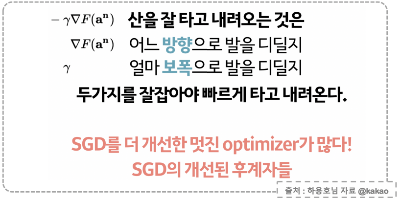

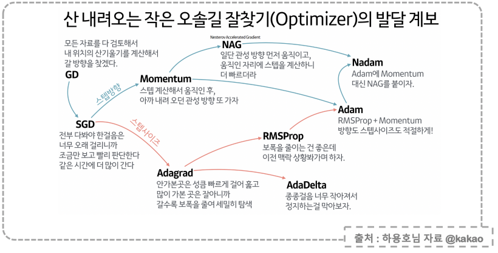

## tensorflow로 딥러닝 선형회귀 모델 만들기
- 텐서플로우를 사용하여 나이와 몸무게를 입력하면 혈중지방 수치를 예측해주는 딥러닝 모델 생성
- Age, weight 값을 입력하면 blood fat을 예측해주는 모델
    - 입력값 : X = (x1 = Age, x2 = weight), x1과 x2는 벡터
    - 가중치 : W = (w1, w2), 벡터
    - 이상치 : b (bias)
    - 출력값 : y
    - $y = XW + b$
- 데이터에서 입출력 값을 계산하여 W와 b를 얻는다.
- 모델을 학습시킨 후 예측값 반환한다.

### 텐서플로우 버전 확인
- 텐서플로우가 임포트되어야 한다.

```python
import tensorflow as tf

tf.__version__

>>>

'2.8.0'
```

### 테스트 파일 로드
- 테스트 파일에는 2차원 배열의 형태로 데이터가 저장 되어 있다.

```python
raw_data = np.genfromtxt('../../04_machine_learning/x09.txt', skip_header=36)
raw_data

>>>

array([[  1.,   1.,  84.,  46., 354.],
       [  2.,   1.,  73.,  20., 190.],
       [  3.,   1.,  65.,  52., 405.],
       [  4.,   1.,  70.,  30., 263.],
       [  5.,   1.,  76.,  57., 451.],
       [  6.,   1.,  69.,  25., 302.],
       [  7.,   1.,  63.,  28., 288.],
       [  8.,   1.,  72.,  36., 385.],
       [  9.,   1.,  79.,  57., 402.],
       [ 10.,   1.,  75.,  44., 365.],
       [ 11.,   1.,  27.,  24., 209.],
       [ 12.,   1.,  89.,  31., 290.],
       [ 13.,   1.,  65.,  52., 346.],
       [ 14.,   1.,  57.,  23., 254.], ...]
```

#### 데이터 프레임으로 변환

```python
temp_df = pd.DataFrame(raw_data, columns=["idx", "temp", "wight", "age", "bloodfat"])
temp_df.head(4)
```
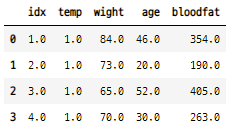

## 데이터 확인
- 특징데이터 : Age, weight, blood fat
    - tensor 형태의 데이터 구조

```python
from mpl_toolkits.mplot3d import Axes3D
import matplotlib.pyplot as plt
%matplotlib inline

xs = np.array(raw_data[:, 2], dtype=np.float32)
ys = np.array(raw_data[:, 3], dtype=np.float32)
zs = np.array(raw_data[:, 4], dtype=np.float32)

fig = plt.figure(figsize=(6, 6))

# ax = fit.gca(projection='3d')으로 해도 된다.
ax = fig.add_subplot(111, projection='3d')

ax.scatter(xs, ys, zs)
ax.set_xlabel("Weight")
ax.set_ylabel("Age")
ax.set_zlabel("Blood Fat")
ax.view_init(10, 30)

plt.show() ;
```

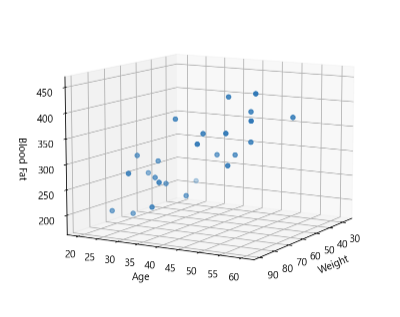


## 학습데이터 생성
- 텐서플로우의 딥러닝 모델에 입력값으로 사용하기 위해 학습데이터를 열벡터 형태로 만들어 준다.

```python
# age, weight 컬럼 : 표본 데이터
x_data = np.array(raw_data[:, 2:4], dtype=np.float32)
# blood fat 컬럼 : 라벨 데이터
y_data = np.array(raw_data[:, 4], dtype=np.float32)

# 라벨 데이터를 열벡터 형태로 변환
y_data = y_data.reshape((25, 1))
y_data

>>>

array([[354.],
       [190.],
       [405.],
       [263.],
       [451.],
       [302.],
       [288.],
       [385.],
       [402.],
       [365.],
       [209.],
       [290.],
       [346.],
       [254.],
       [395.],
       [434.],
       [220.],
       [374.],
       [308.],
       [220.],
       [311.],
       [181.],
       [274.],
       [303.],
       [244.]], dtype=float32)
```


```python
model = tf.keras.models.Sequential(
    [tf.keras.layers.Dense(1, input_shape=(2, )),
    ])

model.compile(optimizer='rmsprop', loss='mse')
```

## 모델의 구성요소 확인
- input : x1, x2, b
- weight : w1, w2
- output : y

#### 현재까지 진행내용
- Age, Weight 값을 입력받아서 blood fat을 추정하는 모델
- 모델 네트워크를 구성했고, loss function과 loss 감소를 위한 optimizer를 선정했다.

```python
model.summary()
```

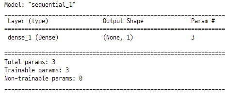


## 모델 학습
- fit함수의 인수들
    - **epochs** : 학습하는 횟수
    - **batch_size** : 한번 학습할 때 사용하는 데이터의 수
    - epochs 가 늘어날 수록 loss 값이 줄어든다.

- 5000학습 하도록 설정

```python
hist = model.fit(x_data, y_data, epochs=5000)
```

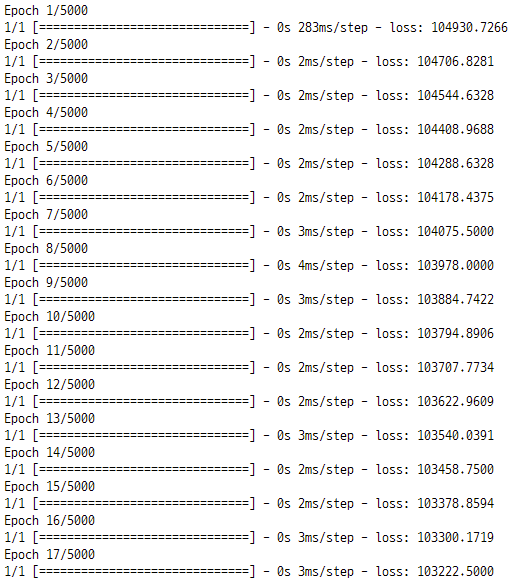

## predict
- 데이터를 이용해서 모델을 만들고, 학습을 시켰다.
- 학습한 딥러닝 모델로 예측

#### 44세 / 100kg 인 경우의 혈중지방 수치

```python
model.predict(np.array([100, 44]).reshape(1, 2))

>>>

array([[374.87704]], dtype=float32)
```

#### 25세 / 60kg 인 경우의 혈중지방 수치

```python
model.predict(np.array([60, 25]).reshape(1, 2))

>>>

array([[219.11273]], dtype=float32)
```

## 가중치와 bias 확인
- 딥러닝 모델의 각 layer 별로 사용된 가중치 벡터와 bias 값 확인
    - 모델 입력 데이터 : 행벡터 (1, 2), [몸무게, 나이]
    - 가중치 벡터 : 열벡터 (2, 1)
    - 가중치 벡터의 첫번째 원소가 w1, 두번째 원소가 w2이다.
    - 그러므로 y = w1x1 + w2x2 + b

```python
W_, b_ = model.get_weights()
print("Weight is : ", W_)
print("bias is : ", b_)

>>>>

Weight is :  [[1.2482475]
 [5.570231 ]]
bias is :  [4.9621167]
```

## 모델의 성능 확인
- 시뮬레이션 : 나이와 몸무게 데이터 생성
- 새로 생성한 데이터와 딥러닝 모델에서 구한 가중치 벡터와의 관계 확인

#### 나이 데이터 50개 생성

```python
# 나이
x = np.linspace(20, 100, 50).reshape(50, 1)
x[:10]

>>>

array([[20.        ],
       [21.63265306],
       [23.26530612],
       [24.89795918],
       [26.53061224],
       [28.16326531],
       [29.79591837],
       [31.42857143],
       [33.06122449],
       [34.69387755]])
```

#### 몸무게 데이터 50개 생성

```python
# 몸무게
y = np.linspace(10, 70, 50).reshape(50, 1)
y[:10]

>>>

array([[10.        ],
       [11.2244898 ],
       [12.44897959],
       [13.67346939],
       [14.89795918],
       [16.12244898],
       [17.34693878],
       [18.57142857],
       [19.79591837],
       [21.02040816]])
```

#### 나이, 몸무게 데이터를 하나의 행렬로 합친다.
- age, weight 특징데이터로 구분 된다.

```python
# 나이와 몸무게를 하나의 행렬로 합하기
X = np.concatenate((x, y), axis=1)
X[:10]

>>>

array([[20.        , 10.        ],
       [21.63265306, 11.2244898 ],
       [23.26530612, 12.44897959],
       [24.89795918, 13.67346939],
       [26.53061224, 14.89795918],
       [28.16326531, 16.12244898],
       [29.79591837, 17.34693878],
       [31.42857143, 18.57142857],
       [33.06122449, 19.79591837],
       [34.69387755, 21.02040816]])
```

#### 딥러닝 모델에서 구한 가중치 벡터와 bias로 선형회귀 모형 계산
- 시뮬레이션 데이터와 가중치 벡터, bias로 가중합을 구한다.
- 이 가중합 벡터가 예측값을 의미한다. 
- **시뮬레이션 데이터의 분포 방향과 가중합 벡터의 방향이 일치하는지 확인하여 딥러닝 모델의 성능을 대략 확인 할 수 있다.**

```python
Z = np.matmul(X, W_) + b_
Z[:15]

>>>

array([[ 85.62937641],
       [ 94.48802249],
       [103.34666857],
       [112.20531466],
       [121.06396074],
       [129.92260682],
       [138.7812529 ],
       [147.63989898],
       [156.49854506],
       [165.35719114],
       [174.21583723],
       [183.07448331],
       [191.93312939],
       [200.79177547],
       [209.65042155]])
```

- 그래프로 그리기

```python
fig = plt.figure(figsize=(10, 10))
ax = fig.add_subplot(111, projection='3d')
ax.scatter(xs, ys, zs)
ax.scatter(x, y, Z)
ax.set_xlabel("Weight")
ax.set_ylabel("Age")
ax.set_zlabel("Blood Fat")
ax.view_init(10, 15)
plt.show() ;
```

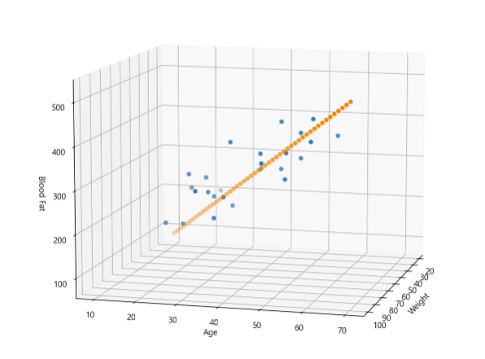


## 선형회귀와 XOR 문제
- 선형모델의 기능 : 추가자료 검색해 볼 것
    - OR 문제 풀 수 있다.
        - 0 or 0 = 0, 0 or 1 = 1, 1 or 1 = 1, 1 or 1 = 1
    - AND 문제 풀 수 있다.
        - 0 and 0 = 0, 0 and 1 = 0, 1 and 0 = 0 , 1 and 1 = 1
    - **XOR 문제 풀 수 없다.**
        - 0 xor 0 = 0, 0 xor 1 = 1, 1 xor 0 = 1 1 xor 1 = 0
- **이러한 문제를 해결하기 위한 방법 sigmoid 함수를 사용**
    - 딥러닝 모델의 활성함수로 sigmoid 함수를 사용

### XOR 데이터 생성
- 첫 번째 layers : input 데이터와 가중치 벡터, bias 벡터가 가중합이 된다.

$\begin{bmatrix}
x_1 & x_2 
\end{bmatrix} \cdot
\begin{bmatrix}
w_{11} & w_{12} \\
w_{21} & w_{22} \\
\end{bmatrix} +
\begin{bmatrix}
b_1 \\
b_2 \\
\end{bmatrix} = 
\begin{bmatrix}
x_1w_{11} + x_2 w_{21} + b_1 & x_1 w_{12} + x_2 w_{22} + b_2 \\ 
\end{bmatrix}$

```python
X = np.array([
    [0, 0],
    [0, 1],
    [1, 0],
    [1, 1]
])

y = np.array([
    [0],
    [1],
    [1],
    [0]
])
```

### 새로운 딥러닝 모델 생성

```python
model = tf.keras.Sequential([
    tf.keras.layers.Dense(2, activation='sigmoid', input_shape=(2,)),
    tf.keras.layers.Dense(1, activation='sigmoid')
])
```

### 모델 컴파일
- optimizer : SGD (stochastic graident descent), loss를 줄여주기 위한 최적화 방법
    - lr : 학습률
- loss : mse (mean squared error)        

```python
model.compile(optimizer=tf.keras.optimizers.SGD(lr=0.1), loss='mse')
```

### 모델 요약

```python
model.summary()
```

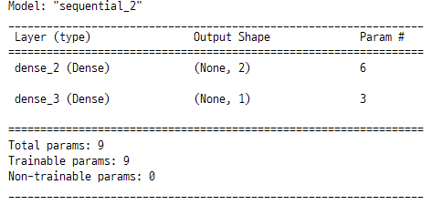

### 모델 학습

```python
hist = model.fit(X, y, epochs=5000, batch_size=1)
```

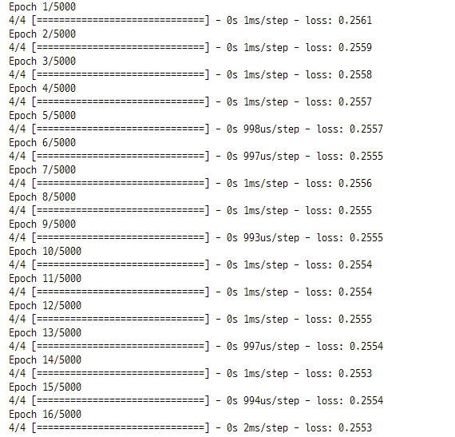


### 학습결과
- xor 문제를 예측한 결과

```python
model.predict(X)

>>>

array([[0.31182924],
       [0.55500746],
       [0.814347  ],
       [0.26470238]], dtype=float32)
```

- 딥러닝 모델에 input 한 데이터 확인

```python
X

>>>

array([[0, 0],
       [0, 1],
       [1, 0],
       [1, 1]])
```

### X 데이터의 순서를 바꾸고, model_2로 다시 예측
- xor 데이터의 순서가 바뀌면 예측 성능이 바뀌는지 확인을 위해 다시 예측

```python
X2 = np.array([
    [0, 0],
    [1, 0],
    [0, 1],
    [1, 1]
])

X2

>>>

array([[0, 0],
       [1, 0],
       [0, 1],
       [1, 1]])
```

- 딥러닝 모델 생성

```python
model_2 = tf.keras.Sequential([
    tf.keras.layers.Dense(2, activation='sigmoid', input_shape=(2,)),
    tf.keras.layers.Dense(1, activation='sigmoid')
])
```

- 딥러닝 모델 컴파일

```python
model_2.compile(optimizer=tf.keras.optimizers.SGD(lr=0.1), loss='mse')
```

- 딥러닝 모델 요약

```python
model_2.summary()
```

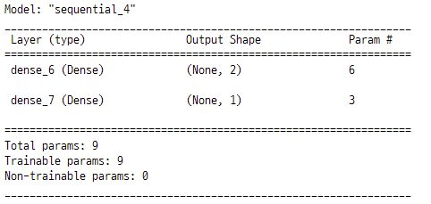


- 딥러닝 모델 학습

```python
hist = model_2.fit(X2, y, epochs=5000, batch_size=1)
```

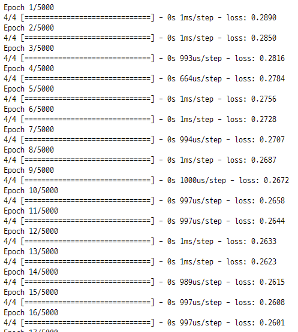

- 예측

```python
model_2.predict(X2)

>>>

array([[0.0660592 ],
       [0.9294084 ],
       [0.9353238 ],
       [0.05811876]], dtype=float32)
```

## 딥러닝 모델의 loss 확인
- 실제값 y와 모델의 예측값 \hat_y의 값의 차이
- 모델에 내장 되어 있다.
    - **hist.history['loss']**

```python
plt.figure(figsize=(8, 6))
plt.plot(hist.history["loss"])
plt.title("model loss")
plt.xlabel("epochs")
plt.ylabel("loss")

plt.show() ;
```

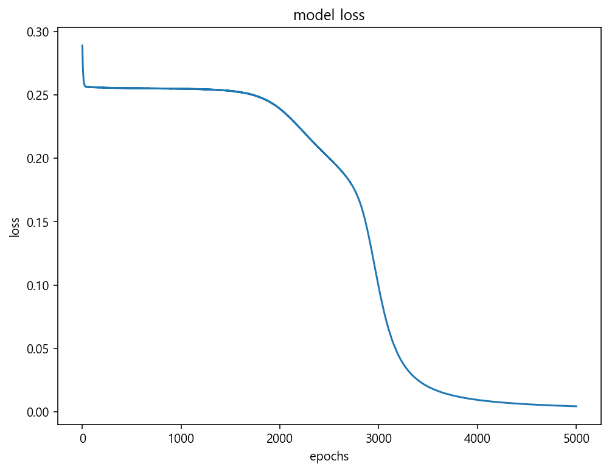


### 학습에서 찾은 가중치
- 딥러닝 모델을 만들때 layer를 2개 만들었다.
- 첫번째 가중합에서 적용 된 가중치
    - w11, w12, w21, w22 : [ 2.2322593,  4.0225554], [-1.963425 , -4.3580823]
- dense_2 에서 찾은 가중치 (가중합의 값)
    - w1, w2 : [ 0.6722828, -2.780185 ]
- 두번째 가중합에서 적용 된 가중치
    - w1, w2 : [-2.8219044], [ 4.2885075]
- dense_3 에서 찾은 가중치 (가중합의 값)
    - w : [0.8260915]

```python
for w in model.weights :
    print("---")
    print(w)

>>>

---
<tf.Variable 'dense_2/kernel:0' shape=(2, 2) dtype=float32, numpy=
array([[ 2.2322593,  4.0225554],
       [-1.963425 , -4.3580823]], dtype=float32)>
---
<tf.Variable 'dense_2/bias:0' shape=(2,) dtype=float32, numpy=array([ 0.6722828, -2.780185 ], dtype=float32)>
---
<tf.Variable 'dense_3/kernel:0' shape=(2, 1) dtype=float32, numpy=
array([[-2.8219044],
       [ 4.2885075]], dtype=float32)>
---
<tf.Variable 'dense_3/bias:0' shape=(1,) dtype=float32, numpy=array([0.8260915], dtype=float32)>
```

## 딥러닝으로 분류 모델 만들기
- 붓꽃데이터의 품종을 분류하는 딥러닝 모델 만들기
- 4개의 layer 생성하고 각 layer 마다 활성함수 설정
    
- 처음 3개의 layer에서는 각각 32개의 뉴런 생성
    - (1x4) x (4x32) = (1x32) x (32x32) = (1x32) x (32x32) = (1x32)
    - 활성함수 activation : relu 함수
- 마지막 layer에서는 3개의 뉴런 생성
    - (1x32) x (32x3) = (1x3)
    - 활성함수 activation : softmax 함수


```python
from sklearn.datasets import load_iris

iris = load_iris()
X = iris.data
y = iris.target
```

### 카테고리 데이터는 원핫인코딩 형태로 변환시켜준다.
- 붓꽃 데이터의 라벨데이터는 0, 1, 2의 카테고리 값을 갖는다.
- 라벨데이터를 원핫인코딩 형태로 변환시켜준다.

```python
y

>>>

array([0, 0, 0, 0, 0, 0, 0, 0, 0, 0, 0, 0, 0, 0, 0, 0, 0, 0, 0, 0, 0, 0,
       0, 0, 0, 0, 0, 0, 0, 0, 0, 0, 0, 0, 0, 0, 0, 0, 0, 0, 0, 0, 0, 0,
       0, 0, 0, 0, 0, 0, 1, 1, 1, 1, 1, 1, 1, 1, 1, 1, 1, 1, 1, 1, 1, 1,
       1, 1, 1, 1, 1, 1, 1, 1, 1, 1, 1, 1, 1, 1, 1, 1, 1, 1, 1, 1, 1, 1,
       1, 1, 1, 1, 1, 1, 1, 1, 1, 1, 1, 1, 2, 2, 2, 2, 2, 2, 2, 2, 2, 2,
       2, 2, 2, 2, 2, 2, 2, 2, 2, 2, 2, 2, 2, 2, 2, 2, 2, 2, 2, 2, 2, 2,
       2, 2, 2, 2, 2, 2, 2, 2, 2, 2, 2, 2, 2, 2, 2, 2, 2, 2])
```

- 원핫인코딩 객체 생성

```python
from sklearn.preprocessing import OneHotEncoder

enc = OneHotEncoder(sparse=False, handle_unknown='ignore')
enc.fit(y.reshape(len(y), 1))

>>>

OneHotEncoder(handle_unknown='ignore', sparse=False)
```

- 라벨데이터를 열벡터의 형태로 만든 후 원핫인코딩 객체로 변환시킨다.

```python
y.reshape(len(y), 1)

>>>

array([[0],
       [0],
       [0],
       [0],
       [0],
       [0],
       [0],
       [0],
       [0],
       [0],
       [0],
       [0],
       [0],
       [0], ...]
```

#### 원핫인코딩 변환

```python
y_onehot = enc.transform(y.reshape(len(y), 1))
y_onehot

>>>

array([[1., 0., 0.],
       [1., 0., 0.],
       [1., 0., 0.],
       [1., 0., 0.],
       [1., 0., 0.],
       [1., 0., 0.],
       [1., 0., 0.],
       [1., 0., 0.],
       [1., 0., 0.],
       [1., 0., 0.],
       [1., 0., 0.],
       [1., 0., 0.],
       [1., 0., 0.],
       [1., 0., 0.], ...]
```

### 학습, 테스트 데이터 분류

```python
from sklearn.model_selection import train_test_split

X_train, X_test, y_train, y_test = train_test_split(X, y_onehot,
                                                   test_size=0.2,
                                                   random_state=13)
```

### 딥러닝 모델 생성
- 4개의 layer 생성
    - layer 당 32개의 뉴런 생성
    - 마지막 layer는 3개의 뉴런 생성
- 뉴런의 활성함수로 relu 함수를 설정
    - back propagation의 vanishing gradient 영향을 최소화 해준다.
    - 계산이 반복될 수록 처음의 계산값에서 멀어지는 현상
- 마지막 layer의 할성함수는 softmax 함수를 설정
    - 카테고리 데이터의 분류에 적합

```python
model_ir = tf.keras.models.Sequential([
    tf.keras.layers.Dense(32, activation='relu', input_shape=(4,)),
    tf.keras.layers.Dense(32, activation='relu'),
    tf.keras.layers.Dense(32, activation='relu'),
    tf.keras.layers.Dense(3, activation='softmax')
])
```

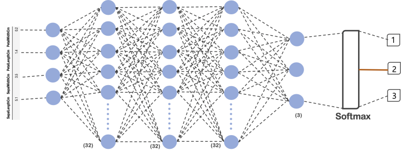

### 모델 컴파일
- optimizer 인수를 Adam 방법으로 설정
- loss 를 줄여주는 방법으로 categorical_crossentropy (카테고리형 교차엔트로피)를 설정

```python
model_ir.compile(optimizer='Adam', loss='categorical_crossentropy', metrics=['accuracy'])
```

### 모델 요약 확인

```python
model_ir.summary()
```

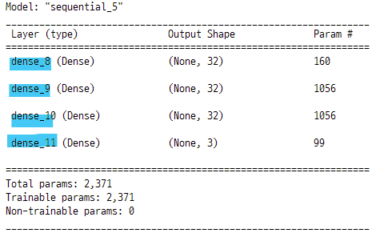

### 모델 학습
- 100번 학습

```python
hist = model_ir.fit(X_train, y_train, epochs=100)
```

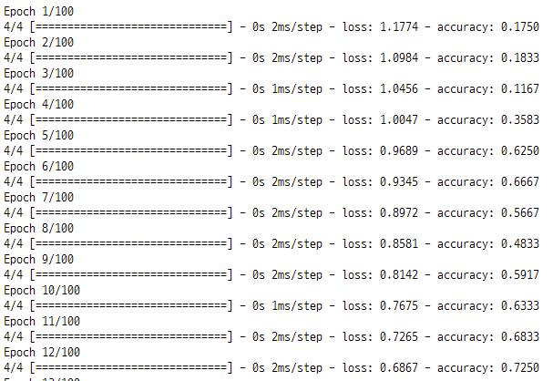

### test 데이터에 대한 accuracy

```python
model_ir.evaluate(X_test, y_test, verbose=2)

>>>

1/1 - 0s - loss: 0.0997 - accuracy: 0.9667 - 122ms/epoch - 122ms/step
[0.09969113767147064, 0.9666666388511658]
```

# loss와 acc의 변화

```python
plt.figure(figsize=(8, 6))
plt.plot(hist.history["loss"], label="loss")
plt.plot(hist.history["accuracy"], label="acc")
plt.title("model loss & acc")
plt.xlabel("epochs")
plt.ylabel("loss")
plt.legend()
plt.show() ;
```

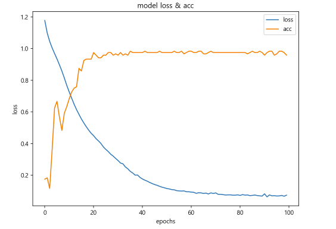


## tensorflow 딥러닝 모델 생성 요약

### 모델생성
- 망(net) 구성하기
    - 최초 layer에는 input_shape 설정
    - activation 설정 : 활성화함수 (relu, sigmoid 등)

```python
model_ir = tf.keras.models.Sequential([
    tf.keras.layers.Dense(32, activation='relu', input_shape=(4,)),
    tf.keras.layers.Dense(32, activation='relu'),
    tf.keras.layers.Dense(32, activation='relu'),
    tf.keras.layers.Dense(3, activation='softmax')
])
```

### 모델컴파일
- optimizer 설정 : loss를 최소화 하기 위한 최적화 방법
- loss 함수 설정 : 실제값과 예측값의 차이를 구하는 함수
- metrics 설정 : 성능 평가 함수

```python
model_ir.compile(optimizer='Adam', loss='categorical_crossentropy', metrics=['accuracy'])
```

### 모델요약
- 망을 구축하고, 컴파일을 설정한 내용을 요약해서 보여준다.

```python
model_ir.summary()
```

### 모델학습
- 학습데이터와 학습용 라벨데이터를 입력한다.
- epochs 설정 : 학습의 횟수

```python
hist = model_ir.fit(X_train, y_train, epochs=100)
```

### loss확인
- hist.history["loss"] : loss 값이 저장되어 있다.
- hist.history["accuracy"] : accuracy 값이 저장되어 있다.

```python
plt.figure(figsize=(8, 6))
plt.plot(hist.history["loss"], label="loss")
plt.plot(hist.history["accuracy"], label="acc")
plt.title("model loss & acc")
plt.xlabel("epochs")
plt.ylabel("loss")
plt.legend()
plt.show() ;
```

### 성능확인
- 테스트 데이터에 대한 accuracy 확인

```python
model_ir.evaluate(X_test, y_test, verbose=2)
```

- 모델에서 만든 가중치벡터와 bias벡터 확인

```python
W_, b_ = model.get_weights()
```

### 모델예측
- 가중치벡터와 bias벡터를 최적화한 모델에 새로운 데이터를 입력하여 결과값을 예측
- 객체를 생성할 때 설정한 input_shape와 같은 형태의 데이터를 입력한다.

```python
model.predict()
```
