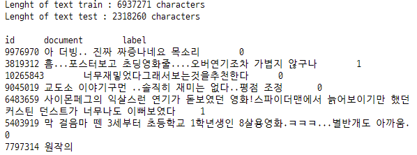

# LSTM
- Long Short Term Memory : RNN 순환신경망을 응용
- simple rnn의 장기 의존성 문제를 보완하는 알고리즘
    - long term dependency : 장기 의존성
    - 입력데이터의 길이가 길어지면 학습 능력이 떨어진다.
    - rnn의 구조상 현재의 답을 얻기 위해 이전의 정보에 의존해야 하는데, 과거의 시점이 현재와 너무 멀어지면 오히려 문제를 풀기 어려워지는 현상.

## 1. Gradient descent weight optimization
- 경사하강법, 최대경사법(steepest gradient descent)
- 딥러닝 모델의 학습과정에서 예측값(pred)과 정답값(target) 사이의 차이(error)를 최소화기 위해 최적화(optimization)를 하는데 이 과정에서 사용하는 계산법
    - 차이를 오차함수(목적함수, 비용함수)로 나타내면 이 오차함수의 최소값의 필요조건은 미분값이 0이어야 한다. 
    - 오차함수의 도함수가 0인 지점을 찾기 위해 현재 지점의 기울기로부터 다음 위치를 찾는 방법이라고 볼 수 있다.
    - 임의의 초기값을 시작점으로 비용함수의 도함수가 최소가 될 때까지 기울기값을 갱신한다.


### 1-1. 수식
- $x_{k+1} = x_k - \mu \bigtriangledown f(x_k) = x_k - \mu g(x_k)$ 
    - \mu : 스텝사이즈, learning rate 학습률
    - \bigtriangledown f(x_k) : 그레디언트 벡터 : 도함수로 이루어진 벡터
- rnn 모델에서의 수식
    - $W_{k+1} = W_{k} - \text{learning_rate} \cdot \dfrac{\partial E}{\partial W}$
    - W_{k+1} : 현재 가중치
    - W_k : 이전 가중치
    - E : error

### 1-2. RNN 모델에서의 최적화의 의미
- 최적의 가중치를 구하기위해 그레디언트 디센트를 사용하여 오차가 최소화되는 값을 찾는다.
- error를 가중치로 미분한값
    - 각 cell error를 가중치로 미분한 값들의 합
- 하나의 cell error의 가중치로 미분값
    - 현재 cell 미분값 + 이전 cell 미분값
    - 즉 chain rule 형태로 각 cell error의 미분값은 이전단계들의 미분값들의 합과 같다.

- 오차함수의 기울기는 모든 error에 대한 도함수의 합


### 1-3. BPTT
- back probagation through time
- chain rule에 의해 각 state의 미분값이 이전 state의 미분값의 합으로 이루어져 있다.
- 이러한 경우 BPTT를 통해서 미분값들을 여러번 곱하고 더한다.


###  1-4. Gradient Vanishing Problem
- sequence가 작은 경우는 bptt 방식의 가중치 계산이 가능하다. 그런데 sequence가 큰 경우 무수히 많은 미분값을 곱해주어야한다.
- 이런 경우 미분값이 1보다 작은 경우 0에 수렵하게 된다.
- 즉 가중치값이 기존의 값과 변화가 없게 된다.
    - 학습이 비효율적이게 된다. 


### 1-5. Gradient Exploding Problem
- sequence가 큰 데이터의 bptt 방식에서 1보다 큰 미분값을 무수히 많이 곱해주게 되면 결과적으로 가중치값이 기존값에서 크게 변화하게 된다.
- 학습이 한 곳으로 수렴하지 못하게 된다. 


## 2. LSTM
- rnn의 학습과정의 최적화에서 발생하는 gradient vanishing, exploding 문제를 보완한 방법
- lstm cell 안에 입력된 정보를 잊는 메카니즘과 기억하는 메카니즘이 수학적으로 구현되어 있다.
    - hidden_state와 memory_cell로 나누어진다.
- lstm cell 안의 각 과정에 sigmoid 함수가 추가됨
    - sigmoid 함수는 0, 1사이의 값을 반환한다. 즉 확률값 처럼 사용할 수 있다.
    - 어떤 정보를 일부만 남기고 일부는 제거할 수 있다.    

- 문장을 학습하여 단어마다 형태소를 예측하는 모델이라고 가정


- LSTM cell의 두 개의 state


- cell 내부의 연산과정


### 2-1. LSTM cell : forget mechanism
-  lstm cell은 C_t-1(memory_cell)와 h_t-1(hidden_state) 값을 이전 state로 부터 input 받으며 각각 병렬구조로 출력된다. 이 구조에서 서로 혼합된다. 
    - rnn은 hidden_state만 받는다.
- 현재 cell의 input 값이 들어오면 h_t-1값과 합쳐지고, sigmoid 함수를 통과한다.
- sigmoid 함수를 통과하면서 0, 1사이의 값이 되고, 이 확률값이 C_t-1의 값과 곱해진다.
    - 즉 이전 state에서 들어온 memory_cell의 값이 sigmoid 함수값과 곱해져서 일부는 잊혀지게 된다.
    - sigmoid 값이 20% 가 나왔다면 이전 meomory_cell 값의 20%만 남겨라는 의미가 된다.


### 2-2. LSTM cell : input mechanism  
- 현재 셀의 input값과 이전 cell의 hidden_state값을 sigmoid 함수와 tanh 함수에 각각 넣고 출력값을 만든다.
- sigmoid 출력값과 tanh 출력값을 곱한다.
- new_memory
    - 이 곱해진 값을 조정된 C_t-1 값과 더해준다. 
    - 과거의 정보에 새로운 정보가 더해지면서 새로운 memory_cell 값이 만들어 진 것과 같다.
    


### 2-3. LSTM cell : output mechanism
- lstm cell도 rnn cell을 기반으로하기 때문에 output 값을 반환하고 hidden_state값을 다음 cell에 넘겨준다. 
    - 추가로 memory_cell 값도 다음 cell에 넘겨준다.
- new_memory 값을 tanh 함수에 넣고 출력값을 얻는다.
- 이전 cell의 hidden_state값과 현재 cell의 input값을 sigmoid 함수에 넣고 출력값을 얻는다.
- 두 개의 값을 곱해준다. 
    - 이 값이 output 값이 되고, 다음 cell에 넘겨줄 hidden_state 값이 된다. 


## 3. TensorFlow LSTM

### 3-1. 데이터 생성
- 균일분포의 데이터를 랜덤하게 생성
- 0~100 중 2개의 정수를 선택하여 idx 값으로 저장
- 원소가 100개인 영벡터 생성한 후 idx에 해당하는 값을 1로 저장
    - 인덱스가 2개 이므로 2개의 값이 바뀐다.
- X 데이터는 균일분포와 영벡터를 zip을 사용하여 합한다.
- Y 데이터는 균일분포 데이터에서 idx에 해당한는 값 2개를 곱한 후 저장한다.

```python
X = []
Y = []

for i in range(3000) :
    lst = np.random.rand(100)
    idx = np.random.choice(100, 2, replace=False)
    zeros = np.zeros(100)
    zeros[idx] = 1
    X.append(np.array(list(zip(zeros, lst))))
    Y.append(np.prod(lst[idx]))

print(X[0], Y[0])

>>>

[[0.         0.12081525]
 [0.         0.92541031]
 [0.         0.8219348 ]
 [0.         0.42718652]
 [0.         0.67883278]
 [1.         0.78966009]
 [0.         0.09728805]
 [0.         0.62496675]
 [0.         0.70654689]
 ...]
```

#### X, Y의 크기

```python
len(X), len(Y), X[0].shape, Y[0].shape

>>>

(3000, 3000, (100, 2), ())
```

### 3-2. RNN 모델의 단점
- 입력데이터가 큰 경우 RNN 모델은 정확도가 떨어진다.
    - 장기 의존성 문제
    - bptt 과정에서 도함수값이 반복하여 곱해지면서 vanishing 또는 exploding 현상이 발생함
- loss 값과 val_loss 값의 차이가 크게 벌어진다.

```python
## 모델 생성
model = tf.keras.Sequential([
    tf.keras.layers.SimpleRNN(units=30, return_sequences=True,
                              input_shape=[100, 2]),
    tf.keras.layers.SimpleRNN(units=30),
    tf.keras.layers.Dense(1)
])

model.compile(optimizer="adam", loss="mse")

## 모델 학습
X = np.array(X)
Y = np.array(Y)

history = model.fit(X[:2560], Y[:2560], epochs=100, validation_split=0.2)

## 모델 평가
plt.plot(history.history["loss"], 'b--', label="loss")
plt.plot(history.history["val_loss"], "r--", label="val_loss")
plt.xlabel("Epoch")
plt.legend()
plt.show() ;
```


### 3-3. LSTM 모델 생성

```python
model_lstm = tf.keras.Sequential([
    tf.keras.layers.LSTM(units=30, return_sequences=True, input_shape=[100,2]),
    tf.keras.layers.LSTM(units=30),
    tf.keras.layers.Dense(1)
])

model_lstm.compile(optimizer='adam', loss="mse")
model_lstm.summary()
```


### 3-4. 모델 학습

```python
X = np.array(X)
Y = np.array(Y)

history_lstm = model_lstm.fit(X[:2560], Y[:2560], epochs=100, validation_split=0.2)
```


### 3-5. 학습 결과
- loss, val_loss 값이 거의 일치한다.
- 큰 입력값에서 rnn보다 성능이 좋다. 

```python
plt.plot(history_lstm.history["loss"], "b--", label="loss")
plt.plot(history_lstm.history["val_loss"], "r--", label="val_lass")
plt.xlabel("Epoch")
plt.legend()
plt.show() ;
```

## 4. LSTM 모델을 사용한 Sentiment Analysis
- 감성분석
- 입력된 자연어 안의 주관적인 의견, 감정 등을 찾아내는 문제
- 이중 문장의 긍정/부정 등을 구분하는 경우가 많다.

### 4-1. 데이터 임포트

```python
url_train = "https://raw.githubusercontent.com/e9t/nsmc/master/ratings_train.txt"
url_test = "https://raw.githubusercontent.com/e9t/nsmc/master/ratings_test.txt"

path_to_train_file = tf.keras.utils.get_file("train.txt", url_train)
path_to_test_file = tf.keras.utils.get_file("test.txt", url_test)
```

### 4-2. 데이터 확인

```python
train_text = open(path_to_train_file, 'rb').read().decode(encoding='utf-8')
test_text = open(path_to_test_file, 'rb').read().decode(encoding='utf-8')

print("Lenght of text train : {} characters".format(len(train_text)))
print("Lenght of text test : {} characters".format(len(test_text)))
print()

print(train_text[:300])
```




#### 데이터에 불필요한 값들이 많음

```python
train_text[:300]
```


#### 데이터 줄 바꿈으로 확인
- 탭 입력 뒤에 라벨 데이터가 보인다.
    - \t0, \t1

```python
train_text.split("\n")
```


#### 라벨 데이터로 사용할 text 데이터
- 데이터의 마지막에 0, 1이 붙어있다.
    - \t로 구분으로하고 마지막의 0, 1을 가져온다.
- 데이터 전처리를 통해서 이 text 부분으로 형식을 맞춰준다.

```python
train_text.split("\n")[3]

>>>

'10265843\t너무재밓었다그래서보는것을추천한다\t0'
```

### 4-3. 라벨 데이터 분리
- 리스트 컴프리핸션을 사용하여 각 문장에서 라벨데이터를 꺼내어 array 형태로 저장한다.
    - 데이터에서 "\n" 구분 -> "\t" 구분으로 문장 나누기
    - 결과값에서 라벨 데이터를 사용할 데이터만 반환하기
    - 각각의 라벨 데이터를 리스트안에 넣기
    - \t로 구분한 원소의 갯수가 0보다 많은 것만 반환

```python
train_Y = np.array([ [int(row.split("\t")[2])]
                    for row in train_text.split("\n")[1:] if row.count("\t") > 0 ])
test_Y = np.array([ [int(row.split("\t")[2])]
                   for row in test_text.split("\n")[1:] if row.count("\t") > 0 ])

print(train_Y.shape, test_Y.shape)
print(train_Y[:5])

>>>

(150000, 1) (50000, 1)
[[0]
 [1]
 [0]
 [0]
 [1]]
```

### 4-4. 데이터 전처리 tokenization, cleaning
- **tokenization** : 자연어를 처리 가능한 최소의 단위로 나누는 것, 언어의 문법적 특성마다 나누는 기준이 달라질 수 있다. 또는 분석의 기준에 따라서 구분할 수 있다. 
    - 여기에서는 단순히 띄어쓰기 기준
- **cleaning** : 불필요한 기호 제거

#### cleaning
- 정규표현식을 사용하여 문장마다 불필요한 요소들을 제거해준다.

```python
def clean_str(string) :
    string = re.sub(r"[^가-힣A-Za-z0-9(), !?\'\']", " ", string)
    string = re.sub(r"\'s", " \'s", string)
    string = re.sub(r"\'ve", " \'ve", string)
    string = re.sub(r"n\'t", " n\'t", string)
    string = re.sub(r"\'re", " \'re", string)
    string = re.sub(r"\'d", " \'d", string)
    string = re.sub(r"\'ll", " \'ll", string)
    string = re.sub(r",", " , ", string)
    string = re.sub(r"!", " ! ", string)
    string = re.sub(r"\(", " \( ", string)
    string = re.sub(r"\)", " \) ", string)
    string = re.sub(r"\?", " \? ", string)
    string = re.sub(r"\s{2,}", " ", string)
    string = re.sub(r"\'{2,}", "\'", string)
    string = re.sub(r"\'", "", string)

    return string.lower()
```

#### train 데이터 cleaning

```python
train_text_X = [ row.split("\t")[1]
                for row in train_text.split("\n")[1:] if row.count("\t") > 0 ]
train_text_x = [clean_str(sentence) for sentence in train_text_X]
sentences = [sentence.split(" ") for sentence in train_text_X]

for i in range(5) :
    print(sentences[i])
```


### 4-5. 데이터 크기 맞추기
- 학습을 위해 네트워크에 입력 데이터의 크기를 같게 해준다.
- 15만개의 문장중에서 대부분 40단어 이하로 이루어져 있다.
- 긴문장은 줄이고 짧은 문장은 공백을 채워 넣는 방식으로 데이터의 크기를 맞춰준다.

#### 문장의 길이 분포

```python
sentence_len = [len(sentence) for sentence in sentences]
sentence_len.sort()
plt.plot(sentence_len)
plt.show() ;

print(sum([int(l <= 25) for l in sentence_len]))

>>>

144646
```


#### 말뭉치 길이를 5개로 균일하게 만들기
- 전처리 하기 전
    - 말뭉치의 길이가 5개보다 더 긴 것들이 있음

```python
sentences[:5]

>>>

[['아', '더빙..', '진짜', '짜증나네요', '목소리'],
 ['흠...포스터보고', '초딩영화줄....오버연기조차', '가볍지', '않구나'],
 ['너무재밓었다그래서보는것을추천한다'],
 ['교도소', '이야기구먼', '..솔직히', '재미는', '없다..평점', '조정'],
 ['사이몬페그의',
  '익살스런',
  '연기가',
  '돋보였던',
  '영화!스파이더맨에서',
  '늙어보이기만',
  '했던',
  '커스틴',
  '던스트가',
  '너무나도',
  '이뻐보였다']]
```

- 전처리 후 
    - 말뭉치의 길이를 최대 5개로 맞춤

```python
sentences_new = []
for sentence in sentences : 
    sentences_new.append([ word[:5] for word in sentence[:25] ])
    
sentences_2 = sentences_new
for i in range(5) : 
    print(sentences_2[i])

>>>

['아', '더빙..', '진짜', '짜증나네요', '목소리']
['흠...포', '초딩영화줄', '가볍지', '않구나']
['너무재밓었']
['교도소', '이야기구먼', '..솔직히', '재미는', '없다..평', '조정']
['사이몬페그', '익살스런', '연기가', '돋보였던', '영화!스파', '늙어보이기', '했던', '커스틴', '던스트가', '너무나도', '이뻐보였다']
```

### 4- 토크나이징과 패딩
- padding : 빈공간에 0을 채우는 방식
    - 어떤 기능인지 확인 할 것

```python
from tensorflow.keras.preprocessing.text import Tokenizer
from tensorflow.keras.preprocessing.sequence import pad_sequences

tokenizer = Tokenizer(num_words=20000)
tokenizer.fit_on_texts(sentences_2)
train_X_1 = tokenizer.texts_to_sequences(sentences_2)
train_X = pad_sequences(train_X_1, padding="post")

print(train_X[:5])

>>>

[[   49     4  6717  1068     0     0     0     0     0     0     0     0
      0     0     0     0     0     0     0     0     0     0     0     0
      0]
 [ 6718     0     0     0     0     0     0     0     0     0     0     0
      0     0     0     0     0     0     0     0     0     0     0     0
      0]
 [    0     0     0     0     0     0     0     0     0     0     0     0
      0     0     0     0     0     0     0     0     0     0     0     0
      0]
 [  324 11089     0     0     0     0     0     0     0     0     0     0
      0     0     0     0     0     0     0     0     0     0     0     0
      0]
 [   95  5218   787   501     0     0     0     0     0     0     0     0
      0     0     0     0     0     0     0     0     0     0     0     0
      0]]
```

### 4-7. 자연어 분석을 위한 딥러닝 모델 생성
- **Embedding layer** : 자연어를 수치화된 정보로 바꾸기 위한 레이어
- 자연어는 기본적으로 시간의 흐름에 따른 연속 정보인 **시퀀스 데이터**와 같다.
- 영어는 문자 단위, 한글은 문자를 넘어 자소 단위로 쪼개기도 한다. 
    - 혹은 띄어쓰기나 형태소로 나누기도 한다.
    - 여러 단어로 묶어서 사용하는 **n-gram** 방식도 있다.
- 이 과정에 원핫인코딩까지 포함시켜준다.

```python
model_nltk = tf.keras.Sequential([
    tf.keras.layers.Embedding(20000, 300, input_length=(25)),
    tf.keras.layers.LSTM(units=50),
    tf.keras.layers.Dense(2, activation="softmax")])

model_nltk.compile(optimizer="adam", loss="sparse_categorical_crossentropy",
                  metrics=["accuracy"])
model_nltk.summary()
```


### 4-8. 모델 학습

```python
import time

start = time.time()

hist_nl = model_nl.fit(train_X, train_Y, epochs=5, batch_size=128,
                      validation_split=0.2)

print("Fit time : {}".format(time.time() - start))
```


### 4-9. 학습 결과
- loss와 val_loss 확인

```python
plt.plot(hist_nltk.history["loss"], "b--", label="loss")
plt.plot(hist_nltk.history["val_loss"], "r--", label="val_loss")
plt.xlabel("Epochs")
plt.show() ;
```

### 4-10. 예측
- 0과 1에 대한 두개의 확률값이 반환 된다.
    - 모델을 만들 때 마지막 layer에 활성함수를 softmax로 설정했기 때문에 조건부 확률값과 같다.

```python
def lstm_sentiment_pred(sentence) :
    temp_sentence = sentence.split(" ")

    test_sentences = []
    now_sentence = []

    for word in temp_sentence :
        now_sentence.append(word)
        test_sentences.append(now_sentence[:])

    test_X_1 = tokenizer.texts_to_sequences(test_sentences)
    test_X_1 = pad_sequences(test_X_1, padding="post", maxlen=25)
    prediction = model_nltk.predict(test_X_1)

    for idx, sentence in enumerate(test_sentences) :
        print(sentence)
        print(prediction[idx])
```

#### 문장 1에 대한 감성 분석
- [0.9989905  0.00100957] : 0의 확률이 더 높다. 
    - 부정적 견해라는 의미이다.

```python
c = "재미있을 줄 알았는데 완전 실망했어. 너무 졸려, 돈도 아까워"
lstm_sentiment_pred(c)
```


#### 문장 2에 대한 감성 분석
- 긍정적인 견해와 부정적인 견해가 섞여 있는 문장
    - 한 사람은 재미있었다는데 나는 재미었었어
- [0.59766257 0.4023374 ] : 0에 대한 확률값이 좀 더 크다.
    - 큰 차이는 없지만 약간 더 부정적인 견해로 예측했다.

```python
c = "어제 여자친구랑 봤는데 여자친구는 재밌었다는데 나는 재미없더라고"
lstm_sentiment_pred(c)
```


#### 문장 3에 대한 감성 분석
- [0.9985837  0.00141639] : 0에 대한 확률값이 더 크다.

```python
c = "배우, 조연 다 좋은데 영화는 별로네"
lstm_sentiment_pred(c)
```


#### 문장 4에 대한 감성 분석
- [0.23842187 0.76157814] : 1에 대한 확률값이 더 크다.
    - 미세하지만 부정적인 뉘앙스에 대한 확률값도 예측 됐다. 

```python
c = "이게 영화인가 싶었는데 나름 볼만했어"
lstm_sentiment_pred(c)
```


