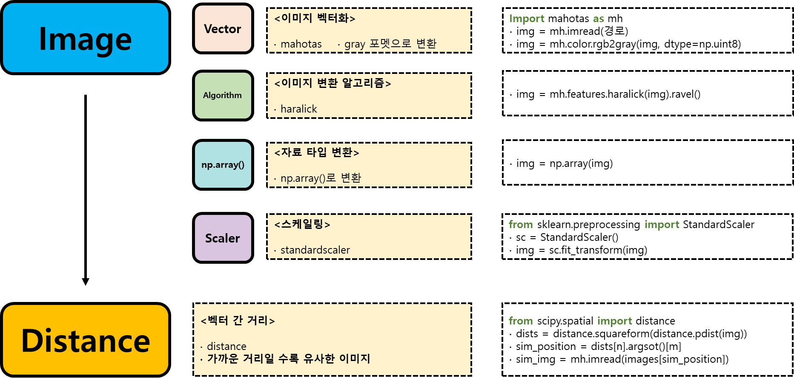
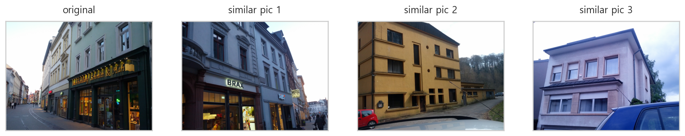
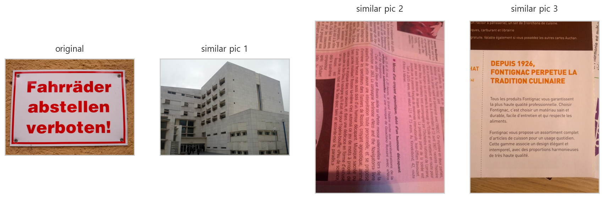

# similar images 


## 이미지 변환

### 1. 이미지를 벡터화
- img는 이미지의 경로 (이미지파일의 형식까지 포함)

```python
im = mh.imread(img)
```
- 벡터화한 이미지 한 개는 어떻게 생겼을까?

```python
mh.imread(images[0])

>>>

array([[[106, 126, 135],
        [104, 124, 133],
        [107, 127, 136],
        ...,
        [ 70, 143, 198],
        [ 71, 144, 199],
        [ 70, 143, 198]],

       [[108, 128, 137],
        [109, 129, 138],
        [104, 124, 133],
        ...,
```

- 벡터화한 이미지 한개의 크기는 이렇다.
- 3차원으로 되어 있는 이유는 rgb 이미지 이기때문이다. (red, green blue)

```python
mh.imread(images[0]).shape

>>>

(1944, 2592, 3)
```

### 2. 벡터화환 이미지를 gray로 변환
- mh.imread()로 이미지를 벡터화 했다. 
- 이미지 벡터를 gray 컬러로 변환해준다.

```python
im = mh.color.rgb2gray(img,dtype=np.uint8)
im

>>>

array([[120, 118, 121, ..., 127, 128, 127],
       [122, 123, 118, ..., 122, 124, 126],
       [130, 131, 116, ..., 122, 125, 129],
       ...,
       [186, 186, 186, ...,  65,  56,  50],
       [185, 186, 186, ...,  63,  63,  68],
       [185, 186, 187, ...,  64,  69,  67]], dtype=uint8)
```

- 회색컬러로 변환한 이미지 벡터는 rgb 차원이 없어지고 2차원 행렬의 형태가 된다.

```python
im.shape

>>>

(1944, 2592)
```

### 3. gray로 변환한 이미지를 haralick 알고리즘으로 변환 후 features에 저장
- 이미지의 날카로운 부분을 잘 나타내줄 수 있는 좌표변환? 알고리즘

```python
features.append(mh.features.haralick(im).ravel())
```

- 회색으로 변환한 이미지 벡터를 haralick 알고리즘으로 다시 변환하면 모양이 바뀐다.
    - 1944x2592 행렬이 4x13 행렬로 변환된다.
```python
mh.features.haralick(im).shape

>>>

(4, 13)
```

### 4. 최종 이미지 벡터를 np.array()로 변환

```python
np.array(features)
```
	
## 라벨 데이터

### 1. 이미지 파일의 경로 검색

#### glob 패키지로 파일 경로 검색
- glob 패키지는 `*.jpg` 등 검색 명령어를 사용할 수 있다.
    - jpg 파일만 검색하기
- images에 파일경로 저장

```python
images = glob("../../04_machine_learning/SimpleImageDataset/SimpleImageDataset/*.jpg")
images

>>>

['../../04_machine_learning/SimpleImageDataset/SimpleImageDataset\\building00.jpg',
 '../../04_machine_learning/SimpleImageDataset/SimpleImageDataset\\building01.jpg',
 '../../04_machine_learning/SimpleImageDataset/SimpleImageDataset\\building02.jpg',
 '../../04_machine_learning/SimpleImageDataset/SimpleImageDataset\\building03.jpg',
 '../../04_machine_learning/SimpleImageDataset/SimpleImageDataset\\building04.jpg',
 '../../04_machine_learning/SimpleImageDataset/SimpleImageDataset\\building05.jpg', ...]
```

#### 파일 경로에서 라벨부분만 선택하기
- 파일명에서 이미지의 마지막에 붙어있는 넘버와 jpg 를 제외하는 인덱스
- 라벨 부분만 떼어내서 labels에 저장한다.

```python
labels = images[0][64:-len("00.jpg")]
labels 

>>>

'building'
```

### 2. 최종 라벨을 np.array()로 변환

```python
np.array(labels)
```
	
## 예측 성능 평가
### 1. pipeline으로 로지스틱 회귀 모델 만들기
- 파이프라인 임포트
- 스케일러 임포트 
- 로지스틱 회귀 분류 모델 임포트 

```python
from sklearn.pipeline import Pipeline
from sklearn.preprocessing import StandardScaler
from sklearn.linear_model import LogisticRegression

clf = Pipeline([("proproc", StandardScaler()), ("classifier", LogisticRegression)])
```

### 2. 예측 정확도 확인
- cross_val_score에 파이프라인 객체와 haralick으로 변환한 이미지 객체, 라벨데이터를 넣는다.
    - 5번의 교차검증 결과가 반환된다. 

```python
from sklearn.model_selection import cross_val_score

scores = cross_val_score(clf, features, labels)
scores 

>>>

array([0.88888889, 0.72222222, 0.94444444, 0.83333333, 0.94444444])
```

## 이미지 벡터간 거리를 계산하여 유사한 이미지 찾기

### 1. 이미지 벡터를 스케일러를 사용하여 스케일링
- features는 list안에 이미지의 벡터가 각각 numpy.ndarray로 저장 되어 있다.

```python
from sklearn.preprocessing import StandardScaler

sc = StandardScaler()
features = sc.fit_transform(features)
```

### 2. 이미지 벡터를 각 이미지 벡터와의 거리를 계산
- 이미지의 갯수 M이면 M X M의 정방행렬로 반환된다. 각 이미지마다 다른 이미지와의 거리값이 저장된다.

```python
from scipy.spatial import distance

distance의 squareform 서브패키지 사용
dists = distance.squareform(distance.pdist(features))
dists.shape

>>>

(90, 90)
```

### 3. dists에서 가장 유사한 이미지 선택
- n번째 이미지와 거리값이 작은 이미지가 유사한 이미지이다.
    - m을 0, 1, 2, 3... 으로 하면, 가장 유사한 이미지의 벡터를 차례대로 선택할 수 있다.

```python
sim_img_position = dists[n].argsort()[m]
```
- dists에서 원하는 이미지 A를 인덱스로 선택
- A에는 A와 나머지 이미지들간의 거리값이 저장되어 있다. 

```python
array([    0.        ,  5261.64361451, 10201.11126381, 10605.19152115, ...])
```

- argsort() 명령어를 사용하면 가장 작은 값 순서데로 인덱스가 나열된다. (거리값이 정렬되는 것이아니다.)
   - 가장 거리값이 작은 것은 0번째, 두번쨰로 거리값이 작은것은 16번째 이미지라는 의미이다.
   - 이 배열에서 인덱스 0, 1, 2, 3, 4 는 가장 거리값이 가까운 이미지이다.

```python
array([ 0, 16,  5, 52,  9,  8, 28,...])
```

- 이미지의 경로가 저장된 images에서 이 인덱스값의 위치에 있는 이미지가 유사한 이미지가 된다.

```python
image = mh.imread(imges[sim_img_position])
```

## 전체 프로세스

### 1. 도식화




### 2. 코드

#### 이미지 -> 벡터화 -> gray변환 -> haralick 알고리즘으로 변환

```python
import time

# image파일을 경로와 함께 리스트에 저장
images = glob("../../04_machine_learning/SimpleImageDataset/SimpleImageDataset/*.jpg")

# haralick 알고리즘으로 변환한 이미지 저장
features = []
# 이미지의 라벨 저장
labels = []

start = time.time()
for im in images :
    
    # 이미지의 라벨만 떼어서 따로 저장 : building, text 등..
    labels.append(im[64:-len("00.jpg")])
    
    # 이미지를 gray로 변환
    ### 이미지를 벡터화하고 gray로 바꿔준다.
    im = mh.imread(im)
    im = mh.colors.rgb2gray(im, dtype=np.uint8)
    
    # gray로 바뀐 이미지를 haralick 알고리즘으로 변환 : 날카롭게?
    features.append(mh.features.haralick(im).ravel())

print("fit time : {}".format(time.time() - start))

>>>

fit time : 44.64558744430542
```

#### np.array()로 변환

```python
features = np.array(features)
labels = np.array(labels)
```

#### pipeline으로 로지스틱 회귀 분류모델 생성 후 모델 성능 평가
- haralick 알고리즘으로 변형한 이미지가 분류모델에서 작동하는지 확인
   - 정확도를 높이기 위해서 다른 처리들을 해주어야 한다.

```python
from sklearn.pipeline import Pipeline
from sklearn.preprocessing import StandardScaler
from sklearn.linear_model import LogisticRegression

clf = Pipeline([("preproc", StandardScaler()),
                ("classifier", LogisticRegression())])

from sklearn.model_selection import cross_val_score

scores = cross_val_score(clf, features, labels)
print("Accuracy : {:.2%}".format(scores.mean()))

>>>

Accuracy : 86.67%
```

#### 이미지 벡터간의 거리를 계산하여 유사한 이미지 찾기
- 스케일러 적용

```python
from sklearn.preprocessing import StandardScaler

sc = StandardScaler()
features = sc.fit_transform(features)
```

- 거리값 계산
   - 각 이미지당 다른 이미지와 거리값 저장 : 90X90의 넘파이 배열이 생성된다.

```python
from scipy.spatial import distance

dists = distance.squareform(distance.pdist(features))
dists

>>>

array([[ 0.        ,  3.24126943,  3.95912978, ...,  9.02335209,
         7.91052397, 11.03622167],
       [ 3.24126943,  0.        ,  2.63112305, ..., 10.19400626,
         9.01450035, 11.39739651],
       [ 3.95912978,  2.63112305,  0.        , ...,  9.75647338,
         9.01878646, 10.31132568],
       ...,
       [ 9.02335209, 10.19400626,  9.75647338, ...,  0.        ,
         2.98306964,  7.4286449 ],
       [ 7.91052397,  9.01450035,  9.01878646, ...,  2.98306964,
         0.        ,  6.96981121],
       [11.03622167, 11.39739651, 10.31132568, ...,  7.4286449 ,
         6.96981121,  0.        ]])
```

#### 유사한 이미지를 찾아서 4개씩 반환하는 함수
- 유사한 이미지 찾는 함수

```python
def selectImage(images, dists, n, m) :
    """
    1. 파라미터
     - dists : 이미지별로 다른 이미지와의 거리값을 저장한 데이터
     - images : 이미지 파일의 경로
     - n : 이미지의 거리값 벡터에서 이미지의 인덱스(이미지의 번호)
     - m : 거리값 데이터 중에서 크기가 작은 인덱스 정렬에서 선택하는 값(0=제일 작은 값의 인덱스, 1=두번째로 작은 값의 인덱스)

    2. 변수
     - image_position : 해당 이미지에서 거리값이 작은 순서의 인덱스를 반환했을 때 선택한 인덱스의 작은 크기 순서번호(이미지의 순서와 같다)
     - image : image_position의 위치에 있는 경로값을 받아서 이미지를 벡터화 한 값

    3. 이미지 plot 함수에서 사용된다.
    """
    image_position = dists[n].argsort()[m]
    image = mh.imread(images[image_position])

    return image
```

- selectImages함수를 호출하여 4개의 유사한 이미지를 반환하는 함수

```python
def plotImages(n) :
    fig, ax = plt.subplots(1, 4, figsize=(15, 5))

    for i in range(4) :
        ax[i].imshow(selectImage(images, dists, n, i))
        ax[i].set_xticks([])
        ax[i].set_yticks([])
        if i == 0 :
            ax[i].set_title("original", y=1.03)
        else :
            ax[i].set_title("similar pic {}".format(i), y=1.03)

    plt.show()
```

#### 함수 호출
- images 리스트에서 10번째 이미지와 유사한 이미지 반환

```python
plotImages(10)
```




- images 리스트에서 70번쨰 이미지와 유사한 이미지 반환

```python
plotImages(70)
```




## 모델 검증과 성능평가
- 간단하게 유사한 이미지 찾기 프로젝트를 해보았다.
- **선택한 이미지와 유사한 이미지를 반환하기는 했지만, 완전히 다른 이미지가 포함되기도 했다.**
- 이러한 문제는 머신러닝 모델이 이미지를 분석 할 때 분석의 영역에 문제가 있기 때문이다.
- 분석가가 이미지에서 분석해주기를 바라는 영역과 머신러닝이 분석한 영역에서 차이가 나기 때문이다.
- **이러한 문제를 해결하여 모델의 성능을 높이기 위해서는 모델을 검증하고 데이터를 면밀하게 검토해야한다.**

