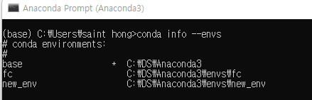
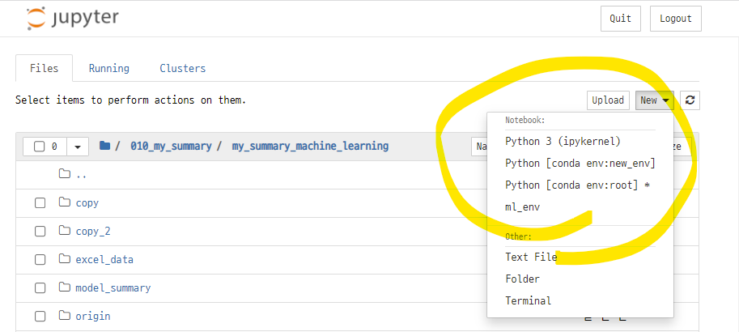
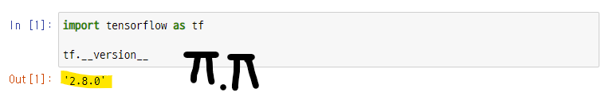

# jupyter notebook에서 tensorflow 실행시 kernel died 오류 해결

### error 발생
- 텐서 플로우를 설치하고 모듈을 임포트하면 아래와 같은 에러? 가 발생했다.


- 몇시간 동안 관련 error를 구글링해 본 결과 많은 사람들이 비슷한 문제를 겪고 있었고, 여러가지 solution들이 제시되고 있었다.
- 이 solution들을 실행해본 결과, 결론적으로 말하면 새로운 가상환경을 만들고 이 가상환경에서 설치하는 방법으로 해결 할 수 있었다. 덕분에 conda 가상환경을 만들고 주피터 노트북에 커널을 연결하고, 여러가지 가상환경을 선택하여 여기에 설치된 프로그램들을 사용하는 방법을 알게 되었다.
- 이 문제를 해결하기 위해 시도했던 내용들을 정리해본다. 

### Tensorflow 설치
- 텐서플로우를 설치한 후 모듈을 임포트 하니 kernerl died error 가 발생했다. 무엇이 문제였을까?
- pip 버전 확인
    - **pip -V**
- pip 업그레이드
    - **pip install --upgrade pip**

### kernel died 해결을 위한 몇가지 접근

#### 1. 쥬피터노트북의 메모리 문제로 커널이 멈출 수 있다.
- 쥬피터 노트북의 메모리를 높여주기
- error 해결 실패, 여전히 커널이 멈춘다.

```
c/uesrs/saint\ hong/.jupyternotebook 디렉토리로 이동
**jupyter_notebook_config.py** vim으로 열기
:?max_buffer_size 검색
"c.NotebookApp.max_buffer_size=100000000" 값을 기존보다 높여준다.
```
- 참고 페이지 : https://romillion.tistory.com/103

#### 2. pip로 tensorflow를 설치해서 연결문제로 커널이 멈출 수 있다.
- 현재 가상환경에서 tensorflow가 실행되지 않을 수 있는데 pip가 아닌 conda로 설치를 해줘야 한다는 해결 방법이었다.
- 해결 실패
- 그런데 이 방법을 실행하면서 가상환경에 설치된 프로그램들의 버전 문제가 있을 수 있겠다는 생각이 들었다.

```
pip uninstall tensorflow 삭제 
conda install tensorflow 재설치
``` 
- 참고 페이지 : https://archive-me-0329.tistory.com/27


#### 3. conda로 재설치 후 tensorflow 임포트시 protobuf 모듈이 MutableMapping을 찾을 수 없다는 다른 에러가 발생 ㅜ
- tensorflow 모듈 임포트하면 protobuf가 MutableMapping 연결할 수 없다는 에러발생
- 해결!

```
!pip freeze | grep protobuf 버전 확인 
/c/DS/Anaconda3/Lib/site-packages/google/protobuf/internal 디렉토리로 이동
vim containers.py 열기
함수 실행 부분에 **from collections.abc import MutableMapping** 추가
```
- 참고 페이지 : https://github.com/protocolbuffers/protobuf/issues/9409


#### 4. jupyter notebook이 커널에 연결되어 있지 않았을 수도 있다.
- conda-가상환경-주피터 노트북이 연결이 안되어 있을 수 있으므로 연결해 준다.
- 해결 실패
```
conda install nb_conda_kernels 설치
conda install ipykernel 설치 후 다시 실행
```
- 참고 페이지 : https://stackoverflow.com/questions/39604271/conda-environments-not-showing-up-in-jupyter-notebook
    
### 현재의 가상환경 자체가 문제라면 새로운 가상환경을 만들자!
- 여러개의 글을 읽어보니 tensorflow 실행시 kerner died error가 발생하는 이유는 정확하지는 않지만, 가상환경과 가상환경 안에 설치된 여러가지 프로그램들의 호환성이 문제인것 같았다. 
- 현재 데이터 분석, 머신러닝 테스트를 하는 가상환경은 **base** 라는 이름의 가상환경이고 2년여간 여러가지 프로그램들을 설치하고, 업그레이드 하는 등의 과정이 있었다. 
- 프로그램들이 많아지고 버전이 다양해지면서 생각지 못한 부분에서 에러가 발생할 수 있을거라고 생각했고, 평소에도 가상환경에서의 버전관리에 관해서 간간히 고민하고 있었기도 했다.
- 그래서 이번기회에 새로운 가상환경을 만들고 머신러닝을 실험하기 위한 전용 가상환경을 구축해 보기로 했다.

#### 1. 새로운 가상환경만들기
- 새로운 가상환경을 만들면서 python 버전을 낮춰서 설치했다.

```
conda create -n new_env python=3.7
```
- 자동으로 몇가지 파일들이 설치된다.

#### 2. 가상환경 확인
- 현재 만들어져 있는 가상환경 확인
- 기존에 만들었던 base, fc 가상환경과 새로만든 new_env 가상환경이 뜬다

```
conda info --envs
```


#### 3. 가상환경 활성화 및 비활성화
- 가상환경을 활성화하고 가상환경 리스트를 확인하면 활성화 된 가상환경에 `*`가 뜬다.
- 또는 입력셀의 제일 앞부분에 ()안에 현재 활성화된 가상환경이 뜬다.

```
활성화 : conda activate new_env
비활성화 : conda deactivate
```

#### 4. 새로만든 가상환경에서 쥬피터 노트북 설치
- new_env에 파이썬은 설치를 했으니, 쥬피터 노트북을 설치해준다.

```
pip install jupyter notebook
```

#### 5. 가상환경과 커널을 연결하고 쥬피터 노트북 실행시 커널 표시
- 주피터 노트북이 실행되는 커널의 이름을 설정해준다. 
   - 설정하지 않으면 가상환경의 이름이 그대로 뜬다.
- 주피터 노트북을 실행한 후 새로운 파일을 생성할 때 가상환경의 이름이 나오는 것을 알게 되었다.

```
python -m ipykernel install --user --name new_env --display-name "ml_env"
```

- 주피터 노트북을 실행할 때 anaconda prompt에서 jupyter notebook 실행해도 실행 된다.

#### 6. 주피터 노트북에서 가상환경 확인, 선택
- new 버튼을 누르면 새로 만든 가상환경과 kernerl 명이 보인다.
- 여기에서 가상환경을 선택하면 해당 가상환경에서 주피터 노트북이 생성된다.
- 물론 선택한 가상환경의 프로그램들이 실행된다.



#### 7. 커널 연결 해제 (error 해결과 상관없음)
- 주피터 노트북과 가상환경을 연결 해제한다.

```
jupyter kernelspec uninstall new_env
```

#### 8. new_env에 autopep8 설치
- 새로운 가상환경 new_env에서 주피터 노트북을 실행하면 autopep8을 설치하라는 메시지가 뜬다.
- autopep8 설치
- 
```
conda install -c conda-forge autopep8
```

#### 9. 버전확인
- pip -V : 21.2.4
- python -V : 3.7

#### 10. pip install tensorflow 설치
- 새로운 가상환경에 tensorflow를 pip로 설치
   - 위에서 pip로 설치하느냐, conda로 설치하느냐에 따라서 차이가 있다는 문제도 있었지만 우선 pip로 다시 설치함

#### 11. tensorflow 임포트 성공
- 버전 확인 : 2.8.0



#### 11. 추가로 설치 해야될 것들
- 새로운 가상환경이므로 필요한 프로그램들을 재설치 해주어야 한다.
- pip install scikit-learn
   - scipy, joblib 함께 설치됨.
- conda install matplotlib

